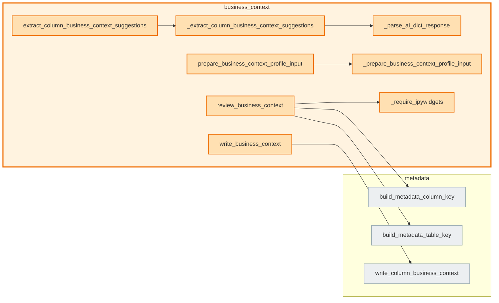

# `business_context` module

  Module overview

## Module dependency summary

Callable count: 6Outbound: 1Inbound: 0

## Module purpose

Owns business meaning for tables and columns.

## Public callables

<table>
  <thead>
    <tr>
      <th>Callable</th>
      <th>Tier</th>
      <th>Type</th>
      <th>Summary</th>
      <th>Related helpers</th>
    </tr>
  </thead>
  <tbody>
    <tr>
      <td><a href="../../reference/draft_business_context/"><code>draft_business_context</code></a></td>
      <td>Essential</td>
      <td>function</td>
      <td>Run Fabric AI to draft column business context suggestions.</td>
      <td>—</td>
    </tr>
    <tr>
      <td><a href="../../reference/review_business_context/"><code>review_business_context</code></a></td>
      <td>Essential</td>
      <td>function</td>
      <td>Display interactive approval widget.</td>
      <td><a href="../../reference/internal/business_context/_require_ipywidgets/"><code>_require_ipywidgets</code></a> (internal)</td>
    </tr>
    <tr>
      <td><a href="../../reference/write_business_context/"><code>write_business_context</code></a></td>
      <td>Essential</td>
      <td>function</td>
      <td>Persist approved business context rows via metadata writer.</td>
      <td>—</td>
    </tr>
    <tr>
      <td><a href="../../reference/extract_column_business_context_suggestions/"><code>extract_column_business_context_suggestions</code></a></td>
      <td>Optional</td>
      <td>function</td>
      <td>Extract review-ready business context suggestion rows from AI responses.</td>
      <td><a href="../../reference/internal/business_context/_extract_column_business_context_suggestions/"><code>_extract_column_business_context_suggestions</code></a> (internal)</td>
    </tr>
    <tr>
      <td><a href="../../reference/get_reviewed_business_context_rows/"><code>get_reviewed_business_context_rows</code></a></td>
      <td>Optional</td>
      <td>function</td>
      <td>Return reviewed business context rows from widget state.</td>
      <td>—</td>
    </tr>
    <tr>
      <td><a href="../../reference/prepare_business_context_profile_input/"><code>prepare_business_context_profile_input</code></a></td>
      <td>Optional</td>
      <td>function</td>
      <td>Prepare profile rows for business context prompt drafting.</td>
      <td><a href="../../reference/internal/business_context/_prepare_business_context_profile_input/"><code>_prepare_business_context_profile_input</code></a> (internal)</td>
    </tr>
  </tbody>
</table>

## Advanced dependency sections

### Related internal helpers

<table>
  <thead>
    <tr>
      <th>Helper</th>
      <th>Related public callables</th>
    </tr>
  </thead>
  <tbody>
    <tr>
      <td><a href="../../reference/internal/business_context/_extract_column_business_context_suggestions/"><code>_extract_column_business_context_suggestions</code></a></td>
      <td><a href="../../reference/extract_column_business_context_suggestions/"><code>extract_column_business_context_suggestions</code></a></td>
    </tr>
    <tr>
      <td><a href="../../reference/internal/business_context/_parse_ai_dict_response/"><code>_parse_ai_dict_response</code></a></td>
      <td>—</td>
    </tr>
    <tr>
      <td><a href="../../reference/internal/business_context/_prepare_business_context_profile_input/"><code>_prepare_business_context_profile_input</code></a></td>
      <td><a href="../../reference/prepare_business_context_profile_input/"><code>prepare_business_context_profile_input</code></a></td>
    </tr>
    <tr>
      <td><a href="../../reference/internal/business_context/_require_ipywidgets/"><code>_require_ipywidgets</code></a></td>
      <td><a href="../../reference/review_business_context/"><code>review_business_context</code></a></td>
    </tr>
  </tbody>
</table>

### Inside this module, used by, and uses

#### Inside this module

<a class="reference-chip" href="../modules/business_context/#_extract_column_business_context_suggestions"><code>_extract_column_business_context_suggestions</code></a> → <a class="reference-chip" href="../modules/business_context/#_parse_ai_dict_response"><code>_parse_ai_dict_response</code></a>
<a class="reference-chip" href="../../reference/extract_column_business_context_suggestions/"><code>extract_column_business_context_suggestions</code></a> → <a class="reference-chip" href="../modules/business_context/#_extract_column_business_context_suggestions"><code>_extract_column_business_context_suggestions</code></a>
<a class="reference-chip" href="../../reference/prepare_business_context_profile_input/"><code>prepare_business_context_profile_input</code></a> → <a class="reference-chip" href="../modules/business_context/#_prepare_business_context_profile_input"><code>_prepare_business_context_profile_input</code></a>
<a class="reference-chip" href="../../reference/review_business_context/"><code>review_business_context</code></a> → <a class="reference-chip" href="../modules/business_context/#_require_ipywidgets"><code>_require_ipywidgets</code></a>

#### Used by

None.
#### Uses

<a class="reference-chip" href="../../reference/review_business_context/"><code>review_business_context</code></a> → <a class="reference-chip" href="../modules/metadata/#build_metadata_column_key"><code>build_metadata_column_key</code></a>
<a class="reference-chip" href="../../reference/review_business_context/"><code>review_business_context</code></a> → <a class="reference-chip" href="../modules/metadata/#build_metadata_table_key"><code>build_metadata_table_key</code></a>
<a class="reference-chip" href="../../reference/write_business_context/"><code>write_business_context</code></a> → <a class="reference-chip" href="../modules/metadata/#write_column_business_context"><code>write_column_business_context</code></a>

