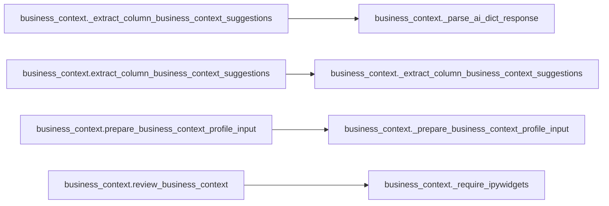
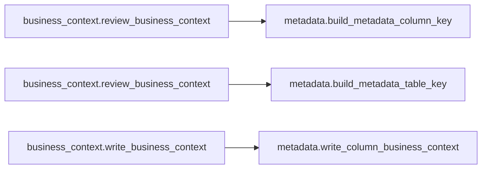

# `business_context` module

  Module overview

## Module dependency summary

| Essential | Optional | Internal | Depends On | Used By |
|---:|---:|---:|---:|---:|
| 3 | 3 | 4 | 1 | 0 |

## Essential callables

| Callable | Type | Summary | Related helpers |
|---|---|---|---|
| [`draft_business_context`](../../reference/draft_business_context/) | function | Run Fabric AI to draft column business context suggestions. | — |
| [`review_business_context`](../../reference/review_business_context/) | function | Display interactive approval widget. | [`_require_ipywidgets`](../../reference/internal/business_context/_require_ipywidgets/) (internal) |
| [`write_business_context`](../../reference/write_business_context/) | function | Persist approved business context rows via metadata writer. | — |

## Optional callables

| Callable | Type | Summary | Related helpers |
|---|---|---|---|
| [`extract_column_business_context_suggestions`](../../reference/extract_column_business_context_suggestions/) | function | Extract review-ready business context suggestion rows from AI responses. | [`_extract_column_business_context_suggestions`](../../reference/internal/business_context/_extract_column_business_context_suggestions/) (internal) |
| [`get_reviewed_business_context_rows`](../../reference/get_reviewed_business_context_rows/) | function | Return reviewed business context rows from widget state. | — |
| [`prepare_business_context_profile_input`](../../reference/prepare_business_context_profile_input/) | function | Prepare profile rows for business context prompt drafting. | [`_prepare_business_context_profile_input`](../../reference/internal/business_context/_prepare_business_context_profile_input/) (internal) |

## Related internal helpers

| Helper | Related public callables |
|---|---|
| [`_extract_column_business_context_suggestions`](../../reference/internal/business_context/_extract_column_business_context_suggestions/) | [`extract_column_business_context_suggestions`](../../reference/extract_column_business_context_suggestions/) |
| [`_parse_ai_dict_response`](../../reference/internal/business_context/_parse_ai_dict_response/) | — |
| [`_prepare_business_context_profile_input`](../../reference/internal/business_context/_prepare_business_context_profile_input/) | [`prepare_business_context_profile_input`](../../reference/prepare_business_context_profile_input/) |
| [`_require_ipywidgets`](../../reference/internal/business_context/_require_ipywidgets/) | [`review_business_context`](../../reference/review_business_context/) |

## Module internal callable graph

## Cross-module callable graph

## Cross-module references

| Caller | Callee |
|---|---|
| `business_context.review_business_context` | `metadata.build_metadata_column_key` |
| `business_context.review_business_context` | `metadata.build_metadata_table_key` |
| `business_context.write_business_context` | `metadata.write_column_business_context` |
