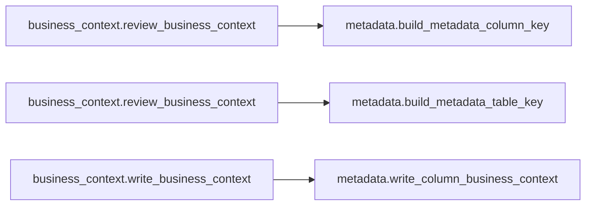

# `business_context` module

  Module overview

## Module dependency summary

| Callable count | Internal helper count | Outbound references | Inbound references |
|---:|---:|---:|---:|
| 6 | 4 | 1 | 0 |

## Module purpose

Owns business meaning for tables and columns.

## Public callables

| Callable | Tier | Type | Summary | Related helpers |
|---|---|---|---|---|
| [`draft_business_context`](../../reference/draft_business_context/) | Essential | function | Run Fabric AI to draft column business context suggestions. | — |
| [`review_business_context`](../../reference/review_business_context/) | Essential | function | Display interactive approval widget. | [`_require_ipywidgets`](../../reference/internal/business_context/_require_ipywidgets/) (internal) |
| [`write_business_context`](../../reference/write_business_context/) | Essential | function | Persist approved business context rows via metadata writer. | — |
| [`extract_column_business_context_suggestions`](../../reference/extract_column_business_context_suggestions/) | Optional | function | Extract review-ready business context suggestion rows from AI responses. | [`_extract_column_business_context_suggestions`](../../reference/internal/business_context/_extract_column_business_context_suggestions/) (internal) |
| [`get_reviewed_business_context_rows`](../../reference/get_reviewed_business_context_rows/) | Optional | function | Return reviewed business context rows from widget state. | — |
| [`prepare_business_context_profile_input`](../../reference/prepare_business_context_profile_input/) | Optional | function | Prepare profile rows for business context prompt drafting. | [`_prepare_business_context_profile_input`](../../reference/internal/business_context/_prepare_business_context_profile_input/) (internal) |

## Advanced dependency sections

### Related internal helpers

| Helper | Related public callables |
|---|---|
| [`_extract_column_business_context_suggestions`](../../reference/internal/business_context/_extract_column_business_context_suggestions/) | [`extract_column_business_context_suggestions`](../../reference/extract_column_business_context_suggestions/) |
| [`_parse_ai_dict_response`](../../reference/internal/business_context/_parse_ai_dict_response/) | — |
| [`_prepare_business_context_profile_input`](../../reference/internal/business_context/_prepare_business_context_profile_input/) | [`prepare_business_context_profile_input`](../../reference/prepare_business_context_profile_input/) |
| [`_require_ipywidgets`](../../reference/internal/business_context/_require_ipywidgets/) | [`review_business_context`](../../reference/review_business_context/) |

### Module internal callable dependencies

Graph omitted because dependencies are simple one-to-one references.

| Caller | Callee |
|---|---|
| `business_context._extract_column_business_context_suggestions` | `business_context._parse_ai_dict_response` |
| `business_context.extract_column_business_context_suggestions` | `business_context._extract_column_business_context_suggestions` |
| `business_context.prepare_business_context_profile_input` | `business_context._prepare_business_context_profile_input` |
| `business_context.review_business_context` | `business_context._require_ipywidgets` |

### Cross-module references

