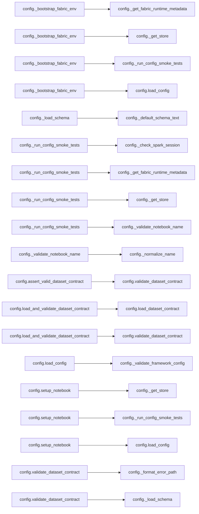

# `config` module

  Module overview

## Module dependency summary

Callable count: 2Outbound: 0Inbound: 1

## Module purpose

Owns environment setup, runtime initialization, paths, and notebook-wide configuration.

## Public callables

<table>
  <thead>
    <tr>
      <th>Callable</th>
      <th>Tier</th>
      <th>Type</th>
      <th>Summary</th>
      <th>Related helpers</th>
    </tr>
  </thead>
  <tbody>
    <tr>
      <td><a href="../../reference/load_config/"><code>load_config</code></a></td>
      <td>Essential</td>
      <td>function</td>
      <td>Validate and return a user-supplied framework configuration.</td>
      <td><a href="../../reference/internal/config/_validate_framework_config/"><code>_validate_framework_config</code></a> (internal)</td>
    </tr>
    <tr>
      <td><a href="../../reference/setup_notebook/"><code>setup_notebook</code></a></td>
      <td>Essential</td>
      <td>function</td>
      <td>Run consolidated FabricOps startup for exploration and pipeline notebooks.</td>
      <td><a href="../../reference/internal/config/_get_store/"><code>_get_store</code></a> (internal), <a href="../../reference/internal/config/_run_config_smoke_tests/"><code>_run_config_smoke_tests</code></a> (internal)</td>
    </tr>
  </tbody>
</table>

## Advanced dependency sections

### Related internal helpers

Expand internal helper table

<table>
  <thead>
    <tr>
      <th>Helper</th>
      <th>Related public callables</th>
    </tr>
  </thead>
  <tbody>
    <tr>
      <td><a href="../../reference/internal/config/_bootstrap_fabric_env/"><code>_bootstrap_fabric_env</code></a></td>
      <td>—</td>
    </tr>
    <tr>
      <td><a href="../../reference/internal/config/_check_fabric_ai_functions_available/"><code>_check_fabric_ai_functions_available</code></a></td>
      <td>—</td>
    </tr>
    <tr>
      <td><a href="../../reference/internal/config/_check_spark_session/"><code>_check_spark_session</code></a></td>
      <td>—</td>
    </tr>
    <tr>
      <td><a href="../../reference/internal/config/_configure_fabric_ai_functions/"><code>_configure_fabric_ai_functions</code></a></td>
      <td>—</td>
    </tr>
    <tr>
      <td><a href="../../reference/internal/config/_default_schema_text/"><code>_default_schema_text</code></a></td>
      <td>—</td>
    </tr>
    <tr>
      <td><a href="../../reference/internal/config/_format_error_path/"><code>_format_error_path</code></a></td>
      <td>—</td>
    </tr>
    <tr>
      <td><a href="../../reference/internal/config/_get_fabric_runtime_metadata/"><code>_get_fabric_runtime_metadata</code></a></td>
      <td>—</td>
    </tr>
    <tr>
      <td><a href="../../reference/internal/config/_get_store/"><code>_get_store</code></a></td>
      <td><a href="../../reference/setup_notebook/"><code>setup_notebook</code></a></td>
    </tr>
    <tr>
      <td><a href="../../reference/internal/config/_load_schema/"><code>_load_schema</code></a></td>
      <td>—</td>
    </tr>
    <tr>
      <td><a href="../../reference/internal/config/_normalize_name/"><code>_normalize_name</code></a></td>
      <td>—</td>
    </tr>
    <tr>
      <td><a href="../../reference/internal/config/_run_config_smoke_tests/"><code>_run_config_smoke_tests</code></a></td>
      <td><a href="../../reference/setup_notebook/"><code>setup_notebook</code></a></td>
    </tr>
    <tr>
      <td><a href="../../reference/internal/config/_validate_framework_config/"><code>_validate_framework_config</code></a></td>
      <td><a href="../../reference/load_config/"><code>load_config</code></a></td>
    </tr>
    <tr>
      <td><a href="../../reference/internal/config/_validate_notebook_name/"><code>_validate_notebook_name</code></a></td>
      <td>—</td>
    </tr>
  </tbody>
</table>

### Module internal callable dependencies

Expand module internal callable graph

### Outbound

No outbound references detected.
