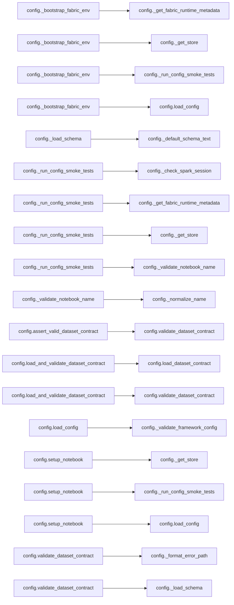

# `config` module

  Module overview

## Module dependency summary

| Callable count | Internal helper count | Outbound references | Inbound references |
|---:|---:|---:|---:|
| 2 | 13 | 0 | 1 |

## Module purpose

Owns environment setup, runtime initialization, paths, and notebook-wide configuration.

## Public callables

| Callable | Tier | Type | Summary | Related helpers |
|---|---|---|---|---|
| [`load_config`](../../reference/load_config/) | Essential | function | Validate and return a user-supplied framework configuration. | [`_validate_framework_config`](../../reference/internal/config/_validate_framework_config/) (internal) |
| [`setup_notebook`](../../reference/setup_notebook/) | Essential | function | Run consolidated FabricOps startup for exploration and pipeline notebooks. | [`_get_store`](../../reference/internal/config/_get_store/) (internal), [`_run_config_smoke_tests`](../../reference/internal/config/_run_config_smoke_tests/) (internal) |

## Advanced dependency sections

### Related internal helpers

Expand internal helper table

| Helper | Related public callables |
|---|---|
| [`_bootstrap_fabric_env`](../../reference/internal/config/_bootstrap_fabric_env/) | — |
| [`_check_fabric_ai_functions_available`](../../reference/internal/config/_check_fabric_ai_functions_available/) | — |
| [`_check_spark_session`](../../reference/internal/config/_check_spark_session/) | — |
| [`_configure_fabric_ai_functions`](../../reference/internal/config/_configure_fabric_ai_functions/) | — |
| [`_default_schema_text`](../../reference/internal/config/_default_schema_text/) | — |
| [`_format_error_path`](../../reference/internal/config/_format_error_path/) | — |
| [`_get_fabric_runtime_metadata`](../../reference/internal/config/_get_fabric_runtime_metadata/) | — |
| [`_get_store`](../../reference/internal/config/_get_store/) | [`setup_notebook`](../../reference/setup_notebook/) |
| [`_load_schema`](../../reference/internal/config/_load_schema/) | — |
| [`_normalize_name`](../../reference/internal/config/_normalize_name/) | — |
| [`_run_config_smoke_tests`](../../reference/internal/config/_run_config_smoke_tests/) | [`setup_notebook`](../../reference/setup_notebook/) |
| [`_validate_framework_config`](../../reference/internal/config/_validate_framework_config/) | [`load_config`](../../reference/load_config/) |
| [`_validate_notebook_name`](../../reference/internal/config/_validate_notebook_name/) | — |

### Module internal callable dependencies

Expand module internal callable graph

### Cross-module references

No cross-module references detected.
