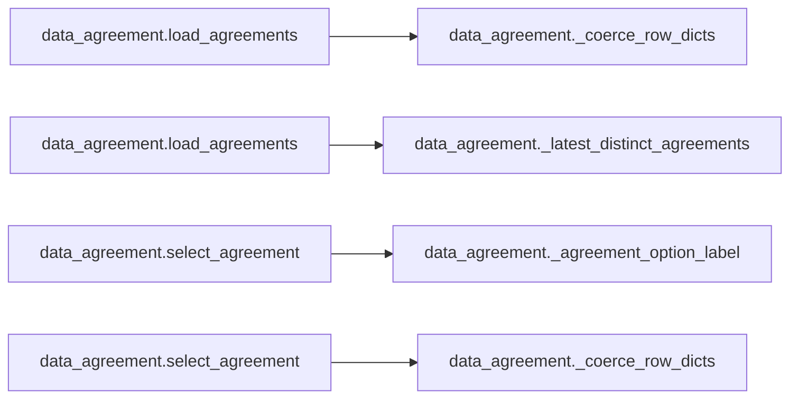

# `data_agreement` module

  Module overview

## Module dependency summary

| Callable count | Internal helper count | Outbound references | Inbound references |
|---:|---:|---:|---:|
| 3 | 3 | 0 | 0 |

## Module purpose

Owns agreement discovery and selection helpers used to anchor notebook workflows to approved business agreements.

## Public callables

| Callable | Tier | Type | Summary | Related helpers |
|---|---|---|---|---|
| [`get_selected_agreement`](../../reference/get_selected_agreement/) | Essential | function | Return selected agreement from widget flow. | — |
| [`load_agreements`](../../reference/load_agreements/) | Essential | function | Load latest distinct agreement metadata rows for widget selection. | [`_coerce_row_dicts`](../../reference/internal/data_agreement/_coerce_row_dicts/) (internal), [`_latest_distinct_agreements`](../../reference/internal/data_agreement/_latest_distinct_agreements/) (internal) |
| [`select_agreement`](../../reference/select_agreement/) | Essential | function | Render a widget dropdown and store selected agreement metadata row in module state. | [`_agreement_option_label`](../../reference/internal/data_agreement/_agreement_option_label/) (internal), [`_coerce_row_dicts`](../../reference/internal/data_agreement/_coerce_row_dicts/) (internal) |

## Advanced dependency sections

### Related internal helpers

| Helper | Related public callables |
|---|---|
| [`_agreement_option_label`](../../reference/internal/data_agreement/_agreement_option_label/) | [`select_agreement`](../../reference/select_agreement/) |
| [`_coerce_row_dicts`](../../reference/internal/data_agreement/_coerce_row_dicts/) | [`load_agreements`](../../reference/load_agreements/), [`select_agreement`](../../reference/select_agreement/) |
| [`_latest_distinct_agreements`](../../reference/internal/data_agreement/_latest_distinct_agreements/) | [`load_agreements`](../../reference/load_agreements/) |

### Module internal callable dependencies

### Cross-module references

No cross-module references detected.
