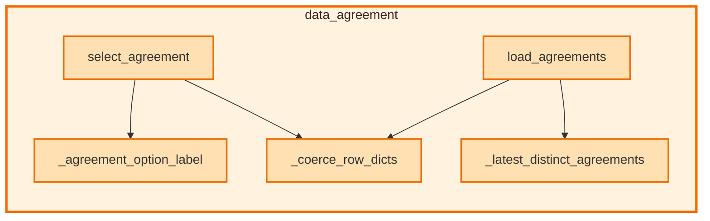

# `data_agreement` module

  Module overview

## Module dependency summary

Callable count: 3Outbound: 0Inbound: 0

## Module purpose

Owns agreement discovery and selection helpers used to anchor notebook workflows to approved business agreements.

## Public callables

<table>
  <thead>
    <tr>
      <th>Callable</th>
      <th>Tier</th>
      <th>Type</th>
      <th>Summary</th>
      <th>Related helpers</th>
    </tr>
  </thead>
  <tbody>
    <tr>
      <td><a href="../../reference/get_selected_agreement/"><code>get_selected_agreement</code></a></td>
      <td>Essential</td>
      <td>function</td>
      <td>Return selected agreement from widget flow.</td>
      <td>—</td>
    </tr>
    <tr>
      <td><a href="../../reference/load_agreements/"><code>load_agreements</code></a></td>
      <td>Essential</td>
      <td>function</td>
      <td>Load latest distinct agreement metadata rows for widget selection.</td>
      <td><a href="../../reference/internal/data_agreement/_coerce_row_dicts/"><code>_coerce_row_dicts</code></a> (internal), <a href="../../reference/internal/data_agreement/_latest_distinct_agreements/"><code>_latest_distinct_agreements</code></a> (internal)</td>
    </tr>
    <tr>
      <td><a href="../../reference/select_agreement/"><code>select_agreement</code></a></td>
      <td>Essential</td>
      <td>function</td>
      <td>Render a widget dropdown and store selected agreement metadata row in module state.</td>
      <td><a href="../../reference/internal/data_agreement/_agreement_option_label/"><code>_agreement_option_label</code></a> (internal), <a href="../../reference/internal/data_agreement/_coerce_row_dicts/"><code>_coerce_row_dicts</code></a> (internal)</td>
    </tr>
  </tbody>
</table>

## Advanced dependency sections

### Related internal helpers

<table>
  <thead>
    <tr>
      <th>Helper</th>
      <th>Related public callables</th>
    </tr>
  </thead>
  <tbody>
    <tr>
      <td><a href="../../reference/internal/data_agreement/_agreement_option_label/"><code>_agreement_option_label</code></a></td>
      <td><a href="../../reference/select_agreement/"><code>select_agreement</code></a></td>
    </tr>
    <tr>
      <td><a href="../../reference/internal/data_agreement/_coerce_row_dicts/"><code>_coerce_row_dicts</code></a></td>
      <td><a href="../../reference/load_agreements/"><code>load_agreements</code></a>, <a href="../../reference/select_agreement/"><code>select_agreement</code></a></td>
    </tr>
    <tr>
      <td><a href="../../reference/internal/data_agreement/_latest_distinct_agreements/"><code>_latest_distinct_agreements</code></a></td>
      <td><a href="../../reference/load_agreements/"><code>load_agreements</code></a></td>
    </tr>
  </tbody>
</table>

### Callable relationships

#### Inside this module

<a class="reference-chip" href="../../reference/load_agreements/"><code>load_agreements</code></a> → <a class="reference-chip" href="../modules/data_agreement/#_coerce_row_dicts"><code>_coerce_row_dicts</code></a>
<a class="reference-chip" href="../../reference/load_agreements/"><code>load_agreements</code></a> → <a class="reference-chip" href="../modules/data_agreement/#_latest_distinct_agreements"><code>_latest_distinct_agreements</code></a>
<a class="reference-chip" href="../../reference/select_agreement/"><code>select_agreement</code></a> → <a class="reference-chip" href="../modules/data_agreement/#_agreement_option_label"><code>_agreement_option_label</code></a>
<a class="reference-chip" href="../../reference/select_agreement/"><code>select_agreement</code></a> → <a class="reference-chip" href="../modules/data_agreement/#_coerce_row_dicts"><code>_coerce_row_dicts</code></a>

#### Used by other modules

None.
#### Uses other modules

None.

