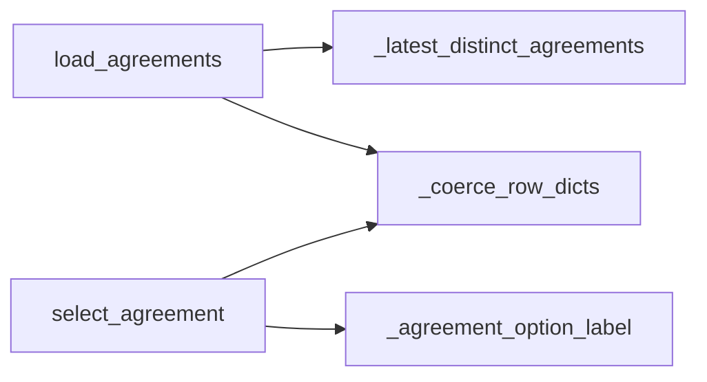
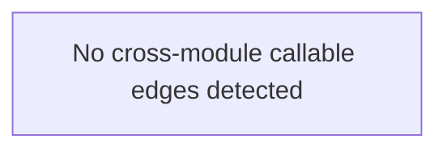

# `data_agreement` module

  Module overview

## Module dependency summary

- **Essential:** 3
- **Optional:** 0
- **Internal:** 3
- **Depends On:** 0 modules
- **Used By:** 0 modules

## Essential callables

| Callable | Type | Summary | Related helpers |
|---|---|---|---|
| [`get_selected_agreement`](../../reference/get_selected_agreement/) | function | Return selected agreement from widget flow. | — |
| [`load_agreements`](../../reference/load_agreements/) | function | Load latest distinct agreement metadata rows for widget selection. | [`_coerce_row_dicts`](../../reference/internal/data_agreement/_coerce_row_dicts/) (internal), [`_latest_distinct_agreements`](../../reference/internal/data_agreement/_latest_distinct_agreements/) (internal) |
| [`select_agreement`](../../reference/select_agreement/) | function | Render a widget dropdown and store selected agreement metadata row in module state. | [`_agreement_option_label`](../../reference/internal/data_agreement/_agreement_option_label/) (internal), [`_coerce_row_dicts`](../../reference/internal/data_agreement/_coerce_row_dicts/) (internal) |

## Optional callables

No advanced helpers listed for this module.

## Related internal helpers

| Helper | Related public callables |
|---|---|
| [`_agreement_option_label`](../../reference/internal/data_agreement/_agreement_option_label/) | [`select_agreement`](../../reference/select_agreement/) |
| [`_coerce_row_dicts`](../../reference/internal/data_agreement/_coerce_row_dicts/) | [`load_agreements`](../../reference/load_agreements/), [`select_agreement`](../../reference/select_agreement/) |
| [`_latest_distinct_agreements`](../../reference/internal/data_agreement/_latest_distinct_agreements/) | [`load_agreements`](../../reference/load_agreements/) |

## Module internal callable graph

## Cross-module callable graph

