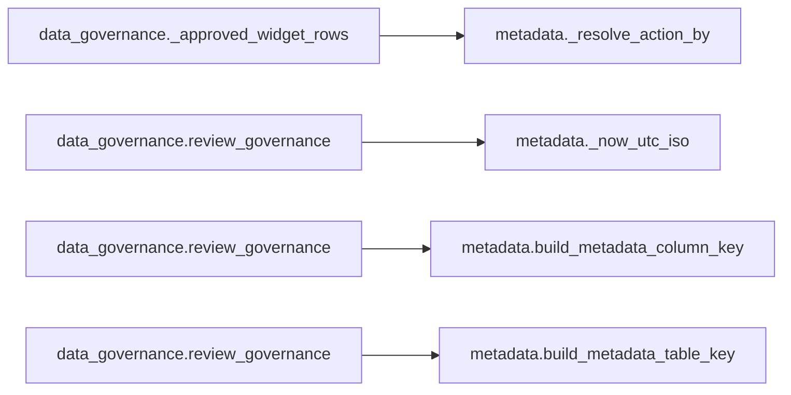

# `data_governance` module

  Module overview

## Module dependency summary

| Callable count | Internal helper count | Outbound references | Inbound references |
|---:|---:|---:|---:|
| 6 | 6 | 1 | 0 |

## Module purpose

Owns sensitivity, PII, confidentiality, policy labels, and governance approval evidence.

## Public callables

| Callable | Tier | Type | Summary | Related helpers |
|---|---|---|---|---|
| [`draft_governance`](../../reference/draft_governance/) | Essential | function | Run Fabric AI personal-identifier suggestion prompt on prepared governance rows. | — |
| [`load_governance`](../../reference/load_governance/) | Essential | function | Load approved governance metadata as read-only agreement context. | [`_coerce_row_dicts`](../../reference/internal/data_governance/_coerce_row_dicts/) (internal) |
| [`review_governance`](../../reference/review_governance/) | Essential | function | Display governance review widget and capture approve/reject decisions in module state. | [`_undo_last_action`](../../reference/internal/data_governance/_undo_last_action/) (internal) |
| [`write_governance`](../../reference/write_governance/) | Essential | function | Persist approved governance rows to metadata table. | [`_approved_widget_rows`](../../reference/internal/data_governance/_approved_widget_rows/) (internal) |
| [`extract_governance_suggestions`](../../reference/extract_governance_suggestions/) | Optional | function | Extract review-ready governance suggestions from AI responses. | [`_extract_pii_suggestions`](../../reference/internal/data_governance/_extract_pii_suggestions/) (internal) |
| [`prepare_governance_input`](../../reference/prepare_governance_input/) | Optional | function | Prepare governance prompt input rows from profile evidence and approved context. | [`_prepare_governance_input`](../../reference/internal/data_governance/_prepare_governance_input/) (internal) |

## Advanced dependency sections

### Related internal helpers

| Helper | Related public callables |
|---|---|
| [`_approved_widget_rows`](../../reference/internal/data_governance/_approved_widget_rows/) | [`write_governance`](../../reference/write_governance/) |
| [`_build_governance_context`](../../reference/internal/data_governance/_build_governance_context/) | — |
| [`_coerce_row_dicts`](../../reference/internal/data_governance/_coerce_row_dicts/) | [`load_governance`](../../reference/load_governance/) |
| [`_extract_pii_suggestions`](../../reference/internal/data_governance/_extract_pii_suggestions/) | [`extract_governance_suggestions`](../../reference/extract_governance_suggestions/) |
| [`_prepare_governance_input`](../../reference/internal/data_governance/_prepare_governance_input/) | [`prepare_governance_input`](../../reference/prepare_governance_input/) |
| [`_undo_last_action`](../../reference/internal/data_governance/_undo_last_action/) | [`review_governance`](../../reference/review_governance/) |

### Module internal callable dependencies

Graph omitted because dependencies are simple one-to-one references.

| Caller | Callee |
|---|---|
| `data_governance.extract_governance_suggestions` | `data_governance._extract_pii_suggestions` |
| `data_governance.load_governance` | `data_governance._coerce_row_dicts` |
| `data_governance.prepare_governance_input` | `data_governance._prepare_governance_input` |
| `data_governance.review_governance` | `data_governance._undo_last_action` |
| `data_governance.write_governance` | `data_governance._approved_widget_rows` |

### Cross-module references

