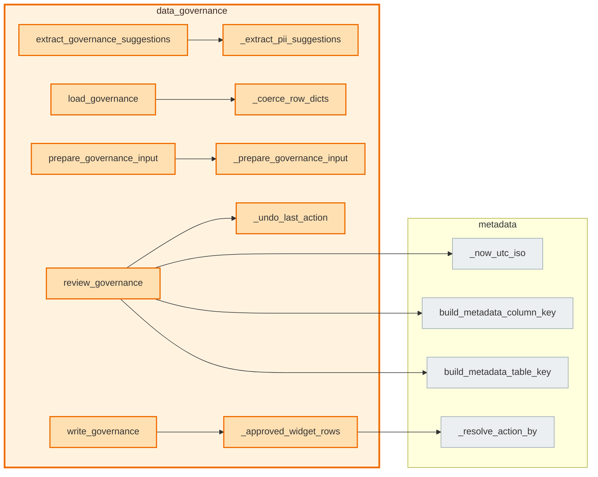

# `data_governance` module

  Module overview

## Module dependency summary

Callable count: 6Outbound: 1Inbound: 0

## Module purpose

Owns sensitivity, PII, confidentiality, policy labels, and governance approval evidence.

## Public callables

<table>
  <thead>
    <tr>
      <th>Callable</th>
      <th>Tier</th>
      <th>Type</th>
      <th>Summary</th>
      <th>Related helpers</th>
    </tr>
  </thead>
  <tbody>
    <tr>
      <td><a href="../../reference/draft_governance/"><code>draft_governance</code></a></td>
      <td>Essential</td>
      <td>function</td>
      <td>Run Fabric AI personal-identifier suggestion prompt on prepared governance rows.</td>
      <td>—</td>
    </tr>
    <tr>
      <td><a href="../../reference/load_governance/"><code>load_governance</code></a></td>
      <td>Essential</td>
      <td>function</td>
      <td>Load approved governance metadata as read-only agreement context.</td>
      <td><a href="../../reference/internal/data_governance/_coerce_row_dicts/"><code>_coerce_row_dicts</code></a> (internal)</td>
    </tr>
    <tr>
      <td><a href="../../reference/review_governance/"><code>review_governance</code></a></td>
      <td>Essential</td>
      <td>function</td>
      <td>Display governance review widget and capture approve/reject decisions in module state.</td>
      <td><a href="../../reference/internal/data_governance/_undo_last_action/"><code>_undo_last_action</code></a> (internal)</td>
    </tr>
    <tr>
      <td><a href="../../reference/write_governance/"><code>write_governance</code></a></td>
      <td>Essential</td>
      <td>function</td>
      <td>Persist approved governance rows to metadata table.</td>
      <td><a href="../../reference/internal/data_governance/_approved_widget_rows/"><code>_approved_widget_rows</code></a> (internal)</td>
    </tr>
    <tr>
      <td><a href="../../reference/extract_governance_suggestions/"><code>extract_governance_suggestions</code></a></td>
      <td>Optional</td>
      <td>function</td>
      <td>Extract review-ready governance suggestions from AI responses.</td>
      <td><a href="../../reference/internal/data_governance/_extract_pii_suggestions/"><code>_extract_pii_suggestions</code></a> (internal)</td>
    </tr>
    <tr>
      <td><a href="../../reference/prepare_governance_input/"><code>prepare_governance_input</code></a></td>
      <td>Optional</td>
      <td>function</td>
      <td>Prepare governance prompt input rows from profile evidence and approved context.</td>
      <td><a href="../../reference/internal/data_governance/_prepare_governance_input/"><code>_prepare_governance_input</code></a> (internal)</td>
    </tr>
  </tbody>
</table>

## Advanced dependency sections

### Related internal helpers

<table>
  <thead>
    <tr>
      <th>Helper</th>
      <th>Related public callables</th>
    </tr>
  </thead>
  <tbody>
    <tr>
      <td><a href="../../reference/internal/data_governance/_approved_widget_rows/"><code>_approved_widget_rows</code></a></td>
      <td><a href="../../reference/write_governance/"><code>write_governance</code></a></td>
    </tr>
    <tr>
      <td><a href="../../reference/internal/data_governance/_build_governance_context/"><code>_build_governance_context</code></a></td>
      <td>—</td>
    </tr>
    <tr>
      <td><a href="../../reference/internal/data_governance/_coerce_row_dicts/"><code>_coerce_row_dicts</code></a></td>
      <td><a href="../../reference/load_governance/"><code>load_governance</code></a></td>
    </tr>
    <tr>
      <td><a href="../../reference/internal/data_governance/_extract_pii_suggestions/"><code>_extract_pii_suggestions</code></a></td>
      <td><a href="../../reference/extract_governance_suggestions/"><code>extract_governance_suggestions</code></a></td>
    </tr>
    <tr>
      <td><a href="../../reference/internal/data_governance/_prepare_governance_input/"><code>_prepare_governance_input</code></a></td>
      <td><a href="../../reference/prepare_governance_input/"><code>prepare_governance_input</code></a></td>
    </tr>
    <tr>
      <td><a href="../../reference/internal/data_governance/_undo_last_action/"><code>_undo_last_action</code></a></td>
      <td><a href="../../reference/review_governance/"><code>review_governance</code></a></td>
    </tr>
  </tbody>
</table>

### Inside this module, used by, and uses

#### Inside this module

<a class="reference-chip" href="../../reference/extract_governance_suggestions/"><code>extract_governance_suggestions</code></a> → <a class="reference-chip" href="../modules/data_governance/#_extract_pii_suggestions"><code>_extract_pii_suggestions</code></a>
<a class="reference-chip" href="../../reference/load_governance/"><code>load_governance</code></a> → <a class="reference-chip" href="../modules/data_governance/#_coerce_row_dicts"><code>_coerce_row_dicts</code></a>
<a class="reference-chip" href="../../reference/prepare_governance_input/"><code>prepare_governance_input</code></a> → <a class="reference-chip" href="../modules/data_governance/#_prepare_governance_input"><code>_prepare_governance_input</code></a>
<a class="reference-chip" href="../../reference/review_governance/"><code>review_governance</code></a> → <a class="reference-chip" href="../modules/data_governance/#_undo_last_action"><code>_undo_last_action</code></a>
<a class="reference-chip" href="../../reference/write_governance/"><code>write_governance</code></a> → <a class="reference-chip" href="../modules/data_governance/#_approved_widget_rows"><code>_approved_widget_rows</code></a>

#### Used by

None.
#### Uses

<a class="reference-chip" href="../modules/data_governance/#_approved_widget_rows"><code>_approved_widget_rows</code></a> → <a class="reference-chip" href="../modules/metadata/#_resolve_action_by"><code>_resolve_action_by</code></a>
<a class="reference-chip" href="../../reference/review_governance/"><code>review_governance</code></a> → <a class="reference-chip" href="../modules/metadata/#_now_utc_iso"><code>_now_utc_iso</code></a>
<a class="reference-chip" href="../../reference/review_governance/"><code>review_governance</code></a> → <a class="reference-chip" href="../modules/metadata/#build_metadata_column_key"><code>build_metadata_column_key</code></a>
<a class="reference-chip" href="../../reference/review_governance/"><code>review_governance</code></a> → <a class="reference-chip" href="../modules/metadata/#build_metadata_table_key"><code>build_metadata_table_key</code></a>

