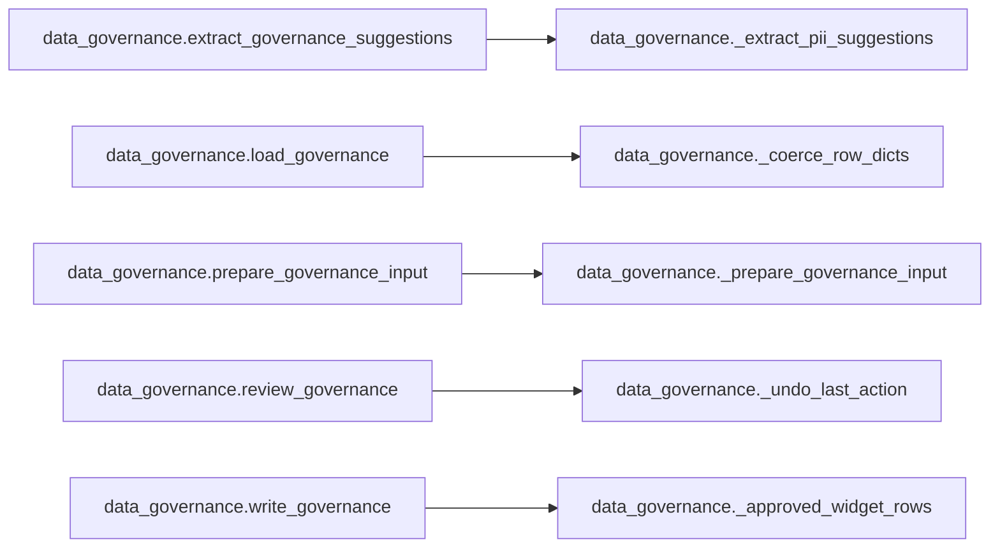
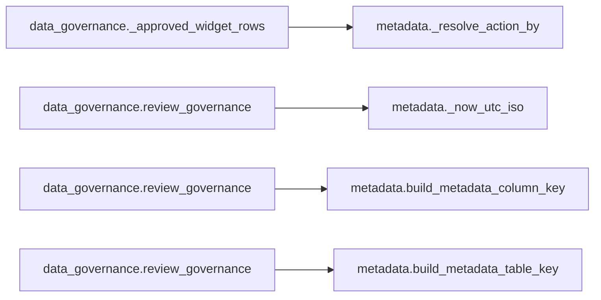

# `data_governance` module

  Module overview

## Module dependency summary

| Essential | Optional | Internal | Depends On | Used By |
|---:|---:|---:|---:|---:|
| 4 | 2 | 6 | 1 | 0 |

## Essential callables

| Callable | Type | Summary | Related helpers |
|---|---|---|---|
| [`draft_governance`](../../reference/draft_governance/) | function | Run Fabric AI personal-identifier suggestion prompt on prepared governance rows. | — |
| [`load_governance`](../../reference/load_governance/) | function | Load approved governance metadata as read-only agreement context. | [`_coerce_row_dicts`](../../reference/internal/data_governance/_coerce_row_dicts/) (internal) |
| [`review_governance`](../../reference/review_governance/) | function | Display governance review widget and capture approve/reject decisions in module state. | [`_undo_last_action`](../../reference/internal/data_governance/_undo_last_action/) (internal) |
| [`write_governance`](../../reference/write_governance/) | function | Persist approved governance rows to metadata table. | [`_approved_widget_rows`](../../reference/internal/data_governance/_approved_widget_rows/) (internal) |

## Optional callables

| Callable | Type | Summary | Related helpers |
|---|---|---|---|
| [`extract_governance_suggestions`](../../reference/extract_governance_suggestions/) | function | Extract review-ready governance suggestions from AI responses. | [`_extract_pii_suggestions`](../../reference/internal/data_governance/_extract_pii_suggestions/) (internal) |
| [`prepare_governance_input`](../../reference/prepare_governance_input/) | function | Prepare governance prompt input rows from profile evidence and approved context. | [`_prepare_governance_input`](../../reference/internal/data_governance/_prepare_governance_input/) (internal) |

## Related internal helpers

| Helper | Related public callables |
|---|---|
| [`_approved_widget_rows`](../../reference/internal/data_governance/_approved_widget_rows/) | [`write_governance`](../../reference/write_governance/) |
| [`_build_governance_context`](../../reference/internal/data_governance/_build_governance_context/) | — |
| [`_coerce_row_dicts`](../../reference/internal/data_governance/_coerce_row_dicts/) | [`load_governance`](../../reference/load_governance/) |
| [`_extract_pii_suggestions`](../../reference/internal/data_governance/_extract_pii_suggestions/) | [`extract_governance_suggestions`](../../reference/extract_governance_suggestions/) |
| [`_prepare_governance_input`](../../reference/internal/data_governance/_prepare_governance_input/) | [`prepare_governance_input`](../../reference/prepare_governance_input/) |
| [`_undo_last_action`](../../reference/internal/data_governance/_undo_last_action/) | [`review_governance`](../../reference/review_governance/) |

## Module internal callable graph

## Cross-module callable graph

## Cross-module references

| Caller | Callee |
|---|---|
| `data_governance._approved_widget_rows` | `metadata._resolve_action_by` |
| `data_governance.review_governance` | `metadata._now_utc_iso` |
| `data_governance.review_governance` | `metadata.build_metadata_column_key` |
| `data_governance.review_governance` | `metadata.build_metadata_table_key` |
