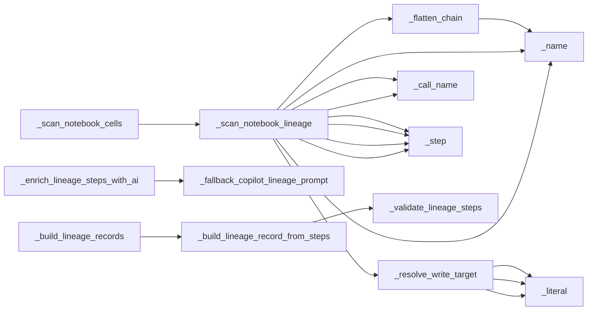

# `data_lineage` module

  Module overview

## Module dependency summary

- **Essential:** 2
- **Optional:** 0
- **Internal:** 13
- **Depends On:** 0 modules
- **Used By:** 0 modules

## Essential callables

| Callable | Type | Summary | Related helpers |
|---|---|---|---|
| [`build_lineage_handover_markdown`](../../reference/build_lineage_handover_markdown/) | function | Build a concise markdown handover summary from lineage execution results. | — |
| [`build_lineage_records`](../../reference/build_lineage_records/) | function | Build compact lineage records for downstream metadata sinks. | — |

## Optional callables

No advanced helpers listed for this module.

## Related internal helpers

| Helper | Related public callables |
|---|---|
| [`_build_lineage_record_from_steps`](../../reference/internal/data_lineage/_build_lineage_record_from_steps/) | — |
| [`_build_lineage_records`](../../reference/internal/data_lineage/_build_lineage_records/) | — |
| [`_call_name`](../../reference/internal/data_lineage/_call_name/) | — |
| [`_enrich_lineage_steps_with_ai`](../../reference/internal/data_lineage/_enrich_lineage_steps_with_ai/) | — |
| [`_fallback_copilot_lineage_prompt`](../../reference/internal/data_lineage/_fallback_copilot_lineage_prompt/) | — |
| [`_flatten_chain`](../../reference/internal/data_lineage/_flatten_chain/) | — |
| [`_literal`](../../reference/internal/data_lineage/_literal/) | — |
| [`_name`](../../reference/internal/data_lineage/_name/) | — |
| [`_resolve_write_target`](../../reference/internal/data_lineage/_resolve_write_target/) | — |
| [`_scan_notebook_cells`](../../reference/internal/data_lineage/_scan_notebook_cells/) | — |
| [`_scan_notebook_lineage`](../../reference/internal/data_lineage/_scan_notebook_lineage/) | — |
| [`_step`](../../reference/internal/data_lineage/_step/) | — |
| [`_validate_lineage_steps`](../../reference/internal/data_lineage/_validate_lineage_steps/) | — |

## Module internal callable graph

## Cross-module callable graph

