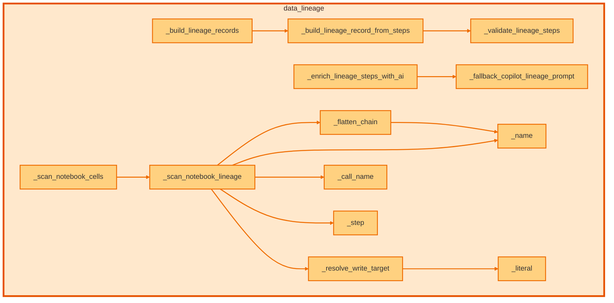

# `data_lineage` module

  Module overview

## Module dependency summary

Callable count: 2Outbound: 0Inbound: 0

## Module purpose

Owns source-to-target lineage and transformation evidence.

## Public callables

<table>
  <thead>
    <tr>
      <th>Callable</th>
      <th>Tier</th>
      <th>Type</th>
      <th>Summary</th>
      <th>Related helpers</th>
    </tr>
  </thead>
  <tbody>
    <tr>
      <td><a href="../../reference/build_lineage_handover_markdown/"><code>build_lineage_handover_markdown</code></a></td>
      <td>Essential</td>
      <td>function</td>
      <td>Build a concise markdown handover summary from lineage execution results.</td>
      <td>—</td>
    </tr>
    <tr>
      <td><a href="../../reference/build_lineage_records/"><code>build_lineage_records</code></a></td>
      <td>Essential</td>
      <td>function</td>
      <td>Build compact lineage records for downstream metadata sinks.</td>
      <td>—</td>
    </tr>
  </tbody>
</table>

## Advanced dependency sections

### Related internal helpers

Expand internal helper table

<table>
  <thead>
    <tr>
      <th>Helper</th>
      <th>Related public callables</th>
    </tr>
  </thead>
  <tbody>
    <tr>
      <td><a href="../../reference/internal/data_lineage/_build_lineage_record_from_steps/"><code>_build_lineage_record_from_steps</code></a></td>
      <td>—</td>
    </tr>
    <tr>
      <td><a href="../../reference/internal/data_lineage/_build_lineage_records/"><code>_build_lineage_records</code></a></td>
      <td>—</td>
    </tr>
    <tr>
      <td><a href="../../reference/internal/data_lineage/_call_name/"><code>_call_name</code></a></td>
      <td>—</td>
    </tr>
    <tr>
      <td><a href="../../reference/internal/data_lineage/_enrich_lineage_steps_with_ai/"><code>_enrich_lineage_steps_with_ai</code></a></td>
      <td>—</td>
    </tr>
    <tr>
      <td><a href="../../reference/internal/data_lineage/_fallback_copilot_lineage_prompt/"><code>_fallback_copilot_lineage_prompt</code></a></td>
      <td>—</td>
    </tr>
    <tr>
      <td><a href="../../reference/internal/data_lineage/_flatten_chain/"><code>_flatten_chain</code></a></td>
      <td>—</td>
    </tr>
    <tr>
      <td><a href="../../reference/internal/data_lineage/_literal/"><code>_literal</code></a></td>
      <td>—</td>
    </tr>
    <tr>
      <td><a href="../../reference/internal/data_lineage/_name/"><code>_name</code></a></td>
      <td>—</td>
    </tr>
    <tr>
      <td><a href="../../reference/internal/data_lineage/_resolve_write_target/"><code>_resolve_write_target</code></a></td>
      <td>—</td>
    </tr>
    <tr>
      <td><a href="../../reference/internal/data_lineage/_scan_notebook_cells/"><code>_scan_notebook_cells</code></a></td>
      <td>—</td>
    </tr>
    <tr>
      <td><a href="../../reference/internal/data_lineage/_scan_notebook_lineage/"><code>_scan_notebook_lineage</code></a></td>
      <td>—</td>
    </tr>
    <tr>
      <td><a href="../../reference/internal/data_lineage/_step/"><code>_step</code></a></td>
      <td>—</td>
    </tr>
    <tr>
      <td><a href="../../reference/internal/data_lineage/_validate_lineage_steps/"><code>_validate_lineage_steps</code></a></td>
      <td>—</td>
    </tr>
  </tbody>
</table>

### Callable relationships

#### Inside this module

<a class="reference-chip" href="../modules/data_lineage/#_build_lineage_record_from_steps"><code>_build_lineage_record_from_steps</code></a> → <a class="reference-chip" href="../modules/data_lineage/#_validate_lineage_steps"><code>_validate_lineage_steps</code></a>
<a class="reference-chip" href="../modules/data_lineage/#_build_lineage_records"><code>_build_lineage_records</code></a> → <a class="reference-chip" href="../modules/data_lineage/#_build_lineage_record_from_steps"><code>_build_lineage_record_from_steps</code></a>
<a class="reference-chip" href="../modules/data_lineage/#_enrich_lineage_steps_with_ai"><code>_enrich_lineage_steps_with_ai</code></a> → <a class="reference-chip" href="../modules/data_lineage/#_fallback_copilot_lineage_prompt"><code>_fallback_copilot_lineage_prompt</code></a>
<a class="reference-chip" href="../modules/data_lineage/#_flatten_chain"><code>_flatten_chain</code></a> → <a class="reference-chip" href="../modules/data_lineage/#_name"><code>_name</code></a>
<a class="reference-chip" href="../modules/data_lineage/#_resolve_write_target"><code>_resolve_write_target</code></a> → <a class="reference-chip" href="../modules/data_lineage/#_literal"><code>_literal</code></a>
<a class="reference-chip" href="../modules/data_lineage/#_scan_notebook_cells"><code>_scan_notebook_cells</code></a> → <a class="reference-chip" href="../modules/data_lineage/#_scan_notebook_lineage"><code>_scan_notebook_lineage</code></a>
<a class="reference-chip" href="../modules/data_lineage/#_scan_notebook_lineage"><code>_scan_notebook_lineage</code></a> → <a class="reference-chip" href="../modules/data_lineage/#_call_name"><code>_call_name</code></a>
<a class="reference-chip" href="../modules/data_lineage/#_scan_notebook_lineage"><code>_scan_notebook_lineage</code></a> → <a class="reference-chip" href="../modules/data_lineage/#_flatten_chain"><code>_flatten_chain</code></a>
<a class="reference-chip" href="../modules/data_lineage/#_scan_notebook_lineage"><code>_scan_notebook_lineage</code></a> → <a class="reference-chip" href="../modules/data_lineage/#_name"><code>_name</code></a>
<a class="reference-chip" href="../modules/data_lineage/#_scan_notebook_lineage"><code>_scan_notebook_lineage</code></a> → <a class="reference-chip" href="../modules/data_lineage/#_resolve_write_target"><code>_resolve_write_target</code></a>
<a class="reference-chip" href="../modules/data_lineage/#_scan_notebook_lineage"><code>_scan_notebook_lineage</code></a> → <a class="reference-chip" href="../modules/data_lineage/#_step"><code>_step</code></a>

#### Used by other modules

None.
#### Uses other modules

None.

