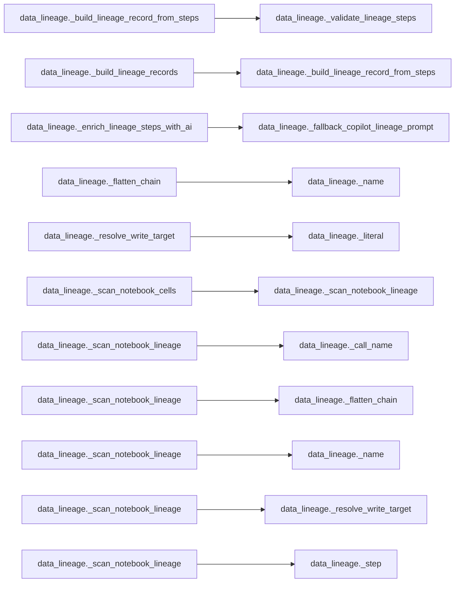

# `data_lineage` module

  Module overview

## Module dependency summary

| Callable count | Internal helper count | Outbound references | Inbound references |
|---:|---:|---:|---:|
| 2 | 13 | 0 | 0 |

## Module purpose

Owns source-to-target lineage and transformation evidence.

## Public callables

| Callable | Tier | Type | Summary | Related helpers |
|---|---|---|---|---|
| [`build_lineage_handover_markdown`](../../reference/build_lineage_handover_markdown/) | Essential | function | Build a concise markdown handover summary from lineage execution results. | — |
| [`build_lineage_records`](../../reference/build_lineage_records/) | Essential | function | Build compact lineage records for downstream metadata sinks. | — |

## Advanced dependency sections

### Related internal helpers

Expand internal helper table

| Helper | Related public callables |
|---|---|
| [`_build_lineage_record_from_steps`](../../reference/internal/data_lineage/_build_lineage_record_from_steps/) | — |
| [`_build_lineage_records`](../../reference/internal/data_lineage/_build_lineage_records/) | — |
| [`_call_name`](../../reference/internal/data_lineage/_call_name/) | — |
| [`_enrich_lineage_steps_with_ai`](../../reference/internal/data_lineage/_enrich_lineage_steps_with_ai/) | — |
| [`_fallback_copilot_lineage_prompt`](../../reference/internal/data_lineage/_fallback_copilot_lineage_prompt/) | — |
| [`_flatten_chain`](../../reference/internal/data_lineage/_flatten_chain/) | — |
| [`_literal`](../../reference/internal/data_lineage/_literal/) | — |
| [`_name`](../../reference/internal/data_lineage/_name/) | — |
| [`_resolve_write_target`](../../reference/internal/data_lineage/_resolve_write_target/) | — |
| [`_scan_notebook_cells`](../../reference/internal/data_lineage/_scan_notebook_cells/) | — |
| [`_scan_notebook_lineage`](../../reference/internal/data_lineage/_scan_notebook_lineage/) | — |
| [`_step`](../../reference/internal/data_lineage/_step/) | — |
| [`_validate_lineage_steps`](../../reference/internal/data_lineage/_validate_lineage_steps/) | — |

### Module internal callable dependencies

Expand module internal callable graph

### Cross-module references

No cross-module references detected.
