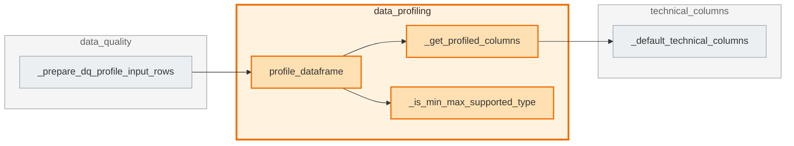

# `data_profiling` module

  Module overview

## Module dependency summary

Callable count: 1Outbound: 1Inbound: 1

## Module purpose

Owns deterministic profiling evidence such as schema, nulls, distincts, min/max, and samples.

## Public callables

<table>
  <thead>
    <tr>
      <th>Callable</th>
      <th>Tier</th>
      <th>Type</th>
      <th>Summary</th>
      <th>Related helpers</th>
    </tr>
  </thead>
  <tbody>
    <tr>
      <td><a href="../../reference/profile_dataframe/"><code>profile_dataframe</code></a></td>
      <td>Essential</td>
      <td>function</td>
      <td>Build canonical DQ-ready profiling rows from a Spark DataFrame.</td>
      <td><a href="../../reference/internal/data_profiling/_get_profiled_columns/"><code>_get_profiled_columns</code></a> (internal), <a href="../../reference/internal/data_profiling/_is_min_max_supported_type/"><code>_is_min_max_supported_type</code></a> (internal)</td>
    </tr>
  </tbody>
</table>

## Advanced dependency sections

### Related internal helpers

<table>
  <thead>
    <tr>
      <th>Helper</th>
      <th>Related public callables</th>
    </tr>
  </thead>
  <tbody>
    <tr>
      <td><a href="../../reference/internal/data_profiling/_get_profiled_columns/"><code>_get_profiled_columns</code></a></td>
      <td><a href="../../reference/profile_dataframe/"><code>profile_dataframe</code></a></td>
    </tr>
    <tr>
      <td><a href="../../reference/internal/data_profiling/_is_min_max_supported_type/"><code>_is_min_max_supported_type</code></a></td>
      <td><a href="../../reference/profile_dataframe/"><code>profile_dataframe</code></a></td>
    </tr>
  </tbody>
</table>

### Callable relationships

#### Inside this module

<a class="reference-chip" href="../../reference/profile_dataframe/"><code>profile_dataframe</code></a> → <a class="reference-chip" href="../modules/data_profiling/#_get_profiled_columns"><code>_get_profiled_columns</code></a>
<a class="reference-chip" href="../../reference/profile_dataframe/"><code>profile_dataframe</code></a> → <a class="reference-chip" href="../modules/data_profiling/#_is_min_max_supported_type"><code>_is_min_max_supported_type</code></a>

#### Used by other modules

<a class="reference-chip" href="../modules/data_quality/#_prepare_dq_profile_input_rows"><code>_prepare_dq_profile_input_rows</code></a> → <a class="reference-chip" href="../../reference/profile_dataframe/"><code>profile_dataframe</code></a>

#### Uses other modules

<a class="reference-chip" href="../modules/data_profiling/#_get_profiled_columns"><code>_get_profiled_columns</code></a> → <a class="reference-chip" href="../modules/technical_columns/#_default_technical_columns"><code>_default_technical_columns</code></a>

