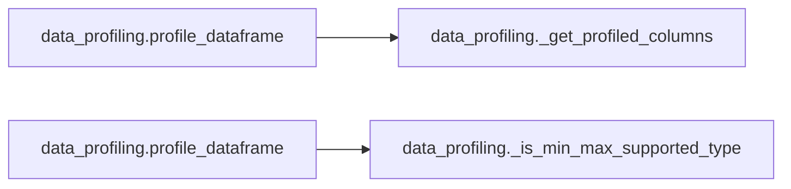
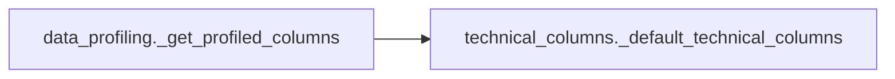

# `data_profiling` module

  Module overview

## Module dependency summary

| Essential | Optional | Internal | Depends On | Used By |
|---:|---:|---:|---:|---:|
| 1 | 0 | 2 | 1 | 1 |

## Essential callables

| Callable | Type | Summary | Related helpers |
|---|---|---|---|
| [`profile_dataframe`](../../reference/profile_dataframe/) | function | Build canonical DQ-ready profiling rows from a Spark DataFrame. | [`_get_profiled_columns`](../../reference/internal/data_profiling/_get_profiled_columns/) (internal), [`_is_min_max_supported_type`](../../reference/internal/data_profiling/_is_min_max_supported_type/) (internal) |

## Optional callables

No advanced helpers listed for this module.

## Related internal helpers

| Helper | Related public callables |
|---|---|
| [`_get_profiled_columns`](../../reference/internal/data_profiling/_get_profiled_columns/) | [`profile_dataframe`](../../reference/profile_dataframe/) |
| [`_is_min_max_supported_type`](../../reference/internal/data_profiling/_is_min_max_supported_type/) | [`profile_dataframe`](../../reference/profile_dataframe/) |

## Module internal callable graph

## Cross-module callable graph

## Cross-module references

| Caller | Callee |
|---|---|
| `data_profiling._get_profiled_columns` | `technical_columns._default_technical_columns` |
