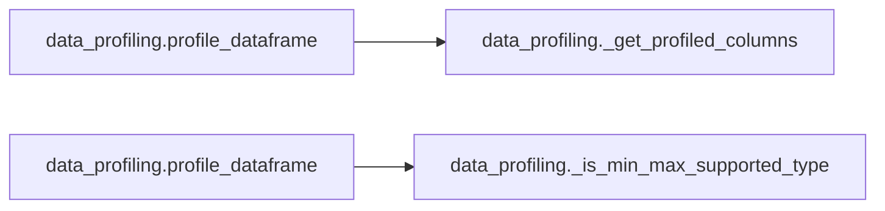

# `data_profiling` module

  Module overview

## Module dependency summary

| Callable count | Internal helper count | Outbound references | Inbound references |
|---:|---:|---:|---:|
| 1 | 2 | 1 | 1 |

## Module purpose

Owns deterministic profiling evidence such as schema, nulls, distincts, min/max, and samples.

## Public callables

| Callable | Tier | Type | Summary | Related helpers |
|---|---|---|---|---|
| [`profile_dataframe`](../../reference/profile_dataframe/) | Essential | function | Build canonical DQ-ready profiling rows from a Spark DataFrame. | [`_get_profiled_columns`](../../reference/internal/data_profiling/_get_profiled_columns/) (internal), [`_is_min_max_supported_type`](../../reference/internal/data_profiling/_is_min_max_supported_type/) (internal) |

## Advanced dependency sections

### Related internal helpers

| Helper | Related public callables |
|---|---|
| [`_get_profiled_columns`](../../reference/internal/data_profiling/_get_profiled_columns/) | [`profile_dataframe`](../../reference/profile_dataframe/) |
| [`_is_min_max_supported_type`](../../reference/internal/data_profiling/_is_min_max_supported_type/) | [`profile_dataframe`](../../reference/profile_dataframe/) |

### Module internal callable dependencies

### Cross-module references

Graph omitted because dependencies are simple one-to-one references.

| Caller | Callee |
|---|---|
| `data_profiling._get_profiled_columns` | `technical_columns._default_technical_columns` |

