# `data_quality` module

  Module overview

## Module dependency summary

Callable count: 10Outbound: 3Inbound: 0

## Module purpose

Owns DQ rule drafting, review, enforcement, quarantine, and quality results.

## Public callables

<table>
  <thead>
    <tr>
      <th>Callable</th>
      <th>Tier</th>
      <th>Type</th>
      <th>Summary</th>
      <th>Related helpers</th>
    </tr>
  </thead>
  <tbody>
    <tr>
      <td><a href="../../reference/assert_dq_passed/"><code>assert_dq_passed</code></a></td>
      <td>Essential</td>
      <td>function</td>
      <td>Raise only after evidence materialization when error-severity rules fail.</td>
      <td>—</td>
    </tr>
    <tr>
      <td><a href="../../reference/draft_dq_rules/"><code>draft_dq_rules</code></a></td>
      <td>Essential</td>
      <td>function</td>
      <td>Draft candidate DQ rules from metadata profiles or raw DataFrame fallback.</td>
      <td><a href="../../reference/internal/data_quality/_extract_dq_rules/"><code>_extract_dq_rules</code></a> (internal), <a href="../../reference/internal/data_quality/_prepare_dq_profile_input_rows/"><code>_prepare_dq_profile_input_rows</code></a> (internal), <a href="../../reference/internal/data_quality/_suggest_dq_rules/"><code>_suggest_dq_rules</code></a> (internal)</td>
    </tr>
    <tr>
      <td><a href="../../reference/enforce_dq/"><code>enforce_dq</code></a></td>
      <td>Essential</td>
      <td>function</td>
      <td>Enforce approved DQ rules and return structured deterministic outputs.</td>
      <td><a href="../../reference/internal/data_quality/_load_active_dq_rules/"><code>_load_active_dq_rules</code></a> (internal), <a href="../../reference/internal/data_quality/_run_dq_rules/"><code>_run_dq_rules</code></a> (internal), <a href="../../reference/internal/data_quality/_split_dq_rows/"><code>_split_dq_rows</code></a> (internal)</td>
    </tr>
    <tr>
      <td><a href="../../reference/get_dq_review_results/"><code>get_dq_review_results</code></a></td>
      <td>Essential</td>
      <td>function</td>
      <td>Collect current approved/rejected DQ review results from widget state.</td>
      <td><a href="../../reference/internal/data_quality/_attach_rule_metadata_keys/"><code>_attach_rule_metadata_keys</code></a> (internal)</td>
    </tr>
    <tr>
      <td><a href="../../reference/load_dq_rules/"><code>load_dq_rules</code></a></td>
      <td>Essential</td>
      <td>function</td>
      <td>Load latest active approved DQ rules from append-only metadata history.</td>
      <td><a href="../../reference/internal/data_quality/_load_active_dq_rules/"><code>_load_active_dq_rules</code></a> (internal)</td>
    </tr>
    <tr>
      <td><a href="../../reference/review_dq_rules/"><code>review_dq_rules</code></a></td>
      <td>Essential</td>
      <td>function</td>
      <td>Review AI-suggested DQ rules sequentially with explicit approve/reject decisions.</td>
      <td><a href="../../reference/internal/data_quality/_require_ipywidgets/"><code>_require_ipywidgets</code></a> (internal)</td>
    </tr>
    <tr>
      <td><a href="../../reference/write_dq_rules/"><code>write_dq_rules</code></a></td>
      <td>Essential</td>
      <td>function</td>
      <td>Validate, build, and persist approved DQ rules.</td>
      <td><a href="../../reference/internal/data_quality/_build_dq_rule_history/"><code>_build_dq_rule_history</code></a> (internal)</td>
    </tr>
    <tr>
      <td><a href="../../reference/review_dq_rule_deactivations/"><code>review_dq_rule_deactivations</code></a></td>
      <td>Optional</td>
      <td>function</td>
      <td>Review active DQ rules one at a time for governed deactivation actions.</td>
      <td><a href="../../reference/internal/data_quality/_require_ipywidgets/"><code>_require_ipywidgets</code></a> (internal)</td>
    </tr>
    <tr>
      <td><a href="../../reference/run_dq_rule_review_widget/"><code>run_dq_rule_review_widget</code></a></td>
      <td>Optional</td>
      <td>function</td>
      <td>Render the notebook widget for human review and approval/rejection of candidate DQ rules.</td>
      <td>—</td>
    </tr>
    <tr>
      <td><a href="../../reference/validate_dq_rules/"><code>validate_dq_rules</code></a></td>
      <td>Optional</td>
      <td>function</td>
      <td>Validate canonical DQ rules before enforcement.</td>
      <td>—</td>
    </tr>
  </tbody>
</table>

Split a Spark DataFrame into pass/quarantine outputs for row-level DQ rules.

## Advanced dependency sections

### Related internal helpers

Expand internal helper table

<table>
  <thead>
    <tr>
      <th>Helper</th>
      <th>Related public callables</th>
    </tr>
  </thead>
  <tbody>
    <tr>
      <td><a href="../../reference/internal/data_quality/_approved_dq_rules_from_review_rows/"><code>_approved_dq_rules_from_review_rows</code></a></td>
      <td>—</td>
    </tr>
    <tr>
      <td><a href="../../reference/internal/data_quality/_attach_rule_metadata_keys/"><code>_attach_rule_metadata_keys</code></a></td>
      <td><a href="../../reference/get_dq_review_results/"><code>get_dq_review_results</code></a></td>
    </tr>
    <tr>
      <td><a href="../../reference/internal/data_quality/_build_dq_rule_deactivation_metadata_df/"><code>_build_dq_rule_deactivation_metadata_df</code></a></td>
      <td>—</td>
    </tr>
    <tr>
      <td><a href="../../reference/internal/data_quality/_build_dq_rule_deactivations/"><code>_build_dq_rule_deactivations</code></a></td>
      <td>—</td>
    </tr>
    <tr>
      <td><a href="../../reference/internal/data_quality/_build_dq_rule_history/"><code>_build_dq_rule_history</code></a></td>
      <td><a href="../../reference/write_dq_rules/"><code>write_dq_rules</code></a></td>
    </tr>
    <tr>
      <td><a href="../../reference/internal/data_quality/_build_dq_rules_metadata_df/"><code>_build_dq_rules_metadata_df</code></a></td>
      <td>—</td>
    </tr>
    <tr>
      <td><a href="../../reference/internal/data_quality/_extract_candidate_rules_from_responses/"><code>_extract_candidate_rules_from_responses</code></a></td>
      <td>—</td>
    </tr>
    <tr>
      <td><a href="../../reference/internal/data_quality/_extract_dq_rules/"><code>_extract_dq_rules</code></a></td>
      <td><a href="../../reference/draft_dq_rules/"><code>draft_dq_rules</code></a></td>
    </tr>
    <tr>
      <td><a href="../../reference/internal/data_quality/_latest_dq_rule_versions/"><code>_latest_dq_rule_versions</code></a></td>
      <td>—</td>
    </tr>
    <tr>
      <td><a href="../../reference/internal/data_quality/_load_active_dq_rule_metadata/"><code>_load_active_dq_rule_metadata</code></a></td>
      <td>—</td>
    </tr>
    <tr>
      <td><a href="../../reference/internal/data_quality/_load_active_dq_rules/"><code>_load_active_dq_rules</code></a></td>
      <td><a href="../../reference/enforce_dq/"><code>enforce_dq</code></a>, <a href="../../reference/load_dq_rules/"><code>load_dq_rules</code></a></td>
    </tr>
    <tr>
      <td><a href="../../reference/internal/data_quality/_parse_dq_rules_dict_from_text/"><code>_parse_dq_rules_dict_from_text</code></a></td>
      <td>—</td>
    </tr>
    <tr>
      <td><a href="../../reference/internal/data_quality/_prepare_dq_profile_input_rows/"><code>_prepare_dq_profile_input_rows</code></a></td>
      <td><a href="../../reference/draft_dq_rules/"><code>draft_dq_rules</code></a></td>
    </tr>
    <tr>
      <td><a href="../../reference/internal/data_quality/_prepare_dq_profile_rows_with_context/"><code>_prepare_dq_profile_rows_with_context</code></a></td>
      <td>—</td>
    </tr>
    <tr>
      <td><a href="../../reference/internal/data_quality/_profile_for_dq/"><code>_profile_for_dq</code></a></td>
      <td>—</td>
    </tr>
    <tr>
      <td><a href="../../reference/internal/data_quality/_require_ipywidgets/"><code>_require_ipywidgets</code></a></td>
      <td><a href="../../reference/review_dq_rule_deactivations/"><code>review_dq_rule_deactivations</code></a>, <a href="../../reference/review_dq_rules/"><code>review_dq_rules</code></a></td>
    </tr>
    <tr>
      <td><a href="../../reference/internal/data_quality/_run_dq_rules/"><code>_run_dq_rules</code></a></td>
      <td><a href="../../reference/enforce_dq/"><code>enforce_dq</code></a></td>
    </tr>
    <tr>
      <td><a href="../../reference/internal/data_quality/_split_dq_rows/"><code>_split_dq_rows</code></a></td>
      <td><a href="../../reference/enforce_dq/"><code>enforce_dq</code></a></td>
    </tr>
    <tr>
      <td><a href="../../reference/internal/data_quality/_suggest_dq_rules/"><code>_suggest_dq_rules</code></a></td>
      <td><a href="../../reference/draft_dq_rules/"><code>draft_dq_rules</code></a></td>
    </tr>
    <tr>
      <td><a href="../../reference/internal/data_quality/_suggest_dq_rules_with_fabric_ai/"><code>_suggest_dq_rules_with_fabric_ai</code></a></td>
      <td>—</td>
    </tr>
  </tbody>
</table>

### Callable relationships

```mermaid
flowchart TB
  classDef currentModule fill:#ffe8cc,stroke:#e65100,stroke-width:4px,color:#3e2723;
  classDef externalModule fill:#f7f7f7,stroke:#b0bec5,stroke-width:1px,color:#607d8b;
  classDef currentCallable fill:#ffd180,stroke:#ef6c00,stroke-width:2px;
  classDef externalCallable fill:#eceff1,stroke:#b0bec5,stroke-width:1px,color:#455a64;
  subgraph m_data_quality[data_quality]
    fabricops_kit_data_quality__attach_rule_metadata_keys["_attach_rule_metadata_keys"]
    fabricops_kit_data_quality__build_dq_rule_deactivation_metadata_df["_build_dq_rule_deactivation_metadata_df"]
    fabricops_kit_data_quality__build_dq_rule_deactivations["_build_dq_rule_deactivations"]
    fabricops_kit_data_quality__build_dq_rule_history["_build_dq_rule_history"]
    fabricops_kit_data_quality__build_dq_rules_metadata_df["_build_dq_rules_metadata_df"]
    fabricops_kit_data_quality__extract_candidate_rules_from_responses["_extract_candidate_rules_from_responses"]
    fabricops_kit_data_quality__extract_dq_rules["_extract_dq_rules"]
    fabricops_kit_data_quality__latest_dq_rule_versions["_latest_dq_rule_versions"]
    fabricops_kit_data_quality__load_active_dq_rule_metadata["_load_active_dq_rule_metadata"]
    fabricops_kit_data_quality__load_active_dq_rules["_load_active_dq_rules"]
    fabricops_kit_data_quality__parse_dq_rules_dict_from_text["_parse_dq_rules_dict_from_text"]
    fabricops_kit_data_quality__prepare_dq_profile_input_rows["_prepare_dq_profile_input_rows"]
    fabricops_kit_data_quality__require_ipywidgets["_require_ipywidgets"]
    fabricops_kit_data_quality__run_dq_rules["_run_dq_rules"]
    fabricops_kit_data_quality__split_dq_rows["_split_dq_rows"]
    fabricops_kit_data_quality__suggest_dq_rules["_suggest_dq_rules"]
    fabricops_kit_data_quality_draft_dq_rules["draft_dq_rules"]
    fabricops_kit_data_quality_enforce_dq["enforce_dq"]
    fabricops_kit_data_quality_get_dq_review_results["get_dq_review_results"]
    fabricops_kit_data_quality_load_dq_rules["load_dq_rules"]
    fabricops_kit_data_quality_review_dq_rule_deactivations["review_dq_rule_deactivations"]
    fabricops_kit_data_quality_review_dq_rules["review_dq_rules"]
    fabricops_kit_data_quality_run_dq_rule_review_widget["run_dq_rule_review_widget"]
    fabricops_kit_data_quality_validate_dq_rules["validate_dq_rules"]
    fabricops_kit_data_quality_write_dq_rules["write_dq_rules"]
  end
  subgraph m_data_profiling[data_profiling]
    fabricops_kit_data_profiling_profile_dataframe["profile_dataframe"]
  end
  subgraph m_fabric_input_output[fabric_input_output]
    fabricops_kit_fabric_input_output_write_lakehouse_table["write_lakehouse_table"]
  end
  subgraph m_metadata[metadata]
    fabricops_kit_metadata__now_utc_iso["_now_utc_iso"]
    fabricops_kit_metadata__resolve_action_by["_resolve_action_by"]
    fabricops_kit_metadata_build_dq_rule_key["build_dq_rule_key"]
    fabricops_kit_metadata_build_metadata_column_key["build_metadata_column_key"]
    fabricops_kit_metadata_build_metadata_table_key["build_metadata_table_key"]
  end
  fabricops_kit_data_quality__attach_rule_metadata_keys --> fabricops_kit_metadata_build_dq_rule_key
  fabricops_kit_data_quality__attach_rule_metadata_keys --> fabricops_kit_metadata_build_metadata_column_key
  fabricops_kit_data_quality__attach_rule_metadata_keys --> fabricops_kit_metadata_build_metadata_table_key
  fabricops_kit_data_quality__build_dq_rule_deactivation_metadata_df --> fabricops_kit_metadata__now_utc_iso
  fabricops_kit_data_quality__build_dq_rule_deactivation_metadata_df --> fabricops_kit_metadata__resolve_action_by
  fabricops_kit_data_quality__build_dq_rule_deactivations --> fabricops_kit_metadata__resolve_action_by
  fabricops_kit_data_quality__build_dq_rule_history --> fabricops_kit_metadata__resolve_action_by
  fabricops_kit_data_quality__build_dq_rules_metadata_df --> fabricops_kit_metadata__now_utc_iso
  fabricops_kit_data_quality__build_dq_rules_metadata_df --> fabricops_kit_metadata__resolve_action_by
  fabricops_kit_data_quality__extract_candidate_rules_from_responses --> fabricops_kit_data_quality__extract_dq_rules
  fabricops_kit_data_quality__extract_candidate_rules_from_responses --> fabricops_kit_data_quality__parse_dq_rules_dict_from_text
  fabricops_kit_data_quality__extract_dq_rules --> fabricops_kit_data_quality__parse_dq_rules_dict_from_text
  fabricops_kit_data_quality__load_active_dq_rule_metadata --> fabricops_kit_data_quality__latest_dq_rule_versions
  fabricops_kit_data_quality__load_active_dq_rules --> fabricops_kit_data_quality__latest_dq_rule_versions
  fabricops_kit_data_quality__prepare_dq_profile_input_rows --> fabricops_kit_data_profiling_profile_dataframe
  fabricops_kit_data_quality__run_dq_rules --> fabricops_kit_data_quality__split_dq_rows
  fabricops_kit_data_quality__run_dq_rules --> fabricops_kit_data_quality_validate_dq_rules
  fabricops_kit_data_quality__split_dq_rows --> fabricops_kit_data_quality_validate_dq_rules
  fabricops_kit_data_quality_draft_dq_rules --> fabricops_kit_data_quality__extract_dq_rules
  fabricops_kit_data_quality_draft_dq_rules --> fabricops_kit_data_quality__prepare_dq_profile_input_rows
  fabricops_kit_data_quality_draft_dq_rules --> fabricops_kit_data_quality__suggest_dq_rules
  fabricops_kit_data_quality_enforce_dq --> fabricops_kit_data_quality__load_active_dq_rules
  fabricops_kit_data_quality_enforce_dq --> fabricops_kit_data_quality__run_dq_rules
  fabricops_kit_data_quality_enforce_dq --> fabricops_kit_data_quality__split_dq_rows
  fabricops_kit_data_quality_enforce_dq --> fabricops_kit_data_quality_validate_dq_rules
  fabricops_kit_data_quality_get_dq_review_results --> fabricops_kit_data_quality__attach_rule_metadata_keys
  fabricops_kit_data_quality_load_dq_rules --> fabricops_kit_data_quality__load_active_dq_rules
  fabricops_kit_data_quality_review_dq_rule_deactivations --> fabricops_kit_data_quality__require_ipywidgets
  fabricops_kit_data_quality_review_dq_rules --> fabricops_kit_data_quality__require_ipywidgets
  fabricops_kit_data_quality_run_dq_rule_review_widget --> fabricops_kit_data_quality_review_dq_rules
  fabricops_kit_data_quality_write_dq_rules --> fabricops_kit_data_quality__build_dq_rule_history
  fabricops_kit_data_quality_write_dq_rules --> fabricops_kit_data_quality_validate_dq_rules
  fabricops_kit_data_quality_write_dq_rules --> fabricops_kit_fabric_input_output_write_lakehouse_table
  linkStyle 9,10,11,12,13,15,16,17,18,19,20,21,22,23,24,25,26,27,28,29,30,31 stroke:#ef6c00,stroke-width:2.2px;
  linkStyle 0,1,2,3,4,5,6,7,8,14,32 stroke:#90a4ae,stroke-width:1.2px,stroke-dasharray: 4 2;
  class m_data_quality currentModule;
  class m_data_profiling,m_fabric_input_output,m_metadata externalModule;
  class fabricops_kit_data_quality__attach_rule_metadata_keys,fabricops_kit_data_quality__build_dq_rule_deactivation_metadata_df,fabricops_kit_data_quality__build_dq_rule_deactivations,fabricops_kit_data_quality__build_dq_rule_history,fabricops_kit_data_quality__build_dq_rules_metadata_df,fabricops_kit_data_quality__extract_candidate_rules_from_responses,fabricops_kit_data_quality__extract_dq_rules,fabricops_kit_data_quality__latest_dq_rule_versions,fabricops_kit_data_quality__load_active_dq_rule_metadata,fabricops_kit_data_quality__load_active_dq_rules,fabricops_kit_data_quality__parse_dq_rules_dict_from_text,fabricops_kit_data_quality__prepare_dq_profile_input_rows,fabricops_kit_data_quality__require_ipywidgets,fabricops_kit_data_quality__run_dq_rules,fabricops_kit_data_quality__split_dq_rows,fabricops_kit_data_quality__suggest_dq_rules,fabricops_kit_data_quality_draft_dq_rules,fabricops_kit_data_quality_enforce_dq,fabricops_kit_data_quality_get_dq_review_results,fabricops_kit_data_quality_load_dq_rules,fabricops_kit_data_quality_review_dq_rule_deactivations,fabricops_kit_data_quality_review_dq_rules,fabricops_kit_data_quality_run_dq_rule_review_widget,fabricops_kit_data_quality_validate_dq_rules,fabricops_kit_data_quality_write_dq_rules currentCallable;
  class fabricops_kit_data_profiling_profile_dataframe,fabricops_kit_fabric_input_output_write_lakehouse_table,fabricops_kit_metadata__now_utc_iso,fabricops_kit_metadata__resolve_action_by,fabricops_kit_metadata_build_dq_rule_key,fabricops_kit_metadata_build_metadata_column_key,fabricops_kit_metadata_build_metadata_table_key externalCallable;
```

#### Inside this module

<a class="reference-chip" href="../modules/data_quality/#_extract_candidate_rules_from_responses"><code>_extract_candidate_rules_from_responses</code></a> → <a class="reference-chip" href="../modules/data_quality/#_extract_dq_rules"><code>_extract_dq_rules</code></a>
<a class="reference-chip" href="../modules/data_quality/#_extract_candidate_rules_from_responses"><code>_extract_candidate_rules_from_responses</code></a> → <a class="reference-chip" href="../modules/data_quality/#_parse_dq_rules_dict_from_text"><code>_parse_dq_rules_dict_from_text</code></a>
<a class="reference-chip" href="../modules/data_quality/#_extract_dq_rules"><code>_extract_dq_rules</code></a> → <a class="reference-chip" href="../modules/data_quality/#_parse_dq_rules_dict_from_text"><code>_parse_dq_rules_dict_from_text</code></a>
<a class="reference-chip" href="../modules/data_quality/#_load_active_dq_rule_metadata"><code>_load_active_dq_rule_metadata</code></a> → <a class="reference-chip" href="../modules/data_quality/#_latest_dq_rule_versions"><code>_latest_dq_rule_versions</code></a>
<a class="reference-chip" href="../modules/data_quality/#_load_active_dq_rules"><code>_load_active_dq_rules</code></a> → <a class="reference-chip" href="../modules/data_quality/#_latest_dq_rule_versions"><code>_latest_dq_rule_versions</code></a>
<a class="reference-chip" href="../modules/data_quality/#_run_dq_rules"><code>_run_dq_rules</code></a> → <a class="reference-chip" href="../modules/data_quality/#_split_dq_rows"><code>_split_dq_rows</code></a>
<a class="reference-chip" href="../modules/data_quality/#_run_dq_rules"><code>_run_dq_rules</code></a> → <a class="reference-chip" href="../../reference/validate_dq_rules/"><code>validate_dq_rules</code></a>
<a class="reference-chip" href="../modules/data_quality/#_split_dq_rows"><code>_split_dq_rows</code></a> → <a class="reference-chip" href="../../reference/validate_dq_rules/"><code>validate_dq_rules</code></a>
<a class="reference-chip" href="../../reference/draft_dq_rules/"><code>draft_dq_rules</code></a> → <a class="reference-chip" href="../modules/data_quality/#_extract_dq_rules"><code>_extract_dq_rules</code></a>
<a class="reference-chip" href="../../reference/draft_dq_rules/"><code>draft_dq_rules</code></a> → <a class="reference-chip" href="../modules/data_quality/#_prepare_dq_profile_input_rows"><code>_prepare_dq_profile_input_rows</code></a>
<a class="reference-chip" href="../../reference/draft_dq_rules/"><code>draft_dq_rules</code></a> → <a class="reference-chip" href="../modules/data_quality/#_suggest_dq_rules"><code>_suggest_dq_rules</code></a>
<a class="reference-chip" href="../../reference/enforce_dq/"><code>enforce_dq</code></a> → <a class="reference-chip" href="../modules/data_quality/#_load_active_dq_rules"><code>_load_active_dq_rules</code></a>
<a class="reference-chip" href="../../reference/enforce_dq/"><code>enforce_dq</code></a> → <a class="reference-chip" href="../modules/data_quality/#_run_dq_rules"><code>_run_dq_rules</code></a>
<a class="reference-chip" href="../../reference/enforce_dq/"><code>enforce_dq</code></a> → <a class="reference-chip" href="../modules/data_quality/#_split_dq_rows"><code>_split_dq_rows</code></a>
<a class="reference-chip" href="../../reference/enforce_dq/"><code>enforce_dq</code></a> → <a class="reference-chip" href="../../reference/validate_dq_rules/"><code>validate_dq_rules</code></a>
<a class="reference-chip" href="../../reference/get_dq_review_results/"><code>get_dq_review_results</code></a> → <a class="reference-chip" href="../modules/data_quality/#_attach_rule_metadata_keys"><code>_attach_rule_metadata_keys</code></a>
<a class="reference-chip" href="../../reference/load_dq_rules/"><code>load_dq_rules</code></a> → <a class="reference-chip" href="../modules/data_quality/#_load_active_dq_rules"><code>_load_active_dq_rules</code></a>
<a class="reference-chip" href="../../reference/review_dq_rule_deactivations/"><code>review_dq_rule_deactivations</code></a> → <a class="reference-chip" href="../modules/data_quality/#_require_ipywidgets"><code>_require_ipywidgets</code></a>
<a class="reference-chip" href="../../reference/review_dq_rules/"><code>review_dq_rules</code></a> → <a class="reference-chip" href="../modules/data_quality/#_require_ipywidgets"><code>_require_ipywidgets</code></a>
<a class="reference-chip" href="../../reference/run_dq_rule_review_widget/"><code>run_dq_rule_review_widget</code></a> → <a class="reference-chip" href="../../reference/review_dq_rules/"><code>review_dq_rules</code></a>
<a class="reference-chip" href="../../reference/write_dq_rules/"><code>write_dq_rules</code></a> → <a class="reference-chip" href="../modules/data_quality/#_build_dq_rule_history"><code>_build_dq_rule_history</code></a>
<a class="reference-chip" href="../../reference/write_dq_rules/"><code>write_dq_rules</code></a> → <a class="reference-chip" href="../../reference/validate_dq_rules/"><code>validate_dq_rules</code></a>

#### Used by other modules

None.
#### Uses other modules

<code>data_profiling</code> (1)
<code>fabric_input_output</code> (1)
<code>metadata</code> (9)

