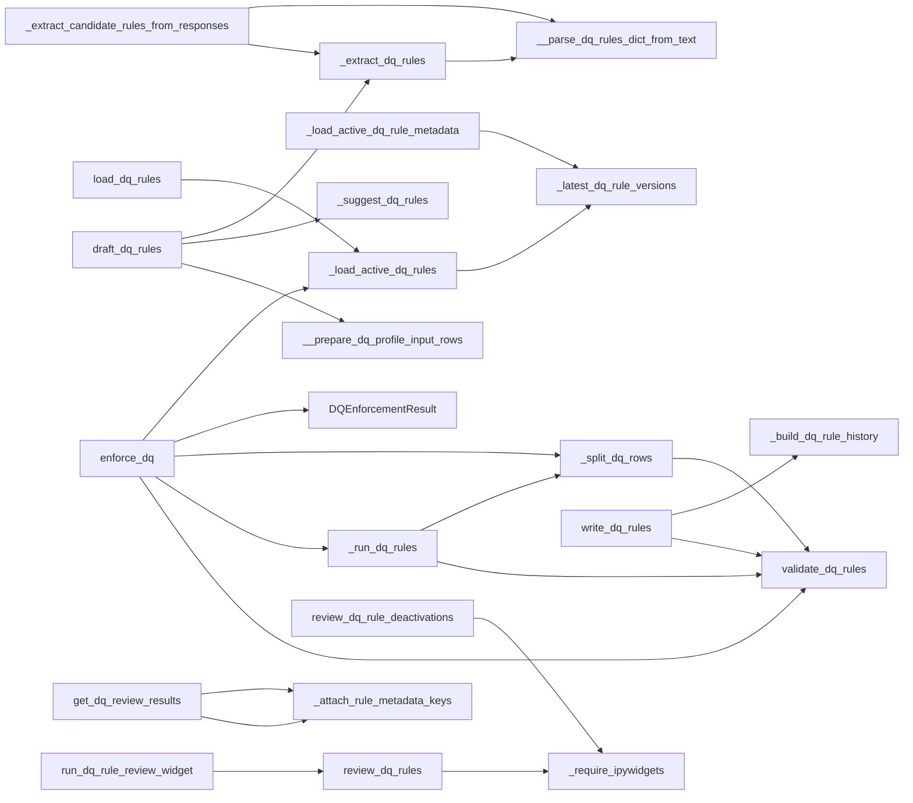
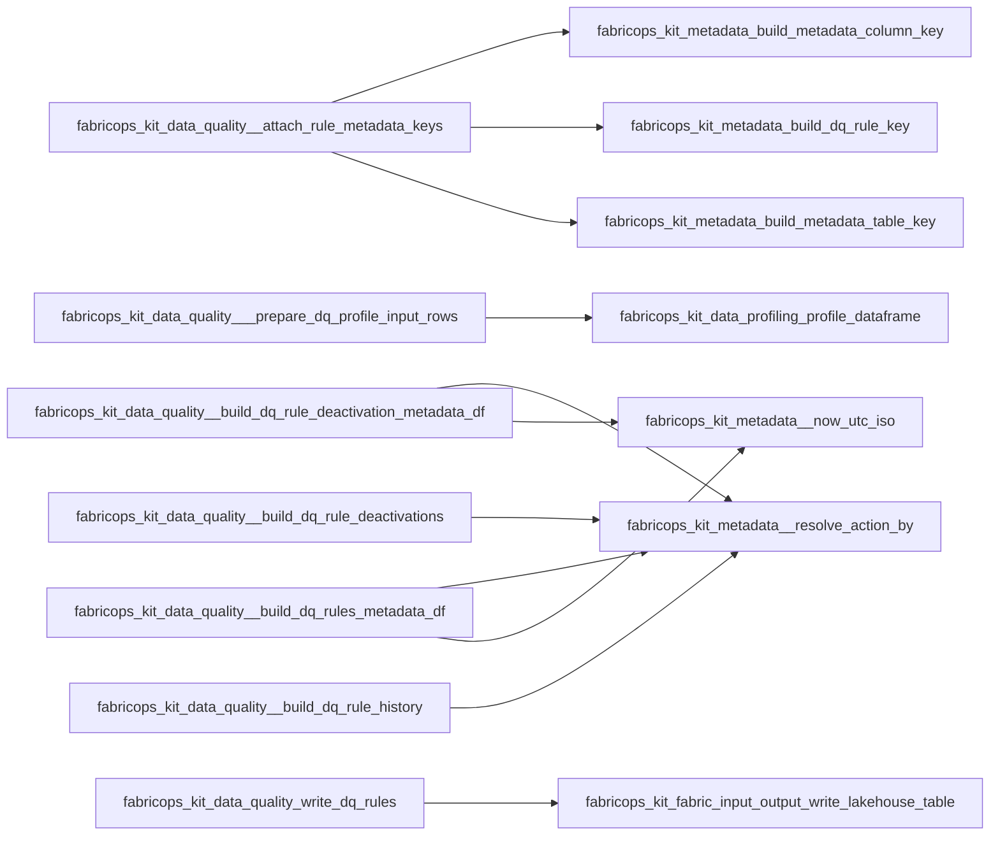

# `data_quality` module

  Module overview

## Module dependency summary

- **Essential:** 7
- **Optional:** 2
- **Internal:** 20
- **Depends On:** 3 modules
- **Used By:** 0 modules

## Essential callables

| Callable | Type | Summary | Related helpers |
|---|---|---|---|
| [`assert_dq_passed`](../../reference/assert_dq_passed/) | function | Raise only after evidence materialization when error-severity rules fail. | — |
| [`draft_dq_rules`](../../reference/draft_dq_rules/) | function | Draft candidate DQ rules from metadata profiles or raw DataFrame fallback. | [`__prepare_dq_profile_input_rows`](../../reference/internal/data_quality/__prepare_dq_profile_input_rows/) (internal), [`_extract_dq_rules`](../../reference/internal/data_quality/_extract_dq_rules/) (internal), [`_suggest_dq_rules`](../../reference/internal/data_quality/_suggest_dq_rules/) (internal) |
| [`enforce_dq`](../../reference/enforce_dq/) | function | Enforce approved DQ rules and return structured deterministic outputs. | [`_load_active_dq_rules`](../../reference/internal/data_quality/_load_active_dq_rules/) (internal), [`_run_dq_rules`](../../reference/internal/data_quality/_run_dq_rules/) (internal), [`_split_dq_rows`](../../reference/internal/data_quality/_split_dq_rows/) (internal) |
| [`get_dq_review_results`](../../reference/get_dq_review_results/) | function | Collect current approved/rejected DQ review results from widget state. | [`_attach_rule_metadata_keys`](../../reference/internal/data_quality/_attach_rule_metadata_keys/) (internal) |
| [`load_dq_rules`](../../reference/load_dq_rules/) | function | Load latest active approved DQ rules from append-only metadata history. | [`_load_active_dq_rules`](../../reference/internal/data_quality/_load_active_dq_rules/) (internal) |
| [`review_dq_rules`](../../reference/review_dq_rules/) | function | Review AI-suggested DQ rules sequentially with explicit approve/reject decisions. | [`_require_ipywidgets`](../../reference/internal/data_quality/_require_ipywidgets/) (internal) |
| [`write_dq_rules`](../../reference/write_dq_rules/) | function | Validate, build, and persist approved DQ rules. | [`_build_dq_rule_history`](../../reference/internal/data_quality/_build_dq_rule_history/) (internal) |

Split a Spark DataFrame into pass/quarantine outputs for row-level DQ rules.

## Optional callables

| Callable | Type | Summary | Related helpers |
|---|---|---|---|
| [`review_dq_rule_deactivations`](../../reference/review_dq_rule_deactivations/) | function | Review active DQ rules one at a time for governed deactivation actions. | [`_require_ipywidgets`](../../reference/internal/data_quality/_require_ipywidgets/) (internal) |
| [`validate_dq_rules`](../../reference/validate_dq_rules/) | function | Validate canonical DQ rules before enforcement. | — |

## Related internal helpers

| Helper | Related public callables |
|---|---|
| [`__parse_dq_rules_dict_from_text`](../../reference/internal/data_quality/__parse_dq_rules_dict_from_text/) | — |
| [`__prepare_dq_profile_input_rows`](../../reference/internal/data_quality/__prepare_dq_profile_input_rows/) | [`draft_dq_rules`](../../reference/draft_dq_rules/) |
| [`_approved_dq_rules_from_review_rows`](../../reference/internal/data_quality/_approved_dq_rules_from_review_rows/) | — |
| [`_attach_rule_metadata_keys`](../../reference/internal/data_quality/_attach_rule_metadata_keys/) | [`get_dq_review_results`](../../reference/get_dq_review_results/) |
| [`_build_dq_rule_deactivation_metadata_df`](../../reference/internal/data_quality/_build_dq_rule_deactivation_metadata_df/) | — |
| [`_build_dq_rule_deactivations`](../../reference/internal/data_quality/_build_dq_rule_deactivations/) | — |
| [`_build_dq_rule_history`](../../reference/internal/data_quality/_build_dq_rule_history/) | [`write_dq_rules`](../../reference/write_dq_rules/) |
| [`_build_dq_rules_metadata_df`](../../reference/internal/data_quality/_build_dq_rules_metadata_df/) | — |
| [`_extract_candidate_rules_from_responses`](../../reference/internal/data_quality/_extract_candidate_rules_from_responses/) | — |
| [`_extract_dq_rules`](../../reference/internal/data_quality/_extract_dq_rules/) | [`draft_dq_rules`](../../reference/draft_dq_rules/) |
| [`_latest_dq_rule_versions`](../../reference/internal/data_quality/_latest_dq_rule_versions/) | — |
| [`_load_active_dq_rule_metadata`](../../reference/internal/data_quality/_load_active_dq_rule_metadata/) | — |
| [`_load_active_dq_rules`](../../reference/internal/data_quality/_load_active_dq_rules/) | [`enforce_dq`](../../reference/enforce_dq/), [`load_dq_rules`](../../reference/load_dq_rules/) |
| [`_prepare_dq_profile_input_rows`](../../reference/internal/data_quality/_prepare_dq_profile_input_rows/) | — |
| [`_profile_for_dq`](../../reference/internal/data_quality/_profile_for_dq/) | — |
| [`_require_ipywidgets`](../../reference/internal/data_quality/_require_ipywidgets/) | [`review_dq_rule_deactivations`](../../reference/review_dq_rule_deactivations/), [`review_dq_rules`](../../reference/review_dq_rules/) |
| [`_run_dq_rules`](../../reference/internal/data_quality/_run_dq_rules/) | [`enforce_dq`](../../reference/enforce_dq/) |
| [`_split_dq_rows`](../../reference/internal/data_quality/_split_dq_rows/) | [`enforce_dq`](../../reference/enforce_dq/) |
| [`_suggest_dq_rules`](../../reference/internal/data_quality/_suggest_dq_rules/) | [`draft_dq_rules`](../../reference/draft_dq_rules/) |
| [`_suggest_dq_rules_with_fabric_ai`](../../reference/internal/data_quality/_suggest_dq_rules_with_fabric_ai/) | — |

## Module internal callable graph

## Cross-module callable graph

