# `drift` module

  Module overview

## Module dependency summary

Callable count: 4Outbound: 1Inbound: 0

## Module purpose

Owns schema/profile/data drift checks as engineering guardrails during pipeline runs.

## Public callables

<table>
  <thead>
    <tr>
      <th>Callable</th>
      <th>Tier</th>
      <th>Type</th>
      <th>Summary</th>
      <th>Related helpers</th>
    </tr>
  </thead>
  <tbody>
    <tr>
      <td><a href="../../reference/check_partition_drift/"><code>check_partition_drift</code></a></td>
      <td>Optional</td>
      <td>function</td>
      <td>Check partition-level drift using keys, partitions, and optional watermark baselines.</td>
      <td>—</td>
    </tr>
    <tr>
      <td><a href="../../reference/check_profile_drift/"><code>check_profile_drift</code></a></td>
      <td>Optional</td>
      <td>function</td>
      <td>Compare profile metrics against a baseline profile and drift thresholds.</td>
      <td>—</td>
    </tr>
    <tr>
      <td><a href="../../reference/check_schema_drift/"><code>check_schema_drift</code></a></td>
      <td>Optional</td>
      <td>function</td>
      <td>Compare a current dataframe schema against a baseline schema snapshot.</td>
      <td>—</td>
    </tr>
    <tr>
      <td><a href="../../reference/summarize_drift_results/"><code>summarize_drift_results</code></a></td>
      <td>Optional</td>
      <td>function</td>
      <td>Summarize schema, partition, and profile drift outcomes into one decision.</td>
      <td>—</td>
    </tr>
  </tbody>
</table>

## Advanced dependency sections

### Related internal helpers

Expand internal helper table

<table>
  <thead>
    <tr>
      <th>Helper</th>
      <th>Related public callables</th>
    </tr>
  </thead>
  <tbody>
    <tr>
      <td><a href="../../reference/internal/drift/_build_pandas_partition_snapshot/"><code>_build_pandas_partition_snapshot</code></a></td>
      <td>—</td>
    </tr>
    <tr>
      <td><a href="../../reference/internal/drift/_build_pandas_schema_snapshot/"><code>_build_pandas_schema_snapshot</code></a></td>
      <td>—</td>
    </tr>
    <tr>
      <td><a href="../../reference/internal/drift/_build_partition_hash/"><code>_build_partition_hash</code></a></td>
      <td>—</td>
    </tr>
    <tr>
      <td><a href="../../reference/internal/drift/_build_spark_partition_snapshot/"><code>_build_spark_partition_snapshot</code></a></td>
      <td>—</td>
    </tr>
    <tr>
      <td><a href="../../reference/internal/drift/_build_spark_schema_snapshot/"><code>_build_spark_schema_snapshot</code></a></td>
      <td>—</td>
    </tr>
    <tr>
      <td><a href="../../reference/internal/drift/_column_hash/"><code>_column_hash</code></a></td>
      <td>—</td>
    </tr>
    <tr>
      <td><a href="../../reference/internal/drift/_hash/"><code>_hash</code></a></td>
      <td>—</td>
    </tr>
    <tr>
      <td><a href="../../reference/internal/drift/_is_closed_partition/"><code>_is_closed_partition</code></a></td>
      <td>—</td>
    </tr>
    <tr>
      <td><a href="../../reference/internal/drift/_is_missing_table_error/"><code>_is_missing_table_error</code></a></td>
      <td>—</td>
    </tr>
    <tr>
      <td><a href="../../reference/internal/drift/_json_dumps/"><code>_json_dumps</code></a></td>
      <td>—</td>
    </tr>
    <tr>
      <td><a href="../../reference/internal/drift/_resolve_change_behavior/"><code>_resolve_change_behavior</code></a></td>
      <td>—</td>
    </tr>
    <tr>
      <td><a href="../../reference/internal/drift/_safe_spark_collect/"><code>_safe_spark_collect</code></a></td>
      <td>—</td>
    </tr>
    <tr>
      <td><a href="../../reference/internal/drift/_utc_now_iso/"><code>_utc_now_iso</code></a></td>
      <td>—</td>
    </tr>
    <tr>
      <td><a href="../../reference/internal/drift/_write_metadata_rows/"><code>_write_metadata_rows</code></a></td>
      <td>—</td>
    </tr>
  </tbody>
</table>

### Callable relationships

```mermaid
flowchart TB
  classDef currentModule fill:#ffe8cc,stroke:#e65100,stroke-width:4px,color:#3e2723;
  classDef externalModule fill:#f7f7f7,stroke:#b0bec5,stroke-width:1px,color:#607d8b;
  classDef currentCallable fill:#ffd180,stroke:#ef6c00,stroke-width:2px;
  classDef externalCallable fill:#eceff1,stroke:#b0bec5,stroke-width:1px,color:#455a64;
  subgraph m_drift[drift]
    fabricops_kit_drift__build_pandas_partition_snapshot["_build_pandas_partition_snapshot"]
    fabricops_kit_drift__build_pandas_schema_snapshot["_build_pandas_schema_snapshot"]
    fabricops_kit_drift__build_partition_hash["_build_partition_hash"]
    fabricops_kit_drift__build_spark_partition_snapshot["_build_spark_partition_snapshot"]
    fabricops_kit_drift__build_spark_schema_snapshot["_build_spark_schema_snapshot"]
    fabricops_kit_drift__column_hash["_column_hash"]
    fabricops_kit_drift__hash["_hash"]
    fabricops_kit_drift__is_closed_partition["_is_closed_partition"]
    fabricops_kit_drift__is_missing_table_error["_is_missing_table_error"]
    fabricops_kit_drift__json_dumps["_json_dumps"]
    fabricops_kit_drift__resolve_change_behavior["_resolve_change_behavior"]
    fabricops_kit_drift__safe_spark_collect["_safe_spark_collect"]
    fabricops_kit_drift__utc_now_iso["_utc_now_iso"]
    fabricops_kit_drift__write_metadata_rows["_write_metadata_rows"]
    fabricops_kit_drift_build_and_write_partition_snapshot["build_and_write_partition_snapshot"]
    fabricops_kit_drift_build_and_write_schema_snapshot["build_and_write_schema_snapshot"]
    fabricops_kit_drift_build_drift_evidence_record["build_drift_evidence_record"]
    fabricops_kit_drift_build_incremental_safety_records["build_incremental_safety_records"]
    fabricops_kit_drift_build_partition_snapshot["build_partition_snapshot"]
    fabricops_kit_drift_build_schema_snapshot["build_schema_snapshot"]
    fabricops_kit_drift_check_partition_drift["check_partition_drift"]
    fabricops_kit_drift_check_schema_drift["check_schema_drift"]
    fabricops_kit_drift_compare_partition_snapshots["compare_partition_snapshots"]
    fabricops_kit_drift_compare_schema_snapshots["compare_schema_snapshots"]
    fabricops_kit_drift_default_incremental_safety_policy["default_incremental_safety_policy"]
    fabricops_kit_drift_default_schema_drift_policy["default_schema_drift_policy"]
    fabricops_kit_drift_detect_dataframe_engine["detect_dataframe_engine"]
    fabricops_kit_drift_load_latest_partition_snapshot["load_latest_partition_snapshot"]
    fabricops_kit_drift_load_latest_schema_snapshot["load_latest_schema_snapshot"]
  end
  subgraph m__utils[_utils]
    fabricops_kit__utils__to_jsonable["_to_jsonable"]
  end
  fabricops_kit_drift__build_pandas_partition_snapshot --> fabricops_kit__utils__to_jsonable
  fabricops_kit_drift__build_pandas_partition_snapshot --> fabricops_kit_drift__build_partition_hash
  fabricops_kit_drift__build_pandas_partition_snapshot --> fabricops_kit_drift__hash
  fabricops_kit_drift__build_pandas_schema_snapshot --> fabricops_kit_drift__column_hash
  fabricops_kit_drift__build_partition_hash --> fabricops_kit_drift__hash
  fabricops_kit_drift__build_spark_partition_snapshot --> fabricops_kit__utils__to_jsonable
  fabricops_kit_drift__build_spark_partition_snapshot --> fabricops_kit_drift__build_partition_hash
  fabricops_kit_drift__build_spark_schema_snapshot --> fabricops_kit_drift__column_hash
  fabricops_kit_drift__json_dumps --> fabricops_kit__utils__to_jsonable
  fabricops_kit_drift_build_and_write_partition_snapshot --> fabricops_kit_drift__json_dumps
  fabricops_kit_drift_build_and_write_partition_snapshot --> fabricops_kit_drift__utc_now_iso
  fabricops_kit_drift_build_and_write_partition_snapshot --> fabricops_kit_drift__write_metadata_rows
  fabricops_kit_drift_build_and_write_partition_snapshot --> fabricops_kit_drift_build_partition_snapshot
  fabricops_kit_drift_build_and_write_schema_snapshot --> fabricops_kit_drift__json_dumps
  fabricops_kit_drift_build_and_write_schema_snapshot --> fabricops_kit_drift__utc_now_iso
  fabricops_kit_drift_build_and_write_schema_snapshot --> fabricops_kit_drift__write_metadata_rows
  fabricops_kit_drift_build_and_write_schema_snapshot --> fabricops_kit_drift_build_schema_snapshot
  fabricops_kit_drift_build_drift_evidence_record --> fabricops_kit_drift__json_dumps
  fabricops_kit_drift_build_drift_evidence_record --> fabricops_kit_drift__utc_now_iso
  fabricops_kit_drift_build_incremental_safety_records --> fabricops_kit__utils__to_jsonable
  fabricops_kit_drift_build_partition_snapshot --> fabricops_kit_drift__build_pandas_partition_snapshot
  fabricops_kit_drift_build_partition_snapshot --> fabricops_kit_drift__build_spark_partition_snapshot
  fabricops_kit_drift_build_partition_snapshot --> fabricops_kit_drift_detect_dataframe_engine
  fabricops_kit_drift_build_schema_snapshot --> fabricops_kit_drift__build_pandas_schema_snapshot
  fabricops_kit_drift_build_schema_snapshot --> fabricops_kit_drift__build_spark_schema_snapshot
  fabricops_kit_drift_build_schema_snapshot --> fabricops_kit_drift_detect_dataframe_engine
  fabricops_kit_drift_check_partition_drift --> fabricops_kit_drift_build_partition_snapshot
  fabricops_kit_drift_check_partition_drift --> fabricops_kit_drift_compare_partition_snapshots
  fabricops_kit_drift_check_partition_drift --> fabricops_kit_drift_default_incremental_safety_policy
  fabricops_kit_drift_check_schema_drift --> fabricops_kit_drift_build_schema_snapshot
  fabricops_kit_drift_check_schema_drift --> fabricops_kit_drift_compare_schema_snapshots
  fabricops_kit_drift_check_schema_drift --> fabricops_kit_drift_default_schema_drift_policy
  fabricops_kit_drift_compare_partition_snapshots --> fabricops_kit__utils__to_jsonable
  fabricops_kit_drift_compare_partition_snapshots --> fabricops_kit_drift__is_closed_partition
  fabricops_kit_drift_compare_partition_snapshots --> fabricops_kit_drift_default_incremental_safety_policy
  fabricops_kit_drift_compare_schema_snapshots --> fabricops_kit_drift__resolve_change_behavior
  fabricops_kit_drift_compare_schema_snapshots --> fabricops_kit_drift_default_schema_drift_policy
  fabricops_kit_drift_load_latest_partition_snapshot --> fabricops_kit_drift__is_missing_table_error
  fabricops_kit_drift_load_latest_partition_snapshot --> fabricops_kit_drift__safe_spark_collect
  fabricops_kit_drift_load_latest_schema_snapshot --> fabricops_kit_drift__is_missing_table_error
  fabricops_kit_drift_load_latest_schema_snapshot --> fabricops_kit_drift__safe_spark_collect
  linkStyle 1,2,3,4,6,7,9,10,11,12,13,14,15,16,17,18,20,21,22,23,24,25,26,27,28,29,30,31,33,34,35,36,37,38,39,40 stroke:#ef6c00,stroke-width:2.2px;
  linkStyle 0,5,8,19,32 stroke:#90a4ae,stroke-width:1.2px,stroke-dasharray: 4 2;
  class m_drift currentModule;
  class m__utils externalModule;
  class fabricops_kit_drift__build_pandas_partition_snapshot,fabricops_kit_drift__build_pandas_schema_snapshot,fabricops_kit_drift__build_partition_hash,fabricops_kit_drift__build_spark_partition_snapshot,fabricops_kit_drift__build_spark_schema_snapshot,fabricops_kit_drift__column_hash,fabricops_kit_drift__hash,fabricops_kit_drift__is_closed_partition,fabricops_kit_drift__is_missing_table_error,fabricops_kit_drift__json_dumps,fabricops_kit_drift__resolve_change_behavior,fabricops_kit_drift__safe_spark_collect,fabricops_kit_drift__utc_now_iso,fabricops_kit_drift__write_metadata_rows,fabricops_kit_drift_build_and_write_partition_snapshot,fabricops_kit_drift_build_and_write_schema_snapshot,fabricops_kit_drift_build_drift_evidence_record,fabricops_kit_drift_build_incremental_safety_records,fabricops_kit_drift_build_partition_snapshot,fabricops_kit_drift_build_schema_snapshot,fabricops_kit_drift_check_partition_drift,fabricops_kit_drift_check_schema_drift,fabricops_kit_drift_compare_partition_snapshots,fabricops_kit_drift_compare_schema_snapshots,fabricops_kit_drift_default_incremental_safety_policy,fabricops_kit_drift_default_schema_drift_policy,fabricops_kit_drift_detect_dataframe_engine,fabricops_kit_drift_load_latest_partition_snapshot,fabricops_kit_drift_load_latest_schema_snapshot currentCallable;
  class fabricops_kit__utils__to_jsonable externalCallable;
```

#### Inside this module

<a class="reference-chip" href="../modules/drift/#_build_pandas_partition_snapshot"><code>_build_pandas_partition_snapshot</code></a> → <a class="reference-chip" href="../modules/drift/#_build_partition_hash"><code>_build_partition_hash</code></a>
<a class="reference-chip" href="../modules/drift/#_build_pandas_partition_snapshot"><code>_build_pandas_partition_snapshot</code></a> → <a class="reference-chip" href="../modules/drift/#_hash"><code>_hash</code></a>
<a class="reference-chip" href="../modules/drift/#_build_pandas_schema_snapshot"><code>_build_pandas_schema_snapshot</code></a> → <a class="reference-chip" href="../modules/drift/#_column_hash"><code>_column_hash</code></a>
<a class="reference-chip" href="../modules/drift/#_build_partition_hash"><code>_build_partition_hash</code></a> → <a class="reference-chip" href="../modules/drift/#_hash"><code>_hash</code></a>
<a class="reference-chip" href="../modules/drift/#_build_spark_partition_snapshot"><code>_build_spark_partition_snapshot</code></a> → <a class="reference-chip" href="../modules/drift/#_build_partition_hash"><code>_build_partition_hash</code></a>
<a class="reference-chip" href="../modules/drift/#_build_spark_schema_snapshot"><code>_build_spark_schema_snapshot</code></a> → <a class="reference-chip" href="../modules/drift/#_column_hash"><code>_column_hash</code></a>
<a class="reference-chip" href="../modules/drift/#build_and_write_partition_snapshot"><code>build_and_write_partition_snapshot</code></a> → <a class="reference-chip" href="../modules/drift/#_json_dumps"><code>_json_dumps</code></a>
<a class="reference-chip" href="../modules/drift/#build_and_write_partition_snapshot"><code>build_and_write_partition_snapshot</code></a> → <a class="reference-chip" href="../modules/drift/#_utc_now_iso"><code>_utc_now_iso</code></a>
<a class="reference-chip" href="../modules/drift/#build_and_write_partition_snapshot"><code>build_and_write_partition_snapshot</code></a> → <a class="reference-chip" href="../modules/drift/#_write_metadata_rows"><code>_write_metadata_rows</code></a>
<a class="reference-chip" href="../modules/drift/#build_and_write_partition_snapshot"><code>build_and_write_partition_snapshot</code></a> → <a class="reference-chip" href="../modules/drift/#build_partition_snapshot"><code>build_partition_snapshot</code></a>
<a class="reference-chip" href="../modules/drift/#build_and_write_schema_snapshot"><code>build_and_write_schema_snapshot</code></a> → <a class="reference-chip" href="../modules/drift/#_json_dumps"><code>_json_dumps</code></a>
<a class="reference-chip" href="../modules/drift/#build_and_write_schema_snapshot"><code>build_and_write_schema_snapshot</code></a> → <a class="reference-chip" href="../modules/drift/#_utc_now_iso"><code>_utc_now_iso</code></a>
<a class="reference-chip" href="../modules/drift/#build_and_write_schema_snapshot"><code>build_and_write_schema_snapshot</code></a> → <a class="reference-chip" href="../modules/drift/#_write_metadata_rows"><code>_write_metadata_rows</code></a>
<a class="reference-chip" href="../modules/drift/#build_and_write_schema_snapshot"><code>build_and_write_schema_snapshot</code></a> → <a class="reference-chip" href="../modules/drift/#build_schema_snapshot"><code>build_schema_snapshot</code></a>
<a class="reference-chip" href="../modules/drift/#build_drift_evidence_record"><code>build_drift_evidence_record</code></a> → <a class="reference-chip" href="../modules/drift/#_json_dumps"><code>_json_dumps</code></a>
<a class="reference-chip" href="../modules/drift/#build_drift_evidence_record"><code>build_drift_evidence_record</code></a> → <a class="reference-chip" href="../modules/drift/#_utc_now_iso"><code>_utc_now_iso</code></a>
<a class="reference-chip" href="../modules/drift/#build_partition_snapshot"><code>build_partition_snapshot</code></a> → <a class="reference-chip" href="../modules/drift/#_build_pandas_partition_snapshot"><code>_build_pandas_partition_snapshot</code></a>
<a class="reference-chip" href="../modules/drift/#build_partition_snapshot"><code>build_partition_snapshot</code></a> → <a class="reference-chip" href="../modules/drift/#_build_spark_partition_snapshot"><code>_build_spark_partition_snapshot</code></a>
<a class="reference-chip" href="../modules/drift/#build_partition_snapshot"><code>build_partition_snapshot</code></a> → <a class="reference-chip" href="../modules/drift/#detect_dataframe_engine"><code>detect_dataframe_engine</code></a>
<a class="reference-chip" href="../modules/drift/#build_schema_snapshot"><code>build_schema_snapshot</code></a> → <a class="reference-chip" href="../modules/drift/#_build_pandas_schema_snapshot"><code>_build_pandas_schema_snapshot</code></a>
<a class="reference-chip" href="../modules/drift/#build_schema_snapshot"><code>build_schema_snapshot</code></a> → <a class="reference-chip" href="../modules/drift/#_build_spark_schema_snapshot"><code>_build_spark_schema_snapshot</code></a>
<a class="reference-chip" href="../modules/drift/#build_schema_snapshot"><code>build_schema_snapshot</code></a> → <a class="reference-chip" href="../modules/drift/#detect_dataframe_engine"><code>detect_dataframe_engine</code></a>
<a class="reference-chip" href="../../reference/check_partition_drift/"><code>check_partition_drift</code></a> → <a class="reference-chip" href="../modules/drift/#build_partition_snapshot"><code>build_partition_snapshot</code></a>
<a class="reference-chip" href="../../reference/check_partition_drift/"><code>check_partition_drift</code></a> → <a class="reference-chip" href="../modules/drift/#compare_partition_snapshots"><code>compare_partition_snapshots</code></a>
<a class="reference-chip" href="../../reference/check_partition_drift/"><code>check_partition_drift</code></a> → <a class="reference-chip" href="../modules/drift/#default_incremental_safety_policy"><code>default_incremental_safety_policy</code></a>
<a class="reference-chip" href="../../reference/check_schema_drift/"><code>check_schema_drift</code></a> → <a class="reference-chip" href="../modules/drift/#build_schema_snapshot"><code>build_schema_snapshot</code></a>
<a class="reference-chip" href="../../reference/check_schema_drift/"><code>check_schema_drift</code></a> → <a class="reference-chip" href="../modules/drift/#compare_schema_snapshots"><code>compare_schema_snapshots</code></a>
<a class="reference-chip" href="../../reference/check_schema_drift/"><code>check_schema_drift</code></a> → <a class="reference-chip" href="../modules/drift/#default_schema_drift_policy"><code>default_schema_drift_policy</code></a>
<a class="reference-chip" href="../modules/drift/#compare_partition_snapshots"><code>compare_partition_snapshots</code></a> → <a class="reference-chip" href="../modules/drift/#_is_closed_partition"><code>_is_closed_partition</code></a>
<a class="reference-chip" href="../modules/drift/#compare_partition_snapshots"><code>compare_partition_snapshots</code></a> → <a class="reference-chip" href="../modules/drift/#default_incremental_safety_policy"><code>default_incremental_safety_policy</code></a>
<a class="reference-chip" href="../modules/drift/#compare_schema_snapshots"><code>compare_schema_snapshots</code></a> → <a class="reference-chip" href="../modules/drift/#_resolve_change_behavior"><code>_resolve_change_behavior</code></a>
<a class="reference-chip" href="../modules/drift/#compare_schema_snapshots"><code>compare_schema_snapshots</code></a> → <a class="reference-chip" href="../modules/drift/#default_schema_drift_policy"><code>default_schema_drift_policy</code></a>
<a class="reference-chip" href="../modules/drift/#load_latest_partition_snapshot"><code>load_latest_partition_snapshot</code></a> → <a class="reference-chip" href="../modules/drift/#_is_missing_table_error"><code>_is_missing_table_error</code></a>
<a class="reference-chip" href="../modules/drift/#load_latest_partition_snapshot"><code>load_latest_partition_snapshot</code></a> → <a class="reference-chip" href="../modules/drift/#_safe_spark_collect"><code>_safe_spark_collect</code></a>
<a class="reference-chip" href="../modules/drift/#load_latest_schema_snapshot"><code>load_latest_schema_snapshot</code></a> → <a class="reference-chip" href="../modules/drift/#_is_missing_table_error"><code>_is_missing_table_error</code></a>
<a class="reference-chip" href="../modules/drift/#load_latest_schema_snapshot"><code>load_latest_schema_snapshot</code></a> → <a class="reference-chip" href="../modules/drift/#_safe_spark_collect"><code>_safe_spark_collect</code></a>

#### Used by other modules

None.
#### Uses other modules

<code>_utils</code> (5)

