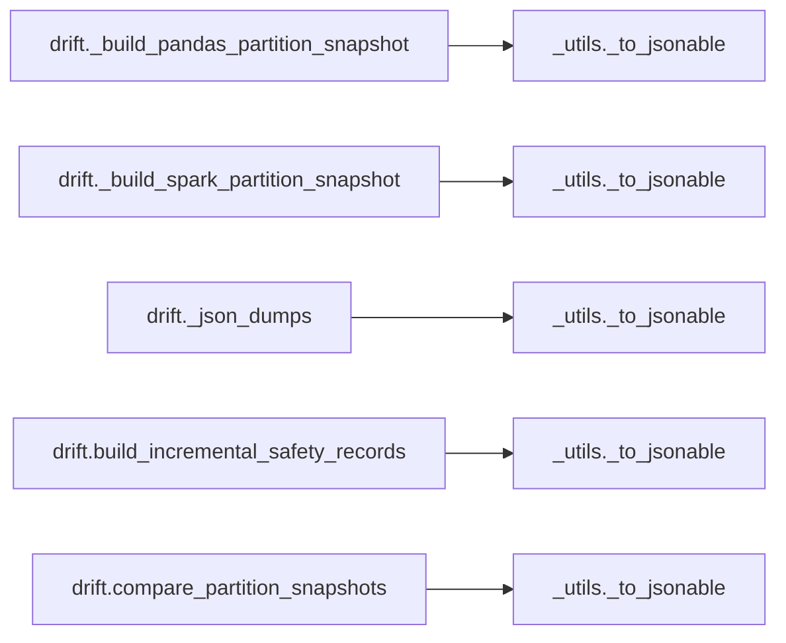

```mermaid
flowchart LR
  n1["drift._build_pandas_partition_snapshot"] --> n1b["drift._build_partition_hash"]
  n2["drift._build_pandas_partition_snapshot"] --> n2b["drift._hash"]
  n3["drift._build_pandas_schema_snapshot"] --> n3b["drift._column_hash"]
  n4["drift._build_partition_hash"] --> n4b["drift._hash"]
  n5["drift._build_spark_partition_snapshot"] --> n5b["drift._build_partition_hash"]
  n6["drift._build_spark_schema_snapshot"] --> n6b["drift._column_hash"]
  n7["drift.build_and_write_partition_snapshot"] --> n7b["drift._json_dumps"]
  n8["drift.build_and_write_partition_snapshot"] --> n8b["drift._utc_now_iso"]
  n9["drift.build_and_write_partition_snapshot"] --> n9b["drift._write_metadata_rows"]
  n10["drift.build_and_write_partition_snapshot"] --> n10b["drift.build_partition_snapshot"]
  n11["drift.build_and_write_schema_snapshot"] --> n11b["drift._json_dumps"]
  n12["drift.build_and_write_schema_snapshot"] --> n12b["drift._utc_now_iso"]
  n13["drift.build_and_write_schema_snapshot"] --> n13b["drift._write_metadata_rows"]
  n14["drift.build_and_write_schema_snapshot"] --> n14b["drift.build_schema_snapshot"]
  n15["drift.build_drift_evidence_record"] --> n15b["drift._json_dumps"]
  n16["drift.build_drift_evidence_record"] --> n16b["drift._utc_now_iso"]
  n17["drift.build_partition_snapshot"] --> n17b["drift._build_pandas_partition_snapshot"]
  n18["drift.build_partition_snapshot"] --> n18b["drift._build_spark_partition_snapshot"]
  n19["drift.build_partition_snapshot"] --> n19b["drift.detect_dataframe_engine"]
  n20["drift.build_schema_snapshot"] --> n20b["drift._build_pandas_schema_snapshot"]
  n21["drift.build_schema_snapshot"] --> n21b["drift._build_spark_schema_snapshot"]
  n22["drift.build_schema_snapshot"] --> n22b["drift.detect_dataframe_engine"]
  n23["drift.check_partition_drift"] --> n23b["drift.build_partition_snapshot"]
  n24["drift.check_partition_drift"] --> n24b["drift.compare_partition_snapshots"]
  n25["drift.check_partition_drift"] --> n25b["drift.default_incremental_safety_policy"]
  n26["drift.check_schema_drift"] --> n26b["drift.build_schema_snapshot"]
  n27["drift.check_schema_drift"] --> n27b["drift.compare_schema_snapshots"]
  n28["drift.check_schema_drift"] --> n28b["drift.default_schema_drift_policy"]
  n29["drift.compare_partition_snapshots"] --> n29b["drift._is_closed_partition"]
  n30["drift.compare_partition_snapshots"] --> n30b["drift.default_incremental_safety_policy"]
  n31["drift.compare_schema_snapshots"] --> n31b["drift._resolve_change_behavior"]
  n32["drift.compare_schema_snapshots"] --> n32b["drift.default_schema_drift_policy"]
  n33["drift.load_latest_partition_snapshot"] --> n33b["drift._is_missing_table_error"]
  n34["drift.load_latest_partition_snapshot"] --> n34b["drift._safe_spark_collect"]
  n35["drift.load_latest_schema_snapshot"] --> n35b["drift._is_missing_table_error"]
  n36["drift.load_latest_schema_snapshot"] --> n36b["drift._safe_spark_collect"]
```

# `drift` module

  Module overview

## Module dependency summary

Callable count: 4Outbound: 1Inbound: 0

## Module purpose

Owns schema/profile/data drift checks as engineering guardrails during pipeline runs.

## Public callables

<table>
  <thead>
    <tr>
      <th>Callable</th>
      <th>Tier</th>
      <th>Type</th>
      <th>Summary</th>
      <th>Related helpers</th>
    </tr>
  </thead>
  <tbody>
    <tr>
      <td><a href="../../reference/check_partition_drift/"><code>check_partition_drift</code></a></td>
      <td>Optional</td>
      <td>function</td>
      <td>Check partition-level drift using keys, partitions, and optional watermark baselines.</td>
      <td>—</td>
    </tr>
    <tr>
      <td><a href="../../reference/check_profile_drift/"><code>check_profile_drift</code></a></td>
      <td>Optional</td>
      <td>function</td>
      <td>Compare profile metrics against a baseline profile and drift thresholds.</td>
      <td>—</td>
    </tr>
    <tr>
      <td><a href="../../reference/check_schema_drift/"><code>check_schema_drift</code></a></td>
      <td>Optional</td>
      <td>function</td>
      <td>Compare a current dataframe schema against a baseline schema snapshot.</td>
      <td>—</td>
    </tr>
    <tr>
      <td><a href="../../reference/summarize_drift_results/"><code>summarize_drift_results</code></a></td>
      <td>Optional</td>
      <td>function</td>
      <td>Summarize schema, partition, and profile drift outcomes into one decision.</td>
      <td>—</td>
    </tr>
  </tbody>
</table>

## Advanced dependency sections

### Related internal helpers

Expand internal helper table

<table>
  <thead>
    <tr>
      <th>Helper</th>
      <th>Related public callables</th>
    </tr>
  </thead>
  <tbody>
    <tr>
      <td><a href="../../reference/internal/drift/_build_pandas_partition_snapshot/"><code>_build_pandas_partition_snapshot</code></a></td>
      <td>—</td>
    </tr>
    <tr>
      <td><a href="../../reference/internal/drift/_build_pandas_schema_snapshot/"><code>_build_pandas_schema_snapshot</code></a></td>
      <td>—</td>
    </tr>
    <tr>
      <td><a href="../../reference/internal/drift/_build_partition_hash/"><code>_build_partition_hash</code></a></td>
      <td>—</td>
    </tr>
    <tr>
      <td><a href="../../reference/internal/drift/_build_spark_partition_snapshot/"><code>_build_spark_partition_snapshot</code></a></td>
      <td>—</td>
    </tr>
    <tr>
      <td><a href="../../reference/internal/drift/_build_spark_schema_snapshot/"><code>_build_spark_schema_snapshot</code></a></td>
      <td>—</td>
    </tr>
    <tr>
      <td><a href="../../reference/internal/drift/_column_hash/"><code>_column_hash</code></a></td>
      <td>—</td>
    </tr>
    <tr>
      <td><a href="../../reference/internal/drift/_hash/"><code>_hash</code></a></td>
      <td>—</td>
    </tr>
    <tr>
      <td><a href="../../reference/internal/drift/_is_closed_partition/"><code>_is_closed_partition</code></a></td>
      <td>—</td>
    </tr>
    <tr>
      <td><a href="../../reference/internal/drift/_is_missing_table_error/"><code>_is_missing_table_error</code></a></td>
      <td>—</td>
    </tr>
    <tr>
      <td><a href="../../reference/internal/drift/_json_dumps/"><code>_json_dumps</code></a></td>
      <td>—</td>
    </tr>
    <tr>
      <td><a href="../../reference/internal/drift/_resolve_change_behavior/"><code>_resolve_change_behavior</code></a></td>
      <td>—</td>
    </tr>
    <tr>
      <td><a href="../../reference/internal/drift/_safe_spark_collect/"><code>_safe_spark_collect</code></a></td>
      <td>—</td>
    </tr>
    <tr>
      <td><a href="../../reference/internal/drift/_utc_now_iso/"><code>_utc_now_iso</code></a></td>
      <td>—</td>
    </tr>
    <tr>
      <td><a href="../../reference/internal/drift/_write_metadata_rows/"><code>_write_metadata_rows</code></a></td>
      <td>—</td>
    </tr>
  </tbody>
</table>

### Module internal callable dependencies

Expand module internal callable graph

### Outbound

