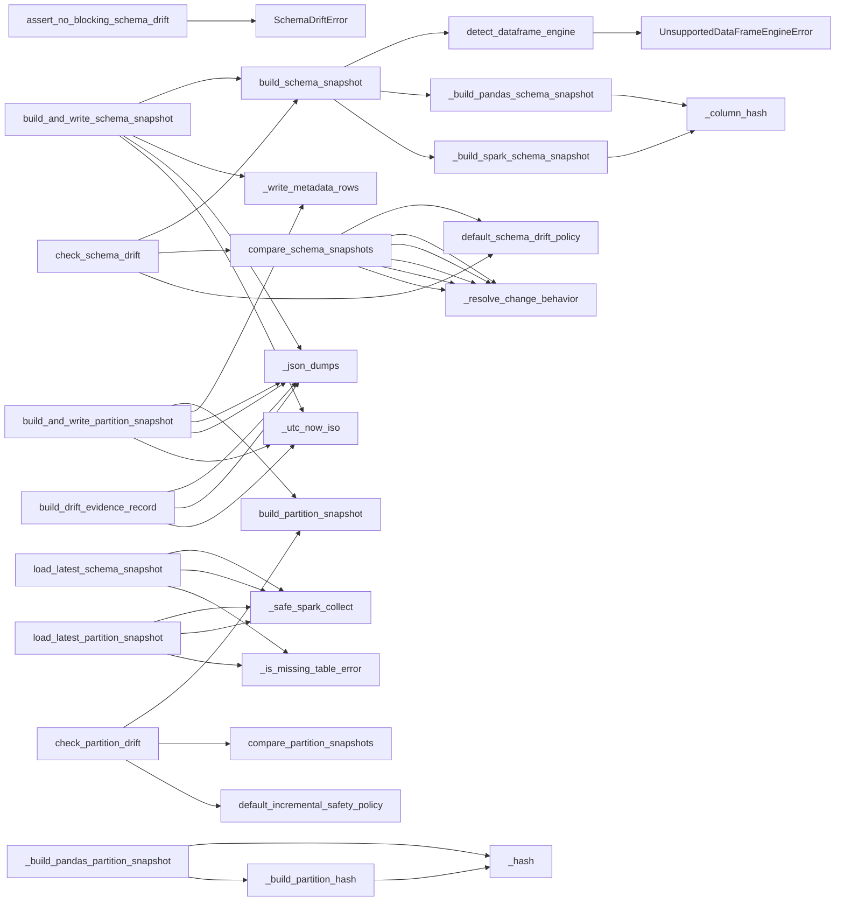
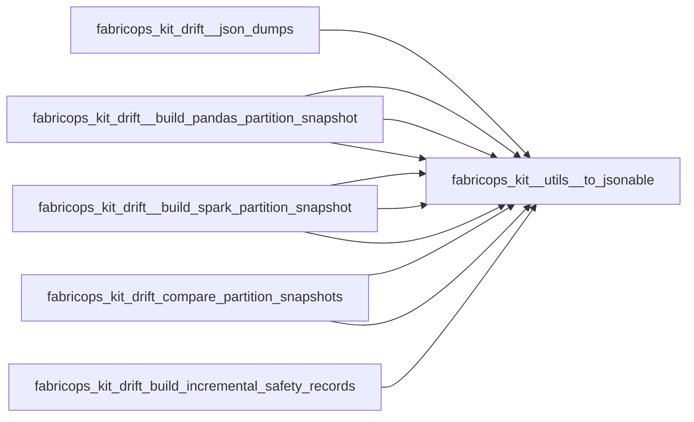

# `drift` module

  Module overview

## Module dependency summary

- **Essential:** 0
- **Optional:** 4
- **Internal:** 14
- **Depends On:** 1 modules
- **Used By:** 0 modules

## Essential callables

| Callable | Type | Summary | Related helpers |
|---|---|---|---|
| — | — | No recommended entrypoints configured. | — |

## Optional callables

| Callable | Type | Summary | Related helpers |
|---|---|---|---|
| [`check_partition_drift`](../../reference/check_partition_drift/) | function | Check partition-level drift using keys, partitions, and optional watermark baselines. | — |
| [`check_profile_drift`](../../reference/check_profile_drift/) | function | Compare profile metrics against a baseline profile and drift thresholds. | — |
| [`check_schema_drift`](../../reference/check_schema_drift/) | function | Compare a current dataframe schema against a baseline schema snapshot. | — |
| [`summarize_drift_results`](../../reference/summarize_drift_results/) | function | Summarize schema, partition, and profile drift outcomes into one decision. | — |

## Related internal helpers

| Helper | Related public callables |
|---|---|
| [`_build_pandas_partition_snapshot`](../../reference/internal/drift/_build_pandas_partition_snapshot/) | — |
| [`_build_pandas_schema_snapshot`](../../reference/internal/drift/_build_pandas_schema_snapshot/) | — |
| [`_build_partition_hash`](../../reference/internal/drift/_build_partition_hash/) | — |
| [`_build_spark_partition_snapshot`](../../reference/internal/drift/_build_spark_partition_snapshot/) | — |
| [`_build_spark_schema_snapshot`](../../reference/internal/drift/_build_spark_schema_snapshot/) | — |
| [`_column_hash`](../../reference/internal/drift/_column_hash/) | — |
| [`_hash`](../../reference/internal/drift/_hash/) | — |
| [`_is_closed_partition`](../../reference/internal/drift/_is_closed_partition/) | — |
| [`_is_missing_table_error`](../../reference/internal/drift/_is_missing_table_error/) | — |
| [`_json_dumps`](../../reference/internal/drift/_json_dumps/) | — |
| [`_resolve_change_behavior`](../../reference/internal/drift/_resolve_change_behavior/) | — |
| [`_safe_spark_collect`](../../reference/internal/drift/_safe_spark_collect/) | — |
| [`_utc_now_iso`](../../reference/internal/drift/_utc_now_iso/) | — |
| [`_write_metadata_rows`](../../reference/internal/drift/_write_metadata_rows/) | — |

## Module internal callable graph

## Cross-module callable graph

