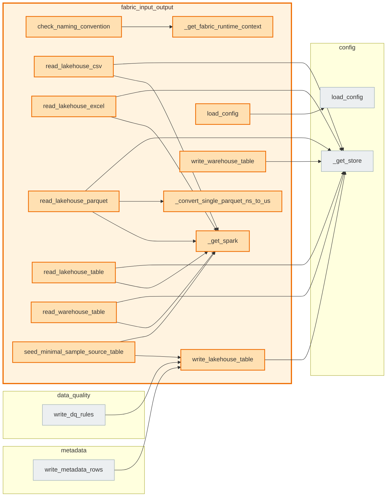

# `fabric_input_output` module

  Module overview

## Module dependency summary

Callable count: 8Outbound: 1Inbound: 2

## Module purpose

Owns Fabric read/write helpers for Lakehouse, Warehouse, and file/table IO.

## Public callables

<table>
  <thead>
    <tr>
      <th>Callable</th>
      <th>Tier</th>
      <th>Type</th>
      <th>Summary</th>
      <th>Related helpers</th>
    </tr>
  </thead>
  <tbody>
    <tr>
      <td><a href="../../reference/read_lakehouse_table/"><code>read_lakehouse_table</code></a></td>
      <td>Essential</td>
      <td>function</td>
      <td>Read a Delta table from a Fabric lakehouse.</td>
      <td><a href="../../reference/internal/fabric_input_output/_get_spark/"><code>_get_spark</code></a> (internal)</td>
    </tr>
    <tr>
      <td><a href="../../reference/read_warehouse_table/"><code>read_warehouse_table</code></a></td>
      <td>Essential</td>
      <td>function</td>
      <td>Read a table from a Microsoft Fabric warehouse.</td>
      <td><a href="../../reference/internal/fabric_input_output/_get_spark/"><code>_get_spark</code></a> (internal)</td>
    </tr>
    <tr>
      <td><a href="../../reference/write_lakehouse_table/"><code>write_lakehouse_table</code></a></td>
      <td>Essential</td>
      <td>function</td>
      <td>Write a Spark DataFrame to a Fabric lakehouse Delta table.</td>
      <td>—</td>
    </tr>
    <tr>
      <td><a href="../../reference/write_warehouse_table/"><code>write_warehouse_table</code></a></td>
      <td>Essential</td>
      <td>function</td>
      <td>Write a Spark DataFrame to a Microsoft Fabric warehouse table.</td>
      <td>—</td>
    </tr>
    <tr>
      <td><a href="../../reference/read_lakehouse_csv/"><code>read_lakehouse_csv</code></a></td>
      <td>Optional</td>
      <td>function</td>
      <td>Read a CSV file from a Fabric lakehouse Files path.</td>
      <td><a href="../../reference/internal/fabric_input_output/_get_spark/"><code>_get_spark</code></a> (internal)</td>
    </tr>
    <tr>
      <td><a href="../../reference/read_lakehouse_excel/"><code>read_lakehouse_excel</code></a></td>
      <td>Optional</td>
      <td>function</td>
      <td>Read an Excel file from a Fabric lakehouse Files path.</td>
      <td><a href="../../reference/internal/fabric_input_output/_get_spark/"><code>_get_spark</code></a> (internal)</td>
    </tr>
    <tr>
      <td><a href="../../reference/read_lakehouse_parquet/"><code>read_lakehouse_parquet</code></a></td>
      <td>Optional</td>
      <td>function</td>
      <td>Read a Parquet file from a Fabric lakehouse Files path.</td>
      <td><a href="../../reference/internal/fabric_input_output/_convert_single_parquet_ns_to_us/"><code>_convert_single_parquet_ns_to_us</code></a> (internal), <a href="../../reference/internal/fabric_input_output/_get_spark/"><code>_get_spark</code></a> (internal)</td>
    </tr>
  </tbody>
</table>

## Advanced dependency sections

### Related internal helpers

<table>
  <thead>
    <tr>
      <th>Helper</th>
      <th>Related public callables</th>
    </tr>
  </thead>
  <tbody>
    <tr>
      <td><a href="../../reference/internal/fabric_input_output/_convert_single_parquet_ns_to_us/"><code>_convert_single_parquet_ns_to_us</code></a></td>
      <td><a href="../../reference/read_lakehouse_parquet/"><code>read_lakehouse_parquet</code></a></td>
    </tr>
    <tr>
      <td><a href="../../reference/internal/fabric_input_output/_get_fabric_runtime_context/"><code>_get_fabric_runtime_context</code></a></td>
      <td>—</td>
    </tr>
    <tr>
      <td><a href="../../reference/internal/fabric_input_output/_get_spark/"><code>_get_spark</code></a></td>
      <td><a href="../../reference/read_lakehouse_csv/"><code>read_lakehouse_csv</code></a>, <a href="../../reference/read_lakehouse_excel/"><code>read_lakehouse_excel</code></a>, <a href="../../reference/read_lakehouse_parquet/"><code>read_lakehouse_parquet</code></a>, <a href="../../reference/read_lakehouse_table/"><code>read_lakehouse_table</code></a>, <a href="../../reference/read_warehouse_table/"><code>read_warehouse_table</code></a></td>
    </tr>
  </tbody>
</table>

### Inside this module, used by, and uses

#### Inside this module

<a class="reference-chip" href="../modules/fabric_input_output/#check_naming_convention"><code>check_naming_convention</code></a> → <a class="reference-chip" href="../modules/fabric_input_output/#_get_fabric_runtime_context"><code>_get_fabric_runtime_context</code></a>
<a class="reference-chip" href="../../reference/read_lakehouse_csv/"><code>read_lakehouse_csv</code></a> → <a class="reference-chip" href="../modules/fabric_input_output/#_get_spark"><code>_get_spark</code></a>
<a class="reference-chip" href="../../reference/read_lakehouse_excel/"><code>read_lakehouse_excel</code></a> → <a class="reference-chip" href="../modules/fabric_input_output/#_get_spark"><code>_get_spark</code></a>
<a class="reference-chip" href="../../reference/read_lakehouse_parquet/"><code>read_lakehouse_parquet</code></a> → <a class="reference-chip" href="../modules/fabric_input_output/#_convert_single_parquet_ns_to_us"><code>_convert_single_parquet_ns_to_us</code></a>
<a class="reference-chip" href="../../reference/read_lakehouse_parquet/"><code>read_lakehouse_parquet</code></a> → <a class="reference-chip" href="../modules/fabric_input_output/#_get_spark"><code>_get_spark</code></a>
<a class="reference-chip" href="../../reference/read_lakehouse_table/"><code>read_lakehouse_table</code></a> → <a class="reference-chip" href="../modules/fabric_input_output/#_get_spark"><code>_get_spark</code></a>
<a class="reference-chip" href="../../reference/read_warehouse_table/"><code>read_warehouse_table</code></a> → <a class="reference-chip" href="../modules/fabric_input_output/#_get_spark"><code>_get_spark</code></a>
<a class="reference-chip" href="../modules/fabric_input_output/#seed_minimal_sample_source_table"><code>seed_minimal_sample_source_table</code></a> → <a class="reference-chip" href="../modules/fabric_input_output/#_get_spark"><code>_get_spark</code></a>
<a class="reference-chip" href="../modules/fabric_input_output/#seed_minimal_sample_source_table"><code>seed_minimal_sample_source_table</code></a> → <a class="reference-chip" href="../../reference/write_lakehouse_table/"><code>write_lakehouse_table</code></a>

#### Used by

<a class="reference-chip" href="../../reference/write_dq_rules/"><code>write_dq_rules</code></a> → <a class="reference-chip" href="../../reference/write_lakehouse_table/"><code>write_lakehouse_table</code></a>
<a class="reference-chip" href="../modules/metadata/#write_metadata_rows"><code>write_metadata_rows</code></a> → <a class="reference-chip" href="../../reference/write_lakehouse_table/"><code>write_lakehouse_table</code></a>

#### Uses

<a class="reference-chip" href="../../reference/load_config/"><code>load_config</code></a> → <a class="reference-chip" href="../../reference/load_config/"><code>load_config</code></a>
<a class="reference-chip" href="../../reference/read_lakehouse_csv/"><code>read_lakehouse_csv</code></a> → <a class="reference-chip" href="../modules/config/#_get_store"><code>_get_store</code></a>
<a class="reference-chip" href="../../reference/read_lakehouse_excel/"><code>read_lakehouse_excel</code></a> → <a class="reference-chip" href="../modules/config/#_get_store"><code>_get_store</code></a>
<a class="reference-chip" href="../../reference/read_lakehouse_parquet/"><code>read_lakehouse_parquet</code></a> → <a class="reference-chip" href="../modules/config/#_get_store"><code>_get_store</code></a>
<a class="reference-chip" href="../../reference/read_lakehouse_table/"><code>read_lakehouse_table</code></a> → <a class="reference-chip" href="../modules/config/#_get_store"><code>_get_store</code></a>
<a class="reference-chip" href="../../reference/read_warehouse_table/"><code>read_warehouse_table</code></a> → <a class="reference-chip" href="../modules/config/#_get_store"><code>_get_store</code></a>
<a class="reference-chip" href="../../reference/write_lakehouse_table/"><code>write_lakehouse_table</code></a> → <a class="reference-chip" href="../modules/config/#_get_store"><code>_get_store</code></a>
<a class="reference-chip" href="../../reference/write_warehouse_table/"><code>write_warehouse_table</code></a> → <a class="reference-chip" href="../modules/config/#_get_store"><code>_get_store</code></a>

