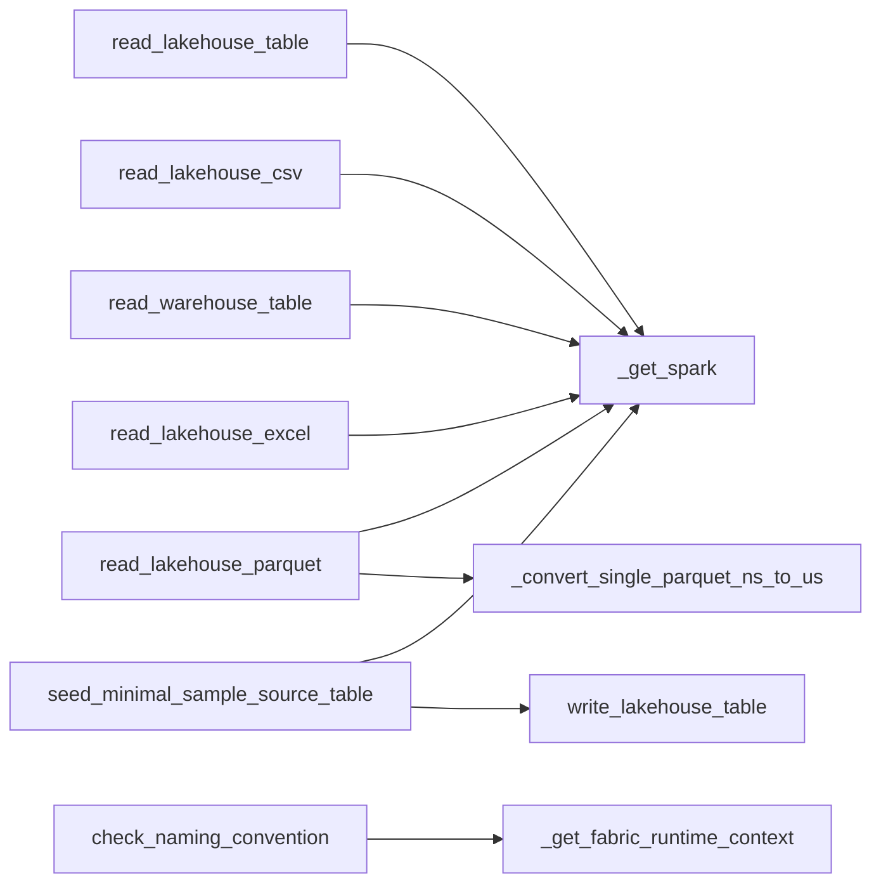
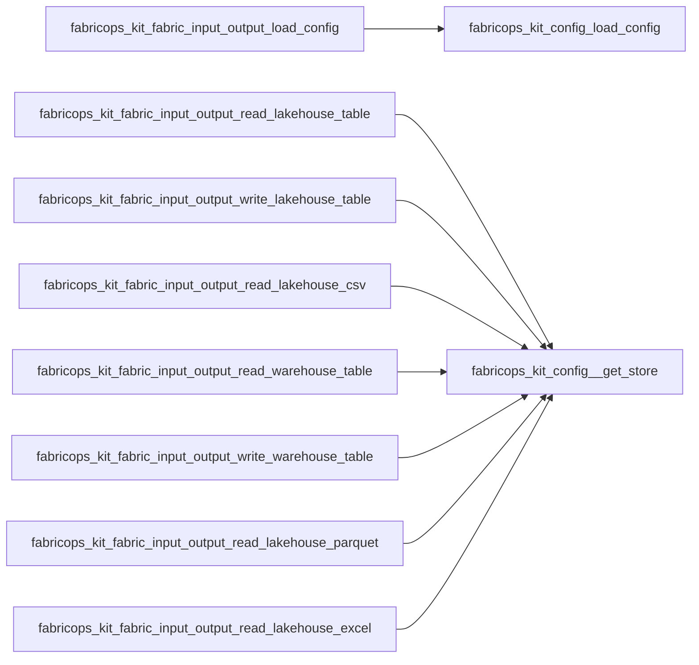

# `fabric_input_output` module

  Module overview

## Module dependency summary

- **Essential:** 4
- **Optional:** 4
- **Internal:** 3
- **Depends On:** 1 modules
- **Used By:** 2 modules

## Essential callables

| Callable | Type | Summary | Related helpers |
|---|---|---|---|
| [`read_lakehouse_table`](../../reference/read_lakehouse_table/) | function | Read a Delta table from a Fabric lakehouse. | [`_get_spark`](../../reference/internal/fabric_input_output/_get_spark/) (internal) |
| [`read_warehouse_table`](../../reference/read_warehouse_table/) | function | Read a table from a Microsoft Fabric warehouse. | [`_get_spark`](../../reference/internal/fabric_input_output/_get_spark/) (internal) |
| [`write_lakehouse_table`](../../reference/write_lakehouse_table/) | function | Write a Spark DataFrame to a Fabric lakehouse Delta table. | — |
| [`write_warehouse_table`](../../reference/write_warehouse_table/) | function | Write a Spark DataFrame to a Microsoft Fabric warehouse table. | — |

## Optional callables

| Callable | Type | Summary | Related helpers |
|---|---|---|---|
| [`read_lakehouse_csv`](../../reference/read_lakehouse_csv/) | function | Read a CSV file from a Fabric lakehouse Files path. | [`_get_spark`](../../reference/internal/fabric_input_output/_get_spark/) (internal) |
| [`read_lakehouse_excel`](../../reference/read_lakehouse_excel/) | function | Read an Excel file from a Fabric lakehouse Files path. | [`_get_spark`](../../reference/internal/fabric_input_output/_get_spark/) (internal) |
| [`read_lakehouse_parquet`](../../reference/read_lakehouse_parquet/) | function | Read a Parquet file from a Fabric lakehouse Files path. | [`_convert_single_parquet_ns_to_us`](../../reference/internal/fabric_input_output/_convert_single_parquet_ns_to_us/) (internal), [`_get_spark`](../../reference/internal/fabric_input_output/_get_spark/) (internal) |

## Related internal helpers

| Helper | Related public callables |
|---|---|
| [`_convert_single_parquet_ns_to_us`](../../reference/internal/fabric_input_output/_convert_single_parquet_ns_to_us/) | [`read_lakehouse_parquet`](../../reference/read_lakehouse_parquet/) |
| [`_get_fabric_runtime_context`](../../reference/internal/fabric_input_output/_get_fabric_runtime_context/) | — |
| [`_get_spark`](../../reference/internal/fabric_input_output/_get_spark/) | [`read_lakehouse_csv`](../../reference/read_lakehouse_csv/), [`read_lakehouse_excel`](../../reference/read_lakehouse_excel/), [`read_lakehouse_parquet`](../../reference/read_lakehouse_parquet/), [`read_lakehouse_table`](../../reference/read_lakehouse_table/), [`read_warehouse_table`](../../reference/read_warehouse_table/) |

## Module internal callable graph

## Cross-module callable graph

