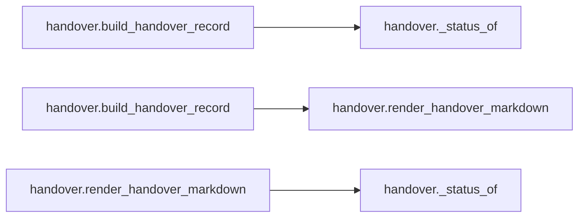

# `handover` module

  Module overview

## Module dependency summary

| Callable count | Internal helper count | Outbound references | Inbound references |
|---:|---:|---:|---:|
| 2 | 1 | 0 | 0 |

## Module purpose

Owns generated maintainer-facing handover and contract narrative output.

## Public callables

| Callable | Tier | Type | Summary | Related helpers |
|---|---|---|---|---|
| [`build_handover`](../../reference/build_handover/) | Essential | function | Build a handover-friendly summary for one data product run. | — |
| [`render_handover_markdown`](../../reference/render_handover_markdown/) | Essential | function | Render a handover summary dictionary into Markdown for handover notes. | [`_status_of`](../../reference/internal/handover/_status_of/) (internal) |

## Advanced dependency sections

### Related internal helpers

| Helper | Related public callables |
|---|---|
| [`_status_of`](../../reference/internal/handover/_status_of/) | [`render_handover_markdown`](../../reference/render_handover_markdown/) |

### Module internal callable dependencies

### Cross-module references

No cross-module references detected.
