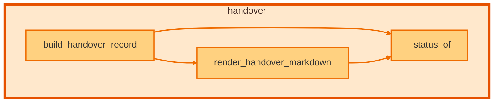

# `handover` module

  Module overview

## Module dependency summary

Callable count: 2Outbound: 0Inbound: 0

## Module purpose

Owns generated maintainer-facing handover and contract narrative output.

## Public callables

<table>
  <thead>
    <tr>
      <th>Callable</th>
      <th>Tier</th>
      <th>Type</th>
      <th>Summary</th>
      <th>Related helpers</th>
    </tr>
  </thead>
  <tbody>
    <tr>
      <td><a href="../../reference/build_handover/"><code>build_handover</code></a></td>
      <td>Essential</td>
      <td>function</td>
      <td>Build a handover-friendly summary for one data product run.</td>
      <td>—</td>
    </tr>
    <tr>
      <td><a href="../../reference/render_handover_markdown/"><code>render_handover_markdown</code></a></td>
      <td>Essential</td>
      <td>function</td>
      <td>Render a handover summary dictionary into Markdown for handover notes.</td>
      <td><a href="../../reference/internal/handover/_status_of/"><code>_status_of</code></a> (internal)</td>
    </tr>
  </tbody>
</table>

## Advanced dependency sections

### Related internal helpers

<table>
  <thead>
    <tr>
      <th>Helper</th>
      <th>Related public callables</th>
    </tr>
  </thead>
  <tbody>
    <tr>
      <td><a href="../../reference/internal/handover/_status_of/"><code>_status_of</code></a></td>
      <td><a href="../../reference/render_handover_markdown/"><code>render_handover_markdown</code></a></td>
    </tr>
  </tbody>
</table>

### Callable relationships

#### Inside this module

<a class="reference-chip" href="../modules/handover/#build_handover_record"><code>build_handover_record</code></a> → <a class="reference-chip" href="../modules/handover/#_status_of"><code>_status_of</code></a>
<a class="reference-chip" href="../modules/handover/#build_handover_record"><code>build_handover_record</code></a> → <a class="reference-chip" href="../../reference/render_handover_markdown/"><code>render_handover_markdown</code></a>
<a class="reference-chip" href="../../reference/render_handover_markdown/"><code>render_handover_markdown</code></a> → <a class="reference-chip" href="../modules/handover/#_status_of"><code>_status_of</code></a>

#### Used by other modules

None.
#### Uses other modules

None.

