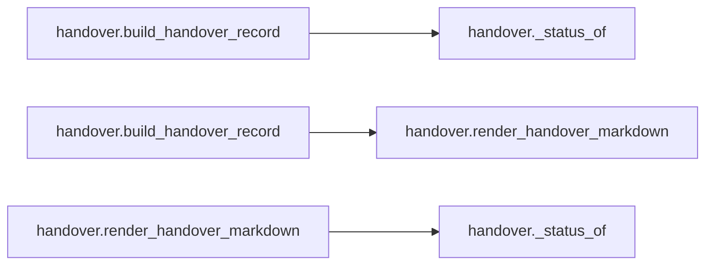
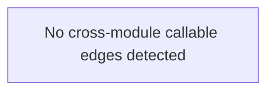

# `handover` module

  Module overview

## Module dependency summary

| Essential | Optional | Internal | Depends On | Used By |
|---:|---:|---:|---:|---:|
| 2 | 0 | 1 | 0 | 0 |

## Essential callables

| Callable | Type | Summary | Related helpers |
|---|---|---|---|
| [`build_handover`](../../reference/build_handover/) | function | Build a handover-friendly summary for one data product run. | — |
| [`render_handover_markdown`](../../reference/render_handover_markdown/) | function | Render a handover summary dictionary into Markdown for handover notes. | [`_status_of`](../../reference/internal/handover/_status_of/) (internal) |

## Optional callables

No advanced helpers listed for this module.

## Related internal helpers

| Helper | Related public callables |
|---|---|
| [`_status_of`](../../reference/internal/handover/_status_of/) | [`render_handover_markdown`](../../reference/render_handover_markdown/) |

## Module internal callable graph

## Cross-module callable graph

## Cross-module references

No cross-module references detected.
