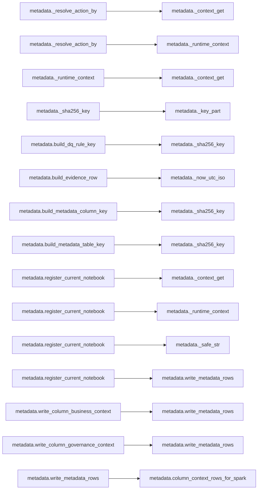

# `metadata` module

  Module overview

## Module dependency summary

| Callable count | Internal helper count | Outbound references | Inbound references |
|---:|---:|---:|---:|
| 2 | 8 | 1 | 3 |

## Module purpose

Owns metadata/contract store access, evidence persistence, agreement metadata, notebook evidence, and contract assembly inputs.

## Public callables

| Callable | Tier | Type | Summary | Related helpers |
|---|---|---|---|---|
| [`load_notebook_registry`](../../reference/load_notebook_registry/) | Essential | function | Load notebook registration metadata rows for agreement notebook traceability. | — |
| [`register_current_notebook`](../../reference/register_current_notebook/) | Essential | function | Register current notebook metadata evidence for agreement traceability. | [`_context_get`](../../reference/internal/metadata/_context_get/) (internal), [`_runtime_context`](../../reference/internal/metadata/_runtime_context/) (internal), [`_safe_str`](../../reference/internal/metadata/_safe_str/) (internal) |

## Advanced dependency sections

### Related internal helpers

| Helper | Related public callables |
|---|---|
| [`_context_get`](../../reference/internal/metadata/_context_get/) | [`register_current_notebook`](../../reference/register_current_notebook/) |
| [`_extract_columns_from_profile`](../../reference/internal/metadata/_extract_columns_from_profile/) | — |
| [`_key_part`](../../reference/internal/metadata/_key_part/) | — |
| [`_now_utc_iso`](../../reference/internal/metadata/_now_utc_iso/) | — |
| [`_resolve_action_by`](../../reference/internal/metadata/_resolve_action_by/) | — |
| [`_runtime_context`](../../reference/internal/metadata/_runtime_context/) | [`register_current_notebook`](../../reference/register_current_notebook/) |
| [`_safe_str`](../../reference/internal/metadata/_safe_str/) | [`register_current_notebook`](../../reference/register_current_notebook/) |
| [`_sha256_key`](../../reference/internal/metadata/_sha256_key/) | — |

### Module internal callable dependencies

Expand module internal callable graph

### Cross-module references

Graph omitted because dependencies are simple one-to-one references.

| Caller | Callee |
|---|---|
| `metadata.write_metadata_rows` | `fabric_input_output.write_lakehouse_table` |

