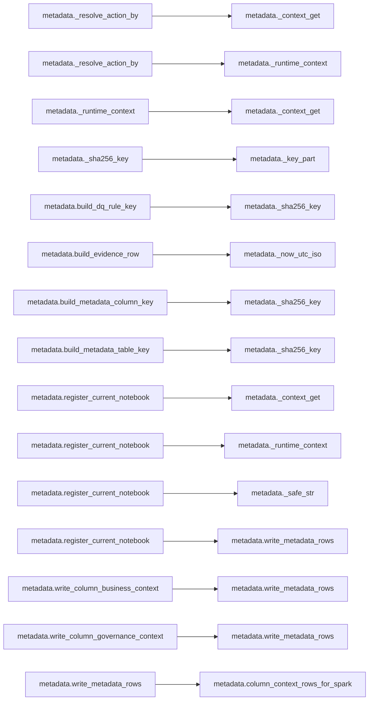

# `metadata` module

  Module overview

## Module dependency summary

Callable count: 2Outbound: 1Inbound: 3

## Module purpose

Owns metadata/contract store access, evidence persistence, agreement metadata, notebook evidence, and contract assembly inputs.

## Public callables

<table>
  <thead>
    <tr>
      <th>Callable</th>
      <th>Tier</th>
      <th>Type</th>
      <th>Summary</th>
      <th>Related helpers</th>
    </tr>
  </thead>
  <tbody>
    <tr>
      <td><a href="../../reference/load_notebook_registry/"><code>load_notebook_registry</code></a></td>
      <td>Essential</td>
      <td>function</td>
      <td>Load notebook registration metadata rows for agreement notebook traceability.</td>
      <td>—</td>
    </tr>
    <tr>
      <td><a href="../../reference/register_current_notebook/"><code>register_current_notebook</code></a></td>
      <td>Essential</td>
      <td>function</td>
      <td>Register current notebook metadata evidence for agreement traceability.</td>
      <td><a href="../../reference/internal/metadata/_context_get/"><code>_context_get</code></a> (internal), <a href="../../reference/internal/metadata/_runtime_context/"><code>_runtime_context</code></a> (internal), <a href="../../reference/internal/metadata/_safe_str/"><code>_safe_str</code></a> (internal)</td>
    </tr>
  </tbody>
</table>

## Advanced dependency sections

### Related internal helpers

<table>
  <thead>
    <tr>
      <th>Helper</th>
      <th>Related public callables</th>
    </tr>
  </thead>
  <tbody>
    <tr>
      <td><a href="../../reference/internal/metadata/_context_get/"><code>_context_get</code></a></td>
      <td><a href="../../reference/register_current_notebook/"><code>register_current_notebook</code></a></td>
    </tr>
    <tr>
      <td><a href="../../reference/internal/metadata/_extract_columns_from_profile/"><code>_extract_columns_from_profile</code></a></td>
      <td>—</td>
    </tr>
    <tr>
      <td><a href="../../reference/internal/metadata/_key_part/"><code>_key_part</code></a></td>
      <td>—</td>
    </tr>
    <tr>
      <td><a href="../../reference/internal/metadata/_now_utc_iso/"><code>_now_utc_iso</code></a></td>
      <td>—</td>
    </tr>
    <tr>
      <td><a href="../../reference/internal/metadata/_resolve_action_by/"><code>_resolve_action_by</code></a></td>
      <td>—</td>
    </tr>
    <tr>
      <td><a href="../../reference/internal/metadata/_runtime_context/"><code>_runtime_context</code></a></td>
      <td><a href="../../reference/register_current_notebook/"><code>register_current_notebook</code></a></td>
    </tr>
    <tr>
      <td><a href="../../reference/internal/metadata/_safe_str/"><code>_safe_str</code></a></td>
      <td><a href="../../reference/register_current_notebook/"><code>register_current_notebook</code></a></td>
    </tr>
    <tr>
      <td><a href="../../reference/internal/metadata/_sha256_key/"><code>_sha256_key</code></a></td>
      <td>—</td>
    </tr>
  </tbody>
</table>

### Module internal callable dependencies

Expand module internal callable graph

### Outbound

Graph omitted because dependencies are simple one-to-one references.

| Caller | Callee |
|---|---|
| `metadata.write_metadata_rows` | `fabric_input_output.write_lakehouse_table` |

