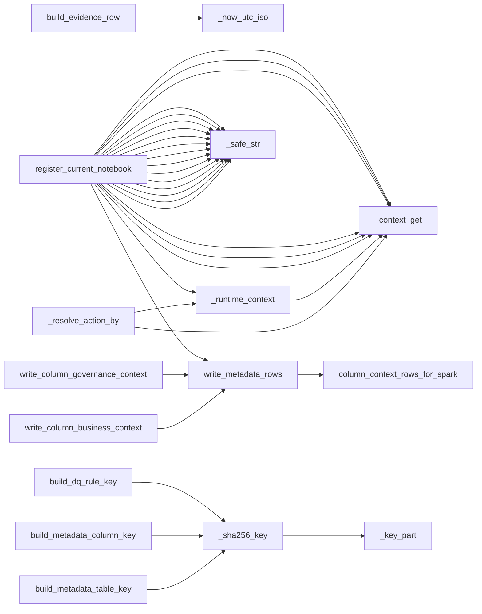
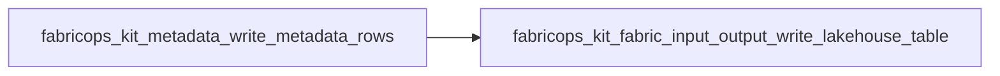

# `metadata` module

  Module overview

## Module dependency summary

- **Essential:** 2
- **Optional:** 0
- **Internal:** 8
- **Depends On:** 1 modules
- **Used By:** 3 modules

## Essential callables

| Callable | Type | Summary | Related helpers |
|---|---|---|---|
| [`load_notebook_registry`](../../reference/load_notebook_registry/) | function | Load notebook registration metadata rows for agreement notebook traceability. | — |
| [`register_current_notebook`](../../reference/register_current_notebook/) | function | Register current notebook metadata evidence for agreement traceability. | [`_context_get`](../../reference/internal/metadata/_context_get/) (internal), [`_runtime_context`](../../reference/internal/metadata/_runtime_context/) (internal), [`_safe_str`](../../reference/internal/metadata/_safe_str/) (internal) |

## Optional callables

No advanced helpers listed for this module.

## Related internal helpers

| Helper | Related public callables |
|---|---|
| [`_context_get`](../../reference/internal/metadata/_context_get/) | [`register_current_notebook`](../../reference/register_current_notebook/) |
| [`_extract_columns_from_profile`](../../reference/internal/metadata/_extract_columns_from_profile/) | — |
| [`_key_part`](../../reference/internal/metadata/_key_part/) | — |
| [`_now_utc_iso`](../../reference/internal/metadata/_now_utc_iso/) | — |
| [`_resolve_action_by`](../../reference/internal/metadata/_resolve_action_by/) | — |
| [`_runtime_context`](../../reference/internal/metadata/_runtime_context/) | [`register_current_notebook`](../../reference/register_current_notebook/) |
| [`_safe_str`](../../reference/internal/metadata/_safe_str/) | [`register_current_notebook`](../../reference/register_current_notebook/) |
| [`_sha256_key`](../../reference/internal/metadata/_sha256_key/) | — |

## Module internal callable graph

## Cross-module callable graph

