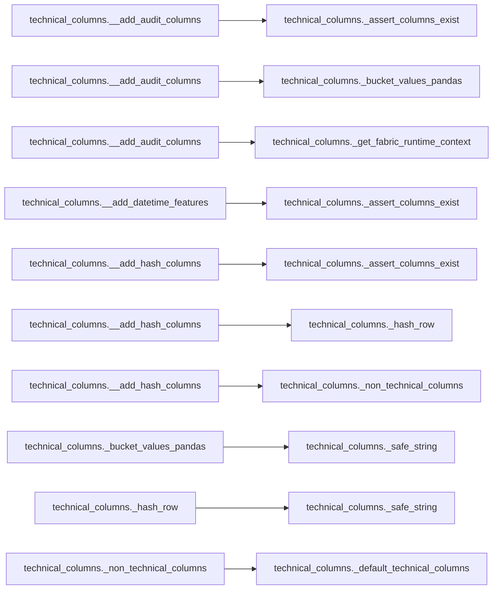

# `technical_columns` module

  Module overview

## Module dependency summary

| Callable count | Internal helper count | Outbound references | Inbound references |
|---:|---:|---:|---:|
| 1 | 10 | 0 | 1 |

## Module purpose

Owns standard output/audit columns for pipeline outputs.

## Public callables

| Callable | Tier | Type | Summary | Related helpers |
|---|---|---|---|---|
| [`standardize_columns`](../../reference/standardize_columns/) | Essential | function | Apply canonical technical/audit enrichment in one notebook-facing wrapper. | — |

## Advanced dependency sections

### Related internal helpers

Expand internal helper table

| Helper | Related public callables |
|---|---|
| [`__add_audit_columns`](../../reference/internal/technical_columns/__add_audit_columns/) | — |
| [`__add_datetime_features`](../../reference/internal/technical_columns/__add_datetime_features/) | — |
| [`__add_hash_columns`](../../reference/internal/technical_columns/__add_hash_columns/) | — |
| [`_assert_columns_exist`](../../reference/internal/technical_columns/_assert_columns_exist/) | — |
| [`_bucket_values_pandas`](../../reference/internal/technical_columns/_bucket_values_pandas/) | — |
| [`_default_technical_columns`](../../reference/internal/technical_columns/_default_technical_columns/) | — |
| [`_get_fabric_runtime_context`](../../reference/internal/technical_columns/_get_fabric_runtime_context/) | — |
| [`_hash_row`](../../reference/internal/technical_columns/_hash_row/) | — |
| [`_non_technical_columns`](../../reference/internal/technical_columns/_non_technical_columns/) | — |
| [`_safe_string`](../../reference/internal/technical_columns/_safe_string/) | — |

### Module internal callable dependencies

Expand module internal callable graph

### Cross-module references

No cross-module references detected.
