# `technical_columns` module

  Module overview

## Module dependency summary

Callable count: 1Outbound: 0Inbound: 1

## Module purpose

Owns standard output/audit columns for pipeline outputs.

## Public callables

<table>
  <thead>
    <tr>
      <th>Callable</th>
      <th>Tier</th>
      <th>Type</th>
      <th>Summary</th>
      <th>Related helpers</th>
    </tr>
  </thead>
  <tbody>
    <tr>
      <td><a href="../../reference/standardize_columns/"><code>standardize_columns</code></a></td>
      <td>Essential</td>
      <td>function</td>
      <td>Apply canonical technical/audit enrichment in one notebook-facing wrapper.</td>
      <td><a href="../../reference/internal/technical_columns/_add_audit_columns/"><code>_add_audit_columns</code></a> (internal), <a href="../../reference/internal/technical_columns/_add_datetime_features/"><code>_add_datetime_features</code></a> (internal), <a href="../../reference/internal/technical_columns/_add_hash_columns/"><code>_add_hash_columns</code></a> (internal)</td>
    </tr>
  </tbody>
</table>

## Advanced dependency sections

### Related internal helpers

Expand internal helper table

<table>
  <thead>
    <tr>
      <th>Helper</th>
      <th>Related public callables</th>
    </tr>
  </thead>
  <tbody>
    <tr>
      <td><a href="../../reference/internal/technical_columns/_add_audit_columns/"><code>_add_audit_columns</code></a></td>
      <td><a href="../../reference/standardize_columns/"><code>standardize_columns</code></a></td>
    </tr>
    <tr>
      <td><a href="../../reference/internal/technical_columns/_add_datetime_features/"><code>_add_datetime_features</code></a></td>
      <td><a href="../../reference/standardize_columns/"><code>standardize_columns</code></a></td>
    </tr>
    <tr>
      <td><a href="../../reference/internal/technical_columns/_add_hash_columns/"><code>_add_hash_columns</code></a></td>
      <td><a href="../../reference/standardize_columns/"><code>standardize_columns</code></a></td>
    </tr>
    <tr>
      <td><a href="../../reference/internal/technical_columns/_assert_columns_exist/"><code>_assert_columns_exist</code></a></td>
      <td>—</td>
    </tr>
    <tr>
      <td><a href="../../reference/internal/technical_columns/_bucket_values_pandas/"><code>_bucket_values_pandas</code></a></td>
      <td>—</td>
    </tr>
    <tr>
      <td><a href="../../reference/internal/technical_columns/_default_technical_columns/"><code>_default_technical_columns</code></a></td>
      <td>—</td>
    </tr>
    <tr>
      <td><a href="../../reference/internal/technical_columns/_get_fabric_runtime_context/"><code>_get_fabric_runtime_context</code></a></td>
      <td>—</td>
    </tr>
    <tr>
      <td><a href="../../reference/internal/technical_columns/_hash_row/"><code>_hash_row</code></a></td>
      <td>—</td>
    </tr>
    <tr>
      <td><a href="../../reference/internal/technical_columns/_non_technical_columns/"><code>_non_technical_columns</code></a></td>
      <td>—</td>
    </tr>
    <tr>
      <td><a href="../../reference/internal/technical_columns/_safe_string/"><code>_safe_string</code></a></td>
      <td>—</td>
    </tr>
  </tbody>
</table>

### Callable relationships

```mermaid
flowchart TB
  classDef currentModule fill:#ffe8cc,stroke:#e65100,stroke-width:4px,color:#3e2723;
  classDef externalModule fill:#f7f7f7,stroke:#b0bec5,stroke-width:1px,color:#607d8b;
  classDef currentCallable fill:#ffd180,stroke:#ef6c00,stroke-width:2px;
  classDef externalCallable fill:#eceff1,stroke:#b0bec5,stroke-width:1px,color:#455a64;
  subgraph m_technical_columns[technical_columns]
    fabricops_kit_technical_columns__add_audit_columns["_add_audit_columns"]
    fabricops_kit_technical_columns__add_datetime_features["_add_datetime_features"]
    fabricops_kit_technical_columns__add_hash_columns["_add_hash_columns"]
    fabricops_kit_technical_columns__assert_columns_exist["_assert_columns_exist"]
    fabricops_kit_technical_columns__bucket_values_pandas["_bucket_values_pandas"]
    fabricops_kit_technical_columns__default_technical_columns["_default_technical_columns"]
    fabricops_kit_technical_columns__get_fabric_runtime_context["_get_fabric_runtime_context"]
    fabricops_kit_technical_columns__hash_row["_hash_row"]
    fabricops_kit_technical_columns__non_technical_columns["_non_technical_columns"]
    fabricops_kit_technical_columns__safe_string["_safe_string"]
    fabricops_kit_technical_columns_standardize_columns["standardize_columns"]
  end
  subgraph m_data_profiling[data_profiling]
    fabricops_kit_data_profiling__get_profiled_columns["_get_profiled_columns"]
  end
  fabricops_kit_data_profiling__get_profiled_columns --> fabricops_kit_technical_columns__default_technical_columns
  fabricops_kit_technical_columns__add_audit_columns --> fabricops_kit_technical_columns__assert_columns_exist
  fabricops_kit_technical_columns__add_audit_columns --> fabricops_kit_technical_columns__bucket_values_pandas
  fabricops_kit_technical_columns__add_audit_columns --> fabricops_kit_technical_columns__get_fabric_runtime_context
  fabricops_kit_technical_columns__add_datetime_features --> fabricops_kit_technical_columns__assert_columns_exist
  fabricops_kit_technical_columns__add_hash_columns --> fabricops_kit_technical_columns__assert_columns_exist
  fabricops_kit_technical_columns__add_hash_columns --> fabricops_kit_technical_columns__hash_row
  fabricops_kit_technical_columns__add_hash_columns --> fabricops_kit_technical_columns__non_technical_columns
  fabricops_kit_technical_columns__bucket_values_pandas --> fabricops_kit_technical_columns__safe_string
  fabricops_kit_technical_columns__hash_row --> fabricops_kit_technical_columns__safe_string
  fabricops_kit_technical_columns__non_technical_columns --> fabricops_kit_technical_columns__default_technical_columns
  fabricops_kit_technical_columns_standardize_columns --> fabricops_kit_technical_columns__add_audit_columns
  fabricops_kit_technical_columns_standardize_columns --> fabricops_kit_technical_columns__add_datetime_features
  fabricops_kit_technical_columns_standardize_columns --> fabricops_kit_technical_columns__add_hash_columns
  linkStyle 1,2,3,4,5,6,7,8,9,10,11,12,13 stroke:#ef6c00,stroke-width:2.2px;
  linkStyle 0 stroke:#90a4ae,stroke-width:1.2px,stroke-dasharray: 4 2;
  class m_technical_columns currentModule;
  class m_data_profiling externalModule;
  class fabricops_kit_technical_columns__add_audit_columns,fabricops_kit_technical_columns__add_datetime_features,fabricops_kit_technical_columns__add_hash_columns,fabricops_kit_technical_columns__assert_columns_exist,fabricops_kit_technical_columns__bucket_values_pandas,fabricops_kit_technical_columns__default_technical_columns,fabricops_kit_technical_columns__get_fabric_runtime_context,fabricops_kit_technical_columns__hash_row,fabricops_kit_technical_columns__non_technical_columns,fabricops_kit_technical_columns__safe_string,fabricops_kit_technical_columns_standardize_columns currentCallable;
  class fabricops_kit_data_profiling__get_profiled_columns externalCallable;
```

#### Inside this module

<a class="reference-chip" href="../modules/technical_columns/#_add_audit_columns"><code>_add_audit_columns</code></a> → <a class="reference-chip" href="../modules/technical_columns/#_assert_columns_exist"><code>_assert_columns_exist</code></a>
<a class="reference-chip" href="../modules/technical_columns/#_add_audit_columns"><code>_add_audit_columns</code></a> → <a class="reference-chip" href="../modules/technical_columns/#_bucket_values_pandas"><code>_bucket_values_pandas</code></a>
<a class="reference-chip" href="../modules/technical_columns/#_add_audit_columns"><code>_add_audit_columns</code></a> → <a class="reference-chip" href="../modules/technical_columns/#_get_fabric_runtime_context"><code>_get_fabric_runtime_context</code></a>
<a class="reference-chip" href="../modules/technical_columns/#_add_datetime_features"><code>_add_datetime_features</code></a> → <a class="reference-chip" href="../modules/technical_columns/#_assert_columns_exist"><code>_assert_columns_exist</code></a>
<a class="reference-chip" href="../modules/technical_columns/#_add_hash_columns"><code>_add_hash_columns</code></a> → <a class="reference-chip" href="../modules/technical_columns/#_assert_columns_exist"><code>_assert_columns_exist</code></a>
<a class="reference-chip" href="../modules/technical_columns/#_add_hash_columns"><code>_add_hash_columns</code></a> → <a class="reference-chip" href="../modules/technical_columns/#_hash_row"><code>_hash_row</code></a>
<a class="reference-chip" href="../modules/technical_columns/#_add_hash_columns"><code>_add_hash_columns</code></a> → <a class="reference-chip" href="../modules/technical_columns/#_non_technical_columns"><code>_non_technical_columns</code></a>
<a class="reference-chip" href="../modules/technical_columns/#_bucket_values_pandas"><code>_bucket_values_pandas</code></a> → <a class="reference-chip" href="../modules/technical_columns/#_safe_string"><code>_safe_string</code></a>
<a class="reference-chip" href="../modules/technical_columns/#_hash_row"><code>_hash_row</code></a> → <a class="reference-chip" href="../modules/technical_columns/#_safe_string"><code>_safe_string</code></a>
<a class="reference-chip" href="../modules/technical_columns/#_non_technical_columns"><code>_non_technical_columns</code></a> → <a class="reference-chip" href="../modules/technical_columns/#_default_technical_columns"><code>_default_technical_columns</code></a>
<a class="reference-chip" href="../../reference/standardize_columns/"><code>standardize_columns</code></a> → <a class="reference-chip" href="../modules/technical_columns/#_add_audit_columns"><code>_add_audit_columns</code></a>
<a class="reference-chip" href="../../reference/standardize_columns/"><code>standardize_columns</code></a> → <a class="reference-chip" href="../modules/technical_columns/#_add_datetime_features"><code>_add_datetime_features</code></a>
<a class="reference-chip" href="../../reference/standardize_columns/"><code>standardize_columns</code></a> → <a class="reference-chip" href="../modules/technical_columns/#_add_hash_columns"><code>_add_hash_columns</code></a>

#### Used by other modules

<code>data_profiling</code> (1)

#### Uses other modules

None.

