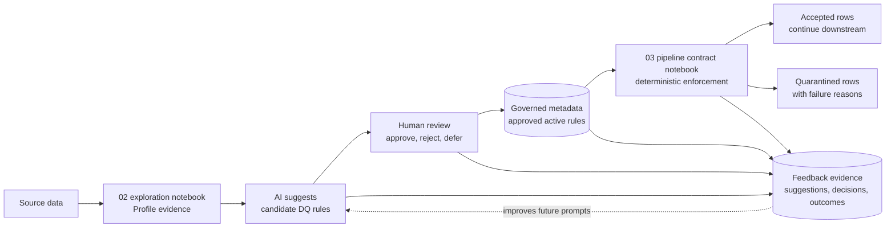

# AI-Assisted Data Quality Rules System

The data quality rules system is an AI-assisted, human-approved, pipeline-enforced workflow inside Fabric.

Data analysts first explore and profile the data in a `02_ex_*` notebook. AI uses that profiling evidence to suggest candidate rules, but those rules are not trusted automatically. A human reviewer must approve them before they become governed metadata. The `03_pc_*` pipeline contract notebook then loads only approved active rules and enforces them deterministically during pipeline execution.

The operating principle is simple:

**AI suggests. Humans approve. Pipelines enforce. Feedback improves the system over time.**

Use this page when you need to understand how data quality rules move from exploration to governed enforcement.

Next read: [Metadata](metadata-and-contracts/index.md), [Start](quick-start.md), [API](reference/index.md).

<figure markdown>
  { .full-width }
  <figcaption>AI-assisted data quality in Fabric: analysts profile source data, AI suggests candidate rules, humans approve governed rules, and pipelines enforce only approved active rules.</figcaption>
</figure>

## Overview

The data quality rules system turns profiling evidence into approved, reusable, enforceable rules.

The workflow starts during exploration. Analysts inspect source data, collect evidence about data shape and quality, and use AI to propose candidate rules. At this stage, the rules are advisory. They are not trusted automatically and are not enforced directly.

A rule becomes enforceable only after a human reviewer approves it. Approved active rules are stored as governed metadata in Fabric tables. During execution, the `03_pc_*` pipeline contract notebook loads that metadata and applies the approved rules deterministically.

## Operating model inside Fabric

The operational flow stays inside Fabric notebooks and Lakehouse metadata tables:

1. **Source data**
   The analyst starts with source data that needs profiling, validation, or onboarding into a governed pipeline.

2. **Profile data in the 02 exploration notebook**
   The `02_ex_*` notebook profiles the data and captures evidence such as:
   - null counts and null rates
   - distinct values and cardinality
   - numeric ranges
   - date ranges
   - observed patterns and formats
   - duplicate indicators
   - suspicious or unexpected values

3. **AI suggests DQ rules**
   AI uses the profile evidence to suggest candidate data quality rules. These suggestions are draft recommendations, not governance decisions.

4. **Human review and approval**
   A reviewer edits, approves, rejects, or defers each candidate rule. The reviewer is the approval gate.

5. **Store approved rules**
   Approved rules are stored as governed metadata. Rejected and deferred suggestions can also be retained as review evidence.

6. **Enforce approved rules in the 03 pipeline contract notebook**
   The `03_pc_*` pipeline contract notebook loads only approved active rules from metadata and applies them during pipeline execution.

7. **Split accepted and quarantined rows**
   Rows that pass approved rules continue downstream. Rows that fail are written to quarantine with failure reasons and run context.

## Role of the 02 exploration notebook

The `02_ex_*` notebook is the analyst workspace for understanding source data before enforcement begins.

In the 02 exploration notebook, analysts:

- inspect source data in context;
- generate profile evidence for columns, tables, and candidate keys;
- identify nulls, duplicates, unexpected formats, suspicious values, and range issues;
- ask AI to suggest candidate DQ rules based on the evidence;
- capture the initial review context for each suggested rule.

This notebook is exploratory and advisory. AI can accelerate rule discovery, but it does not approve rules and does not enforce them. Candidate rules must move through human review before they become governed metadata.

## Role of the 03 pipeline contract notebook

The `03_pc_*` pipeline contract notebook is the production enforcement point.

During pipeline execution, the 03 pipeline contract notebook:

- loads approved active rules from the governed metadata tables;
- applies those rules to the current dataframe or table;
- evaluates rules deterministically, without relying on AI at enforcement time;
- writes passing rows to the intended target layer;
- writes failed rows to quarantine with failure reasons;
- records enforcement outcomes with run or execution context.

This separates rule suggestion from rule enforcement. AI helps propose rules during exploration. Humans approve the rule set. Pipelines enforce the approved active rules.

## Metadata tables

The metadata model should capture enough information to connect suggestion, approval, enforcement, and feedback evidence. Keep the schema practical and governed, but avoid overfitting it before implementation needs are clear.

Likely metadata includes:

- rule ID;
- agreement ID or data product ID;
- source table and target table;
- column name;
- rule type;
- rule expression or parameters;
- AI suggestion text;
- human decision;
- approval status;
- approved by;
- approved timestamp;
- active flag;
- enforcement severity;
- failure reason;
- run ID or execution ID.

Approved active rules are the rules the `03_pc_*` notebook can enforce. Candidate, rejected, and deferred rules are review evidence and should not be enforced unless they are later approved and active.

## Feedback loop

The system improves when evidence is retained across the lifecycle.

Useful feedback evidence includes:

- AI suggestions generated from profiling evidence;
- reviewer decisions, edits, approvals, rejections, and deferrals;
- final approved rules;
- rule failures and failure reasons;
- accepted and quarantined row counts;
- recurring failure patterns by column, table, rule, or run.

Future prompts can use this evidence to produce better suggestions. For example, rejected rules can help AI avoid repeating weak recommendations, approved rules can show preferred patterns, and enforcement outcomes can highlight where new rules may be needed.

The feedback loop does not make AI the governance decision-maker. It gives analysts and reviewers better evidence for the next exploration and approval cycle.

## Expandable rule set

Start with a small set of high-value rules, then expand as the pipeline matures.

Common starting rules include:

- not null;
- allowed values;
- numeric range;
- date range;
- regex or format;
- uniqueness;
- referential check;
- freshness;
- duplicate detection.

The rule catalog can grow over time without changing the operating model. New rule types still follow the same path: profile evidence, AI suggestion, human approval, governed metadata, deterministic pipeline enforcement, and feedback.

## Key principle

**AI suggests. Humans approve. Pipelines enforce. Feedback improves the system over time.**
