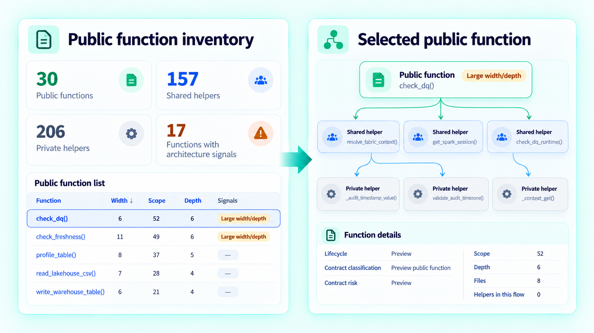
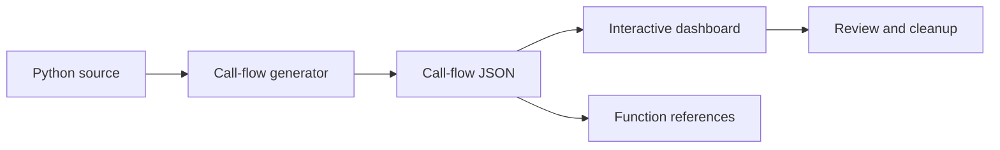
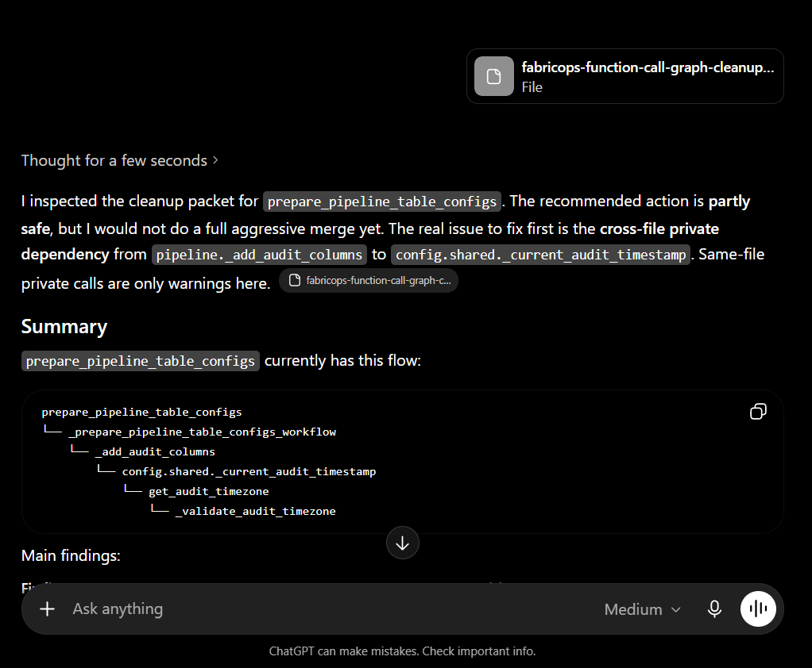

# Explore How FabricOps Functions Work Under the Hood

<span class="fabricops-release-status fabricops-release-status--live">Live</span> <span class="fabricops-release-status fabricops-release-status--maintainer">Maintainer</span>

This is a maintainer review surface for inspecting FabricOps public callable architecture. It is generated from repository source and used as part of the active maintenance workflow.

<div align="center">
  <a class="md-button md-button--primary" href="../assets/public-function-call-flows-dashboard.html">Open Call Flow Dashboard</a>
  <a class="md-button" href="../reference/_data/public-function-call-flows.json">View JSON Contract</a>
</div>

[](assets/public-function-call-flows-dashboard.html)

## Purpose

As the public API grows, reviewing functions one file at a time makes it harder to see helper reachability, architecture boundaries, call-tree complexity, and the impact of a change. The Function Call Graph is the maintainability checkpoint for that work.

A deterministic generator scans the repository into a versioned call-flow JSON contract, and the interactive dashboard turns that contract into a focused review surface. Use it to inspect a public callable, understand its dependencies and architecture signals, and export focused cleanup context before changing the implementation.

> **First make it exist. Then make it good.**

## Maintainer workflow



The workflow keeps source authoritative. Repository code is scanned into the generated JSON contract, which feeds the review experience. Changes are made back in source and the affected generated artifacts are refreshed.

## Implementation details

### 1. Repository Code

**Source of truth**

The repository contains the implementation that the call-flow contract describes:

* public functions
* shared helpers
* private helpers
* classes and internal methods

```text
src/
├── public function owner files
├── shared helpers
└── private implementation helpers
```

The repository is authoritative. When generated output disagrees with the implementation, update the source scanner or generator rules rather than manually changing the JSON.

### 2. Agent reads context

**Plan before editing**

Before changing a public function or helper, the agent reads:

* `AGENTS.md`
* `docs/reference/_data/public-function-call-flows.json`

This gives the agent the current:

* public callable scope
* helper reachability
* source locations
* architecture signals

The purpose of this step is to understand the existing function boundary and downstream impact before editing code.

### 3. Edit function source

**Update the implementation**

The agent updates the Python source, not the generated JSON.

Typical changes include:

* changing public or helper code
* extracting or combining helpers
* moving reusable logic to a shared boundary
* removing unnecessary wrapper layers
* correcting callable classification

Keep source as the truth. Do not patch `public-function-call-flows.json` manually.

### 4. Regenerate call flow

**Refresh the contract**

After a function-level source change, run:

```bash
PYTHONPATH=src python scripts/generate_public_function_call_flows_json.py
```

This updates:

```text
docs/reference/_data/public-function-call-flows.json
```

Commit the regenerated JSON when callable structure, source locations, exports, helper relationships, architecture classification, or call-flow metrics have changed.

### 5. Dashboard & review

**Consume the refreshed JSON**

The dashboard reads the regenerated contract and provides the main review surface.

Use it to:

* inspect the call tree
* review the callable inventory
* check width, depth, and architecture violations
* identify inline or shared-helper candidates
* export a focused AI refactor packet

Selecting a public function should scope the call tree, inventory, signals, and export workflow around that callable.

## Review details

The dashboard and JSON expose deterministic signals to guide cleanup. These signals support reviewer judgement; they do not replace reviewing the implementation.

### Public-flow signals

| Signal | Calculation | Reviewer action |
|---|---|---|
| Large width or depth | Width > 10 or Depth > 5 | Review whether the public callable has become too wide or deeply nested. |
| Architecture violation | Any Type 1 to Type 5 violation appears in the selected flow | Review the boundary shape before helper cleanup. |

### Architecture violation types

| Type | Rule | Why it matters |
|---|---|---|
| Type 1 | Public function calls another public function directly | Public callables should own their workflow instead of chaining public entry points. |
| Type 2 | Shared function calls a public function directly | Shared helpers should not depend on public entry points. |
| Type 3 | Private function calls a public function directly | Private implementation details should not call public entry points. |
| Type 4 | Shared function calls a private function from another file | Shared helpers should not reach into another file's private implementation. |
| Type 5 | Private function calls a private function from another file | Private helpers should remain file-local. |

Private implementation helpers may call shared reusable functions directly.

### Cleanup suggestions

| Suggestion | Calculation | Reviewer action |
|---|---|---|
| Inline candidate | Called by one parent, not recursive, not reused elsewhere, and not called repeatedly by the same parent | Consider absorbing the helper into its owner. |
| Promote to shared | Private function called by more than one distinct caller | Consider moving it to a shared helper boundary. |

## AI refactor packet

When a selected flow needs cleanup, use the dashboard export to create a focused packet rather than sending the entire repository.



A focused packet should contain enough context to plan a safe change while remaining specific to the selected public callable and its dependencies.


## Generator ownership

The generated artifacts have separate owners:

| Script | Owns |
|---|---|
| `scripts/generate_public_function_call_flows_json.py` | `docs/reference/_data/public-function-call-flows.json` |
| `scripts/generate_public_function_call_flows_dashboard.py` | `docs/assets/public-function-call-flows-dashboard.html` |
| `scripts/generate_individual_function_reference_pages.py` | Individual pages under `docs/api/reference/` and `docs/reference/index.md` |

`docs/function-call-graph.md` is a standalone, manually maintained guide. It is not owned or regenerated by the individual function reference generator.