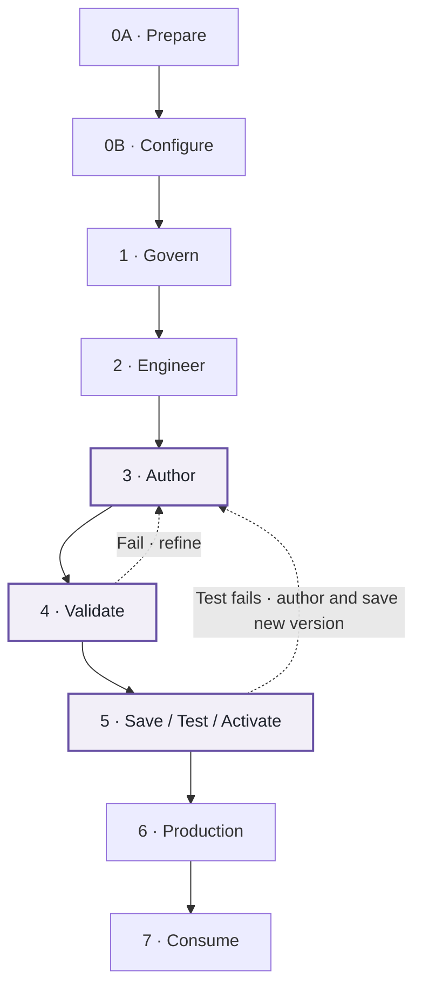

# FabricOps Guided Demo

**The Guided Demo is the practical, step-by-step path for running the FabricOps workflow from initial Fabric preparation through Governance, Engineering Development validation, Engineering Production, and downstream consumption.**

Read [How FabricOps Works](how-fabricops-works.md) first for the operating model and the Governance ↔ Engineering workflow. Use the [FabricOps Engineering Guide](reference/engineering-cheat-sheet.md) when you want the deeper reasoning behind `00_env_config`, I/O, Lakehouse/Warehouse choices, PySpark, and processing patterns.

!!! tip "New to Microsoft Fabric?"

    Start with [Microsoft Learn: Fabric fundamentals](https://learn.microsoft.com/en-us/fabric/fundamentals/) for the platform concepts used throughout the demo. When you reach the engineering parts, continue with [Microsoft Learn: Fabric Data Engineering](https://learn.microsoft.com/en-us/fabric/data-engineering/) for Lakehouse, notebooks, Spark, and Data Engineering workflows.

    **Useful visual reference:** [Microsoft Fabric Visual Notes](https://www.slideshare.net/slideshow/microsoft-fabric-complete-handwritten-notes-pdf/289496813) — a visual community reference covering Fabric architecture, PySpark, pipelines, incremental loading, data quality, CI/CD, monitoring, and related concepts.

    FabricOps documentation remains the source of truth for how this starter kit is designed and used.

## What you'll build

You will progressively take the same governed pipeline through the FabricOps lifecycle. **Steps 1–7 are the core FabricOps workflow; 0A and 0B prepare and configure the environment before that workflow begins.**

The non-linear part is **Steps 3, 4, and 5**. Governance authors the governed definition in Step 3, Engineering validates current authoring in Step 4, then Governance saves an immutable Data Contract version in Step 5. Engineering selects and tests that exact saved version before the selected version is activated for Production. If validation or saved-version testing shows the definition needs work, return to Step 3 and save a new version after refinement.

Testing and governance sign-off are part of the recommended operating workflow. The current implementation does not technically block activation based on a recorded pass or approval state.

The demo is intentionally action-oriented. Each module tells you what to do, what you should see, and what FabricOps records at that stage.

<!-- SCREEN-RECORDING SLOT: Optional 20-30 second demo orientation -->

## Learning path

| Module | Workspace | Notebook | What you do | What FabricOps records / proves |
| --- | --- | --- | --- | --- |
| [0A. Prepare Fabric artifacts](guided-demo/00A-setup-fabric-artifacts.md) | Governance, Engineering Development, Engineering Production, and required consumer workspaces | — | Create the Fabric items needed by the demo. | The operating environment exists and is ready for the notebook workflow. |
| [0B. Set up the operating environment](guided-demo/00B-run-environment-setup.md) | Governance, Engineering Development, Engineering Production | `00_env_config` | Configure environment-aware Fabric routing and create or validate the Governance metadata tables. | Logical stores resolve to the correct environment-specific Fabric items. |
| [1. Data Stewards and Data Agreement](guided-demo/01-create-agreement.md) | Governance | `01_governance` | Create provider and recipient Data Stewards and a Data Agreement. | The governed sharing relationship is established. |
| [2. ETL, Profile, and Catalogue](guided-demo/02-run-pipeline.md) | Engineering Development | `02_pipeline` | Run the complete ETL for the governed target. | Data Catalogue, Data Profiled, Data Profiled Frequency where applicable, and Data Lineage records are written for the governed `table_id`. |
| [3. Enrich Catalogue and define Guardrails](guided-demo/03-enrich-guardrails.md) | Governance | `01_governance` | Read the Engineering metadata, add Enrichment, and author Guardrails. | The governed definition for the same `table_id` is enriched with business context and enforceable expectations. |
| [4. Validate with Guardrails / Data Contract](guided-demo/04-run-pipeline-with-guardrails.md) | Engineering Development | `02_pipeline` | Rerun the same ETL with current Guardrails or a selected saved Data Contract version. | Guardrail Results and row-level results where applicable prove whether the governed expectations pass. |
| [5. Save, test, and activate the Data Contract](guided-demo/05-create-data-contract.md) | Governance + Engineering Development | `01_governance` + `02_pipeline` | Save an immutable version, select and test that exact version in Development, complete governance sign-off as required by your operating process, then activate the selected version. | One saved Data Contract version is designated active for Production resolution. |
| [6. Run the Production pipeline](guided-demo/06-promote-to-production.md) | Engineering Production | `02_pipeline` | Promote the validated pipeline using the organisation's deployment process, resolve the active Data Contract, and run the governed Production pipeline. | Production executes against the active saved immutable contract definition. |
| [7. Consume approved Production data](guided-demo/99-explore-via-notebook.md) | Project-Specific Consumer | `99_explore` | Consume approved Production data without duplicating the Production engineering workflow. | Downstream BI, AI, data science, and exploration use the trusted Production source. |

## How to use each module

Each action page should stay practical and use the same rhythm:

1. **What you are doing** — the purpose of the step in one sentence.
2. **Do this** — the actual notebook, widget, or Fabric action.
3. **What you should see** — the expected result, supported by a screenshot or short real screen recording where motion matters.
4. **What FabricOps recorded** — the metadata, result, or governed state created by the step.
5. **Go deeper** — link back to [How FabricOps Works](how-fabricops-works.md) for the operating concept or the [Engineering Guide](reference/engineering-cheat-sheet.md) for technical reasoning.

The Guided Demo should not repeat long architecture or engineering explanations. Those concepts live on the pages above so this path can stay focused on doing the work.

For the conceptual explanation of the Step 3 → Step 4 → Step 5 loop and the Data Contract lifecycle, see [How FabricOps Works](how-fabricops-works.md#the-governance-and-engineering-loop).

## Promotion mechanism

!!! note "Promotion remains separate from contract activation"

    The canonical **Promote** stage remains part of FabricOps. The standardised promotion mechanism is planned and may use Fabric deployment or pipeline approval, Git-based CI/CD, or a controlled manual approval-and-ferry process.

    The current demo assumes the validated `02_pipeline` is made available in Engineering Production through the organisation's current Fabric process before the Production run.

## Live, Preview, and Planned content

Action pages use these maturity labels where implementation status matters:

???+ success "Live — validated demo component"

    Expanded by default. These components are part of the currently validated Guided Demo path.

??? info "Preview — implemented capability"

    Collapsed by default. These components are implemented and part of the intended FabricOps workflow, but are not yet part of the fully validated baseline demo path.

??? note "Planned — workflow direction"

    Collapsed by default. These items describe planned operating workflow that is not yet implemented end to end in the demo.
