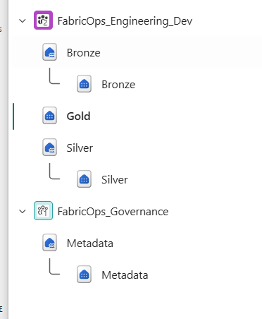
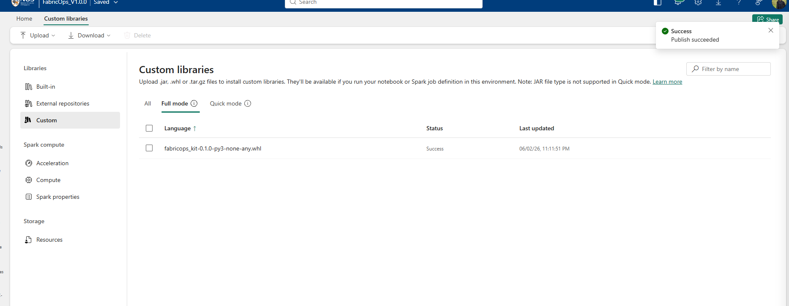

# Step 0A: Prepare Fabric artifacts

**Prepare the Fabric workspaces, stores, Environment, notebook templates, and demo files needed for the Guided Demo.**

This is normally a one-time setup that you adapt to your own Fabric environment.

## What you will prepare

1. Workspaces
2. Lakehouses and Warehouses
3. Fabric Environment with the FabricOps wheel
4. Template notebooks
5. Demo datasets and files

## 1. Create the Fabric workspaces

For the full governed workflow, prepare:

1. Governance
2. Engineering Development
3. Engineering Production

!!! note "Simpler demo setup"

    For demonstration purposes, you can place all required items in one demo workspace instead of creating three separate workspaces.

## 2. Create the Lakehouses and Warehouses

### Governance

Create a Lakehouse named `METADATA`.

### Engineering Development

Create:

- a source Lakehouse
- a unified Lakehouse
- a product Warehouse

For the Guided Demo we use the names `source`, `unified`, and `product`.

### Engineering Production

Create the same Lakehouse and Warehouse names used in Engineering Development so promotion does not require path renaming.

??? info "Background reading"

    If you want more context before choosing your own storage layout, review the Microsoft guidance on medallion architecture and the Fabric Lakehouse versus Warehouse decision guide.

## 3. Create a Fabric Environment and install the FabricOps wheel

1. Download the `.whl` file from the GitHub Release you want to use, for example `fabricops_kit-0.1.0-py3-none-any.whl`.
2. Create a Fabric Environment.
3. Open the Environment.
4. Go to **Custom libraries**.
5. Upload the `.whl` file.
6. Save or publish the Environment.

## 4. Upload the notebook templates

Download the notebooks from the GitHub [`templates/notebooks`](https://github.com/Voycepeh/FabricOps-Starter-Kit/tree/main/templates/notebooks) folder into the relevant Fabric workspaces.

| Notebook | Purpose |
| --- | --- |
| `00_env_config` | Configures workspaces, Lakehouses, Warehouse, metadata routing, audit settings, and runtime settings. |
| `01_governance` | Manages Data Steward, Data Agreement, Data Contract, Enrichment, Guardrail, and review workflows. |
| `02_pipeline` | Processes data, profiles outputs, checks Guardrails, and records evidence. |
| `99_explore` | Uses approved Production data for project exploration, AI, or BI work. |

!!! tip "Naming your copies"

    Keep the notebook prefix and add the project or task name when useful, for example `01_governance_projectname` or `02_pipeline_emaildata`.

## 5. Upload the Guided Demo data files

Download the files from the GitHub [`templates/DemoData`](https://github.com/Voycepeh/FabricOps-Starter-Kit/tree/main/templates/DemoData) folder.

| Demo data | Purpose |
| --- | --- |
| `laptop_inventory_demo.csv` | Main demo dataset used across the governed workflow. |
| `demo.csv` | Simple CSV read example. |
| `demo.xlsx` | Simple Excel read example. |
| `demo.parquet` | Simple Parquet read example. |

## Expected result

You should now have:

- the required Fabric workspaces
- the required Lakehouses and Warehouses
- a Fabric Environment with the FabricOps wheel installed
- editable copies of the Guided Demo notebooks
- the demo data files needed for the walkthrough

**Next:** [Step 0B: Set up the operating environment](00B-run-environment-setup.md).
