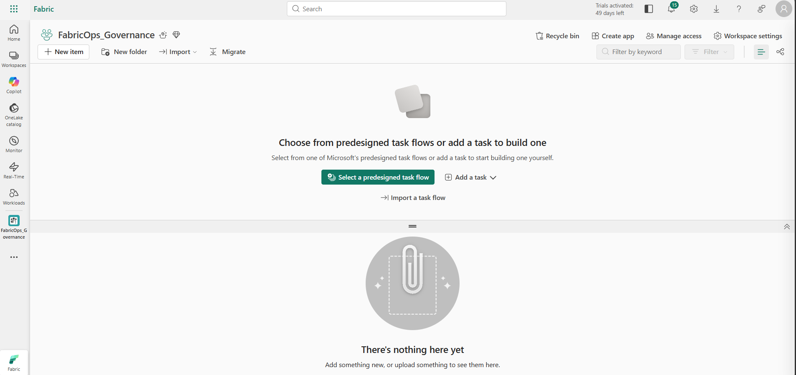
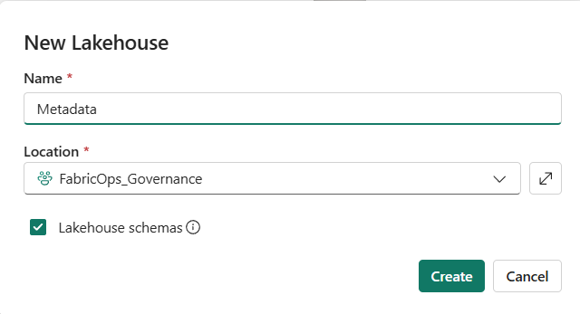

# 0A. Prepare the Fabric environment

**Create the Fabric workspaces and stores, then install FabricOps into a Fabric Environment in each workspace that will run FabricOps notebooks.**

This is foundation setup, not one of the seven FabricOps lifecycle steps.

## 1. Open Microsoft Fabric

Open [Microsoft Fabric](https://app.fabric.microsoft.com/) and sign in with your Microsoft account.

You need access to Microsoft Fabric capacity to complete the walkthrough. If you do not already have access through your organisation, you can use a Fabric trial where available.

## 2. Create the workspaces

Create these workspaces for the walkthrough:

| Workspace | Required? | Used for |
| --- | --- | --- |
| **Governance** | Yes | Governance metadata, Data Stewards, Data Agreements, and Data Contracts. |
| **Engineering Development** | Yes | Build and validate the Engineering pipeline. |
| **Engineering Production** | Optional until Step 6 | Production mirror of the Development engineering workspace. |
| **Consumer** | Optional until Step 7 | Consume approved Production data. |

For Steps 1–5, only **Governance** and **Engineering Development** are required. Create the optional workspaces now if you want to follow the entire seven-step walkthrough without stopping later.



## 3. Create the Governance metadata Lakehouse

Open the **Governance** workspace and create a Lakehouse named:

```text
Metadata
```

Use this exact name and casing for the Guided Demo. FabricOps uses this Lakehouse to persist its Governance metadata throughout the walkthrough.



## 4. Create the Engineering stores

Open **Engineering Development** and create:

| Item | Name | Role in the walkthrough |
| --- | --- | --- |
| Lakehouse | `bronze` | Source / landing data. |
| Lakehouse | `silver` | Curated engineering data. |
| Warehouse | `gold` | Product / serving data. |


If you created **Engineering Production**, repeat the same setup there. Production should be a **1:1 structural mirror of Engineering Development**: `bronze`, `silver`, and `gold` with the same item types and names.

The **Consumer** workspace does not need its own Fabric store for this Guided Demo. It will consume approved Production data in Step 7.

## 5. Get FabricOps

The easiest option is to download the packaged FabricOps wheel from the [FabricOps Releases page](https://github.com/Voycepeh/FabricOps-Starter-Kit/releases).

Download the `.whl` file from the release you want to run.

If you prefer to build FabricOps yourself, clone the repository locally and run:

```bash
uv build
```

The built wheel will be available under `dist/`.

## 6. Create Fabric Environments and install FabricOps

A Fabric Environment belongs to a **workspace**. An Environment created in Governance is not automatically available in Engineering Development, Engineering Production, or Consumer.

Start in the **Governance** workspace and create a Fabric **Environment**. Then:

1. Open **Custom libraries**.
2. Upload the FabricOps `.whl` file.
3. Confirm the wheel appears in the custom library list.
4. **Publish** the Environment.

Publishing is required before the installed FabricOps package is available to notebooks that use this Environment.


Repeat the same Environment setup in every workspace that will run FabricOps notebooks:

| Workspace | Environment needed? | Why |
| --- | --- | --- |
| **Governance** | Yes | Runs `01_governance` and Governance metadata operations. |
| **Engineering Development** | Yes | Runs `00_env_config` and `02_pipeline` during Development. |
| **Engineering Production** | Yes when you reach Step 6 | Runs the Production copy of the validated pipeline. |
| **Consumer** | Yes when you reach Step 7 | Runs `99_explore` using the FabricOps package. |

Use the same FabricOps wheel version in each workspace so Governance, Development, Production, and Consumer are running the same package version during the Guided Demo.

## Expected result

You now have:

- a Governance workspace with the `Metadata` Lakehouse and a published Fabric Environment containing FabricOps;
- an Engineering Development workspace with `bronze`, `silver`, and `gold`, plus its own published Fabric Environment containing the same FabricOps wheel;
- optionally, a matching Engineering Production workspace for Step 6, with its own Environment when you are ready to use it; and
- optionally, a Consumer workspace for Step 7, with its own Environment when you are ready to run `99_explore`.

The physical Fabric foundation is ready. The next step imports the FabricOps notebook templates and demo data.

**Next:** [0B. Configure the environment and load demo data](00B-run-environment-setup.md)
