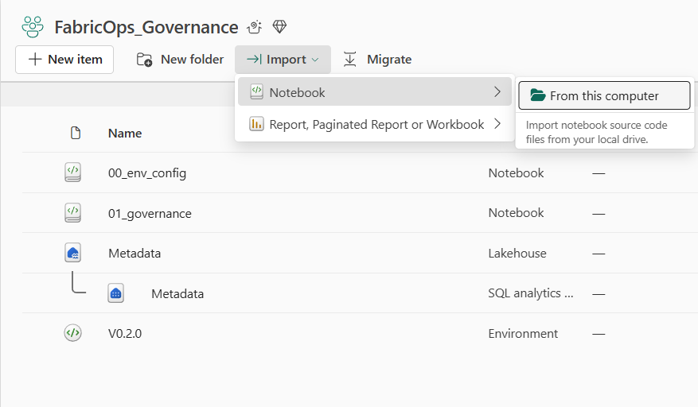
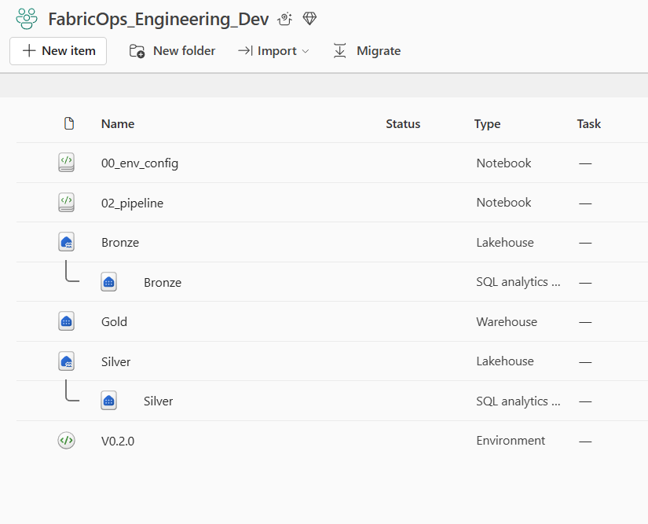
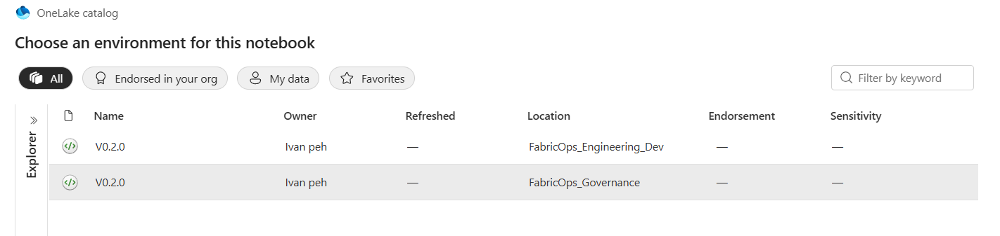
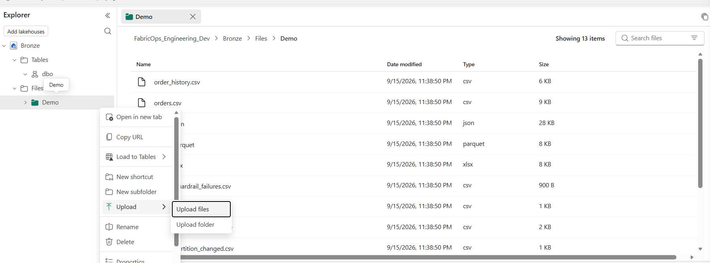

# 0B. Load and configure the Guided Demo assets

**Import the FabricOps notebooks, attach the correct Fabric Environment, configure the Fabric item IDs, create the Governance metadata tables, and upload the packaged demo files.**

This is the final setup step before the executable demo-data preparation in 0C.

## 1. Download and import the notebook templates

Download the current notebook templates from the FabricOps repository:

[FabricOps notebook templates](https://github.com/Voycepeh/FabricOps-Starter-Kit/tree/main/templates/notebooks)

You need these four notebooks:

| Notebook | Where it goes now |
| --- | --- |
| `00_env_config.ipynb` | Copy into every workspace that will run a FabricOps notebook |
| `01_governance.ipynb` | Governance workspace |
| `02_pipeline.ipynb` | Engineering Development workspace |
| `99_explore.ipynb` | Consumer workspace |

In Fabric, open the target workspace, choose **Import notebook**, and upload the downloaded `.ipynb` file.

After importing the notebooks, the two required workspaces should now look like this.



The Governance workspace contains the `metadata` Lakehouse, its Fabric Environment, `00_env_config`, and `01_governance`.



The Engineering Development workspace contains `bronze`, `silver`, `gold`, its Fabric Environment, `00_env_config`, and `02_pipeline`.

The Consumer workspace should contain `00_env_config` and `99_explore`. It does not need its own Fabric store for this Guided Demo.

## 2. Open all the notebooks and set the Fabric Environment

Open each imported notebook and make sure it uses the Fabric Environment created in 0A that contains the FabricOps custom library.

1. Open the notebook.
2. In the notebook toolbar, make sure the runtime is set to **PySpark (Python)**.
3. Beside it, open the **Environment** dropdown and choose **Change environment**.
4. Select the Environment created for that workspace in 0A, where the FabricOps `.whl` was uploaded as a custom library.
5. Repeat this for every imported notebook in Governance, Engineering Development, and Consumer.




If you are a member of several Fabric workspaces, the Environment picker may show Environments from more than one workspace. For this Guided Demo, choose the Environment that belongs to the notebook's own workspace.

Use the same FabricOps wheel version across the workspace-specific Environments so the notebooks run against a consistent package version.

## 3. Configure `00_env_config`

Open `00_env_config` and replace the example Fabric IDs with the IDs for the Fabric items you created in 0A.

The easiest way to get them is directly from the Fabric URL in your browser.

1. Open the Fabric item you want to configure, for example the `bronze` Lakehouse.
2. Look at the browser address bar. A Fabric Lakehouse URL follows this shape:

```text
https://app.fabric.microsoft.com/groups/<workspace-id>/lakehouses/<item-id>/...
```

A Warehouse URL follows the same pattern, but uses `warehouses`:

```text
https://app.fabric.microsoft.com/groups/<workspace-id>/warehouses/<item-id>/...
```

3. Copy the GUID immediately after `/groups/`. This is the `workspace_id`.
4. Copy the GUID immediately after `/lakehouses/` or `/warehouses/`. This is the `item_id`.
5. Paste those values into the matching `FabricStore(...)` entry in `00_env_config`.

Use the current walkthrough store keys exactly as they appear in `00_env_config`:

| `FabricStore` key | Open this Fabric item | `kind` |
| --- | --- | --- |
| `metadata` | Governance → `metadata` | `lakehouse` |
| `bronze` | Engineering Development → `bronze` | `lakehouse` |
| `silver` | Engineering Development → `silver` | `lakehouse` |
| `gold` | Engineering Development → `gold` | `warehouse` |

The `workspace_id` is the same for `bronze`, `silver`, and `gold` because they are in the same Engineering Development workspace. The `metadata` Lakehouse uses the Governance workspace ID.


## 4. Setup the metadata tables

In the Governance workspace, run the metadata setup block in `00_env_config`.


This prepares the metadata Lakehouse before `01_governance` starts creating Data Stewards, Data Agreements, and later Data Contracts.

## 5. Download the demo data

Download the supplied demo files from: [FabricOps DemoData](https://github.com/Voycepeh/FabricOps-Starter-Kit/tree/main/templates/DemoData)

Download the **entire DemoData folder**. Every retained file has an explicit Guided Demo owner:

| Demo asset | When it is used |
| --- | --- |
| `orders.csv`, `orders.json`, `orders.parquet`, `orders.xlsx` | 0C uses these equivalent 120-row files to demonstrate the FabricOps file readers. |
| `products.csv` | 0C seeds `bronze.demo.products`. |
| `order_history.csv` | 0C seeds `gold.demo.order_history` and demonstrates Warehouse reads. |
| `orders_incremental.csv` | Kept untouched in 0C and revisited later in the `02_pipeline` walkthrough. |
| `orders_partition_baseline.csv`, `orders_partition_changed.csv`, `orders_partition_new.csv` | Reserved for the later partition-overwrite incremental/load-strategy showcase. |
| `orders_watermark_duplicate.csv`, `orders_watermark_null.csv` | Reserved for later incremental watermark validation examples. |
| `orders_guardrail_failures.csv` | Reserved for the later Guardrail validation story. |

## 6. Upload the demo data

1. Open the **Engineering Development** workspace.
2. Open the `bronze` Lakehouse created in 0A.
3. Under **Files**, create a subfolder named `Demo`.
4. Upload the **entire downloaded DemoData folder contents** into that folder.



At this point, stop. Do not create the managed source tables manually in 0B.

The next setup notebook demonstrates the FabricOps I/O helpers and prepares the exact managed tables that `02_pipeline` will use.

**Next:** [0C. Prepare the demo data with FabricOps I/O](00C-prepare-demo-data.md)
