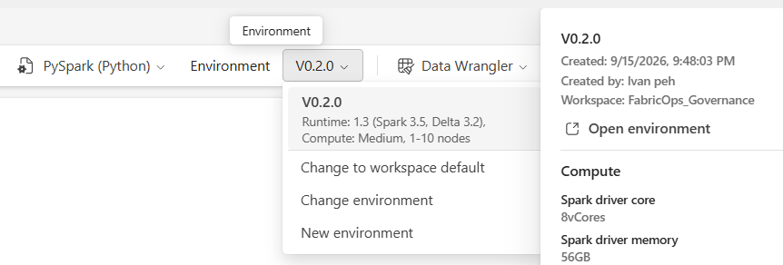
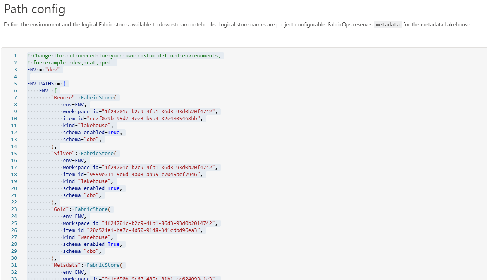
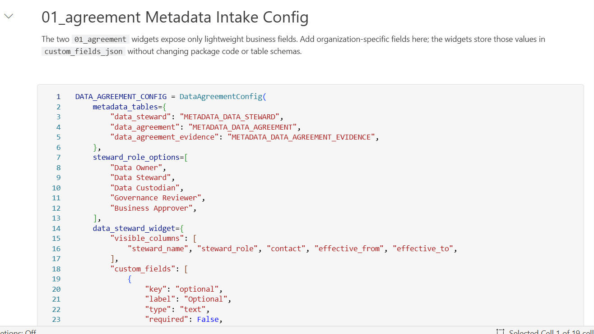
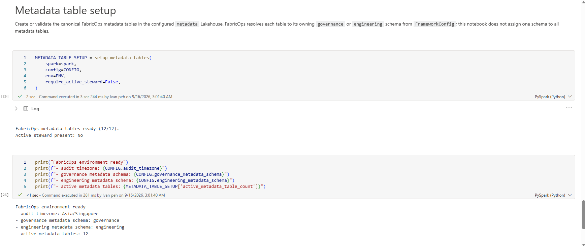
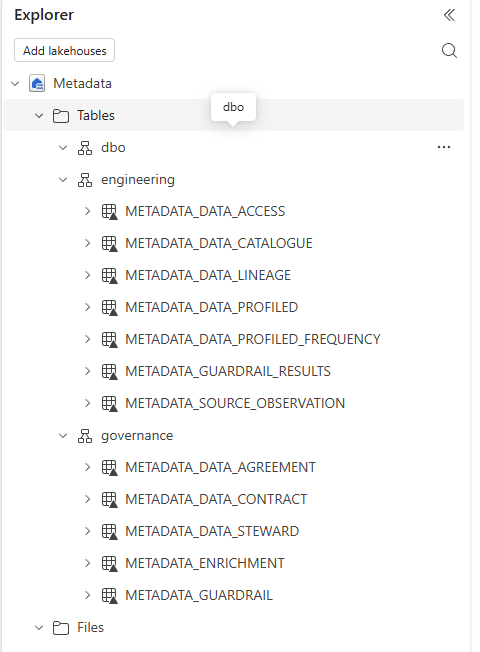
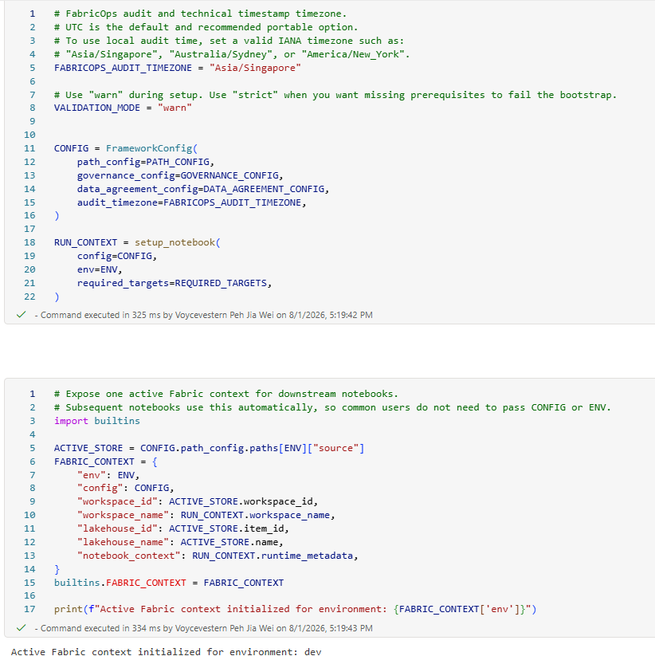

# Step 0B: Set up the operating environment

**Configure `00_env_config` so every FabricOps notebook can resolve the correct workspace, Fabric items, runtime settings, widgets, and metadata target.**

Complete [Step 0A: Prepare Fabric artifacts](00A-setup-fabric-artifacts.md) first.

## High-level flow

```text
Open config → Attach Environment → Configure paths → Review widgets → Set up metadata → Reuse context
```

???+ success "Live — Open `00_env_config`"

    Open the copied `00_env_config` notebook in the target workspace. Run it in Governance, Engineering Development, and Engineering Production.

???+ success "Live — Attach the Fabric Environment"

    1. Open the notebook.
    2. Select the Fabric Environment containing the FabricOps wheel.
    3. Restart the notebook session after changing the Environment or its libraries.

    You can skip this when the workspace default Environment already contains the correct FabricOps package.

    

???+ success "Live — Configure Fabric item paths"

    Update `ENV_PATHS` for the active environment so FabricOps can resolve the required workspaces and Fabric items.

    A Fabric item URL contains the workspace ID and item ID, which can be used to populate the configuration.

    

    !!! note "Why this configuration exists"

        A Fabric notebook can only have one default Lakehouse or Warehouse attached at a time. FabricOps avoids hardcoding cross-workspace paths in every notebook by centralising them in `00_env_config`.

???+ success "Live — Review widget settings"

    Change widget settings only when you need different dropdown options or additional custom fields.

    Custom fields are stored as JSON and do not create additional physical table columns.

    

???+ success "Live — Set up metadata tables"

    Complete this block in the Governance workspace.

    1. Confirm that the `metadata` target points to the correct metadata Lakehouse.
    2. Run the metadata setup cell.
    3. Allow the setup to create or validate the required metadata tables.
    4. Leave the setup cell unchanged during normal Guided Demo runs.

    

    The cell should complete without errors and confirm that the metadata tables are ready.

    

???+ success "Live — Confirm reusable context"

    `00_env_config` prepares reusable context for downstream FabricOps functions and notebooks.

    

## Expected result

`00_env_config` is ready when the Fabric Environment is attached, package imports work, paths and runtime settings are configured, metadata tables exist, and `FABRIC_CONTEXT["env"]` plus `FABRIC_CONTEXT["config"]` are available.

**Previous:** [Step 0A: Prepare Fabric artifacts](00A-setup-fabric-artifacts.md)  
**Next:** [Step 1: Create Data Stewards and Data Agreements](01-create-agreement.md)
