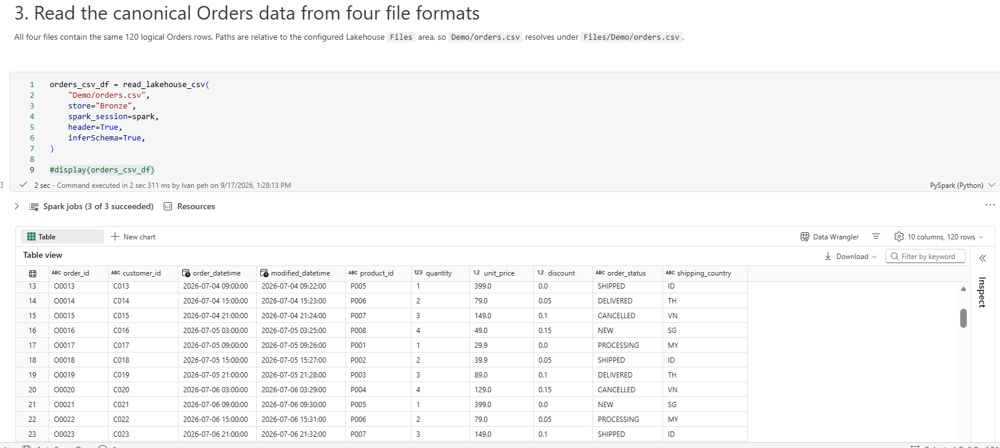
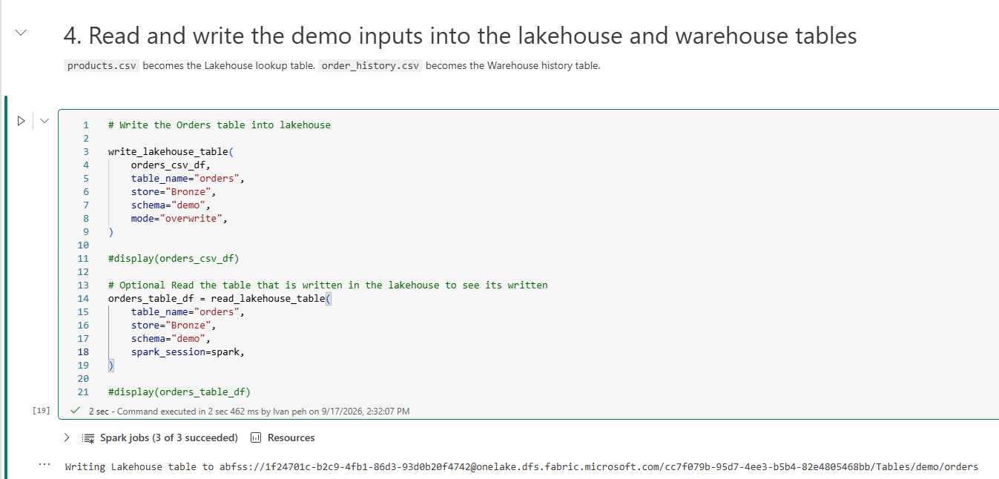
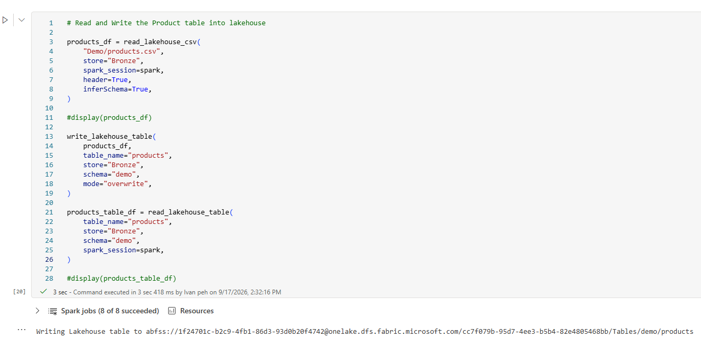
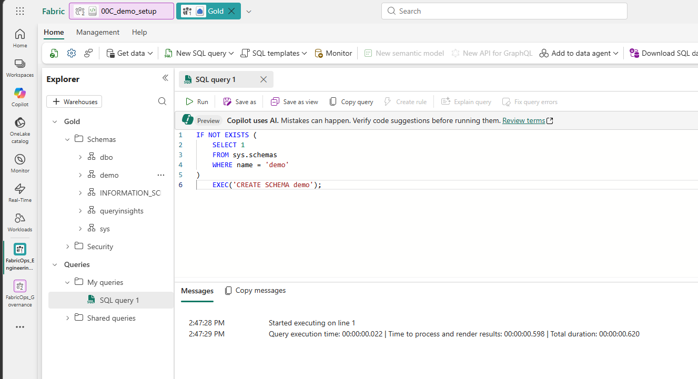
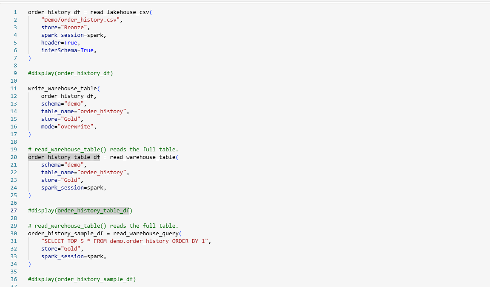

# 0C. Prepare the demo data with FabricOps I/O

**Run a notebook that demonstrates the FabricOps I/O helpers and prepares the tables required by the `02_pipeline` demo flow.**

## 1. Import the setup notebook

1. Download [`00C_demo_setup.ipynb`](https://github.com/Voycepeh/FabricOps-Starter-Kit/blob/main/templates/DemoData/00C_demo_setup.ipynb) and import it into Fabric Engineering Workspace (Dev).
2. Attach the same Fabric Environment used by the other notebooks.
3. Run the first two steps in the notebook.


## 2. Read the same Orders dataset from four file formats

Read the same canonical Orders dataset using CSV, JSON, Parquet, and Excel.



```python
# Optional: uncomment to inspect the loaded data
display(orders_csv_df)
```

### Optional: verify all four file formats match

Copy and paste this into an empty code cell.

Normalize the format-specific inferred schemas, then verify that CSV, JSON, Parquet, and Excel resolve to the same canonical Orders dataset using a checksum comparison.

```python
from pyspark.sql import functions as F

schema = {
    "order_id": "string",
    "customer_id": "string",
    "order_datetime": "timestamp",
    "modified_datetime": "timestamp",
    "product_id": "string",
    "quantity": "int",
    "unit_price": "double",
    "discount": "double",
    "order_status": "string",
    "shipping_country": "string",
}

def normalize(df):
    return df.select(*[
        F.col(c).cast(dtype).alias(c)
        for c, dtype in schema.items()
    ])

formats = {
    "CSV": orders_csv_df,
    "JSON": orders_json_df,
    "PARQUET": orders_parquet_df,
    "EXCEL": orders_excel_df,
}

normalized = {name: normalize(df) for name, df in formats.items()}

def checksum(df):
    cols = sorted(df.columns)
    return (
        df.select(F.sha2(F.concat_ws("||", *[F.coalesce(F.col(c).cast("string"), F.lit("<NULL>")) for c in cols]), 256).alias("hash"))
        .agg(F.sha2(F.concat_ws("", F.sort_array(F.collect_list("hash"))), 256).alias("hash"))
        .first()["hash"]
    )

hashes = [checksum(df) for df in normalized.values()]
assert len(set(hashes)) == 1, "Orders file variants do not match."

print("✓ CSV = JSON = PARQUET = EXCEL")
print("✓ 1:1:1:1 data match")
```

The expected output confirms that all four file formats resolve to equivalent data. This step is only used to demonstrate the FabricOps file I/O capabilities.

```text
✓ CSV = JSON = PARQUET = EXCEL
✓ 1:1:1:1 data match
```

## 3. Read and write the demo data

Read the remaining demo sources and write the managed Lakehouse and Warehouse tables used by the later pipeline walkthrough.

### Orders (we will write the dataframe we ingested earlier into the bronze lakehouse table and then re-read from that lakehouse table to see if the data is loaded properly)



### Products (we will ingest the product data and write into the bronze lakehouse table and then re-read from that lakehouse table to see if the data is loaded properly)



### Create the Warehouse schema (for warehouses you will need to create schema via sql prior to writing to it)



### Order history (we will ingest the order history data and write into the bronze lakehouse table and then re-read from that lakehouse table to see if the data is loaded properly)


FabricOps provides two Warehouse read helpers:

* `read_warehouse_table()` reads the full Warehouse table into a Spark DataFrame.
* `read_warehouse_query()` executes SQL in the Warehouse first, then returns only the query result to Spark.

Use `read_warehouse_query()` when filtering, selecting columns, joining, or aggregating Warehouse data. This pushes the SQL work down to the Warehouse before the result crosses into PySpark, avoiding translation of more Warehouse data into Spark than necessary.

For guidance on when to use SQL pushdown versus landing Warehouse data into a Lakehouse for repeated PySpark engineering, see [Lakehouse-first engineering](../reference/engineering-cheat-sheet.md#lakehouse-first).


## What the notebook intentionally does not load

`orders_incremental.csv` remains in `bronze/Files/Demo/` and is **not** appended here. It is revisited later in the `02_pipeline` walkthrough so the source-change story happens at the right point in the lifecycle.

The partition and watermark fixtures are also left untouched for the later incremental and load-strategy showcase.

`orders_guardrail_failures.csv` is left untouched until the later Guardrail validation step. The normal baseline stays valid so the first Engineering run is deterministic.

## Expected result

After the notebook finishes, Engineering Development should contain the managed sources required by `02_pipeline`:

```text
bronze Lakehouse
  demo.orders       # canonical Day 1 Orders baseline
  demo.products

gold Warehouse
  demo.order_history
```

**Next:** [Step 1. Establish Governance context](01-create-agreement.md)
