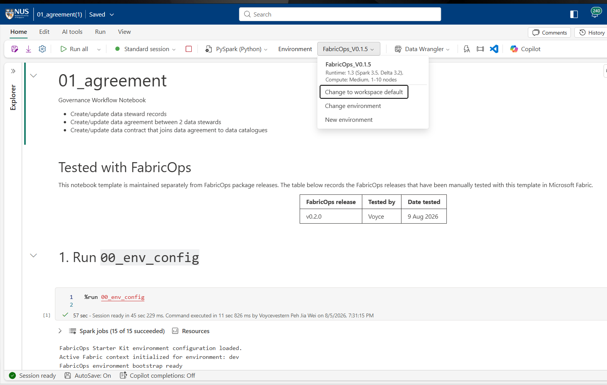
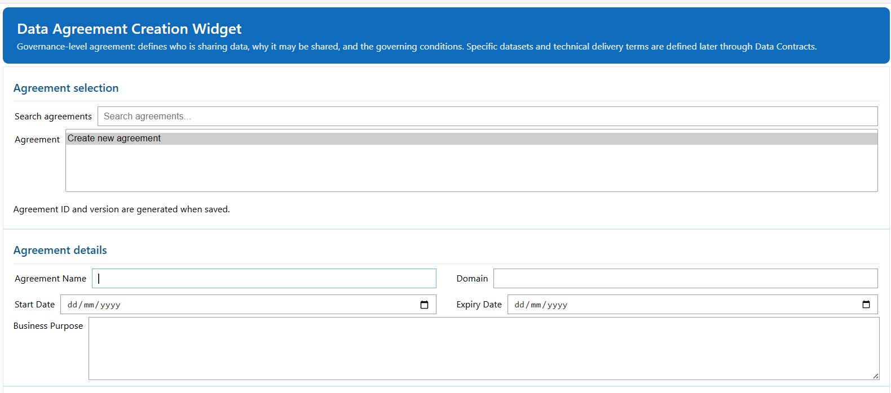

# Step 1: Create data stewards, establish an agreement, and later register contracts

Run `01_agreement` in the Governance workspace after Step 0 to capture steward and agreement context before pipeline execution. This notebook supports two governance stages: establish the Data Agreement first, then return later to register one or more Data Contracts after the relevant catalogue and validation evidence exists.

Run it in the Governance workspace 

## Start by making sure you have selected the correct Environment & %run 00_env_config

### 1. Populate the data steward table

### 2. Poplulate the data agreement table between 2 data steward 

.png)

### Fow now thats it , a final missing link is to link agreement created here to the data catalgoue created in `02 pipeline` but we will revist this in step 5 [Step 5: Create data contract](05-create-data-contract.md)

Next, continue to [Step 2: Run the first Development pipeline](run-pipeline.md).