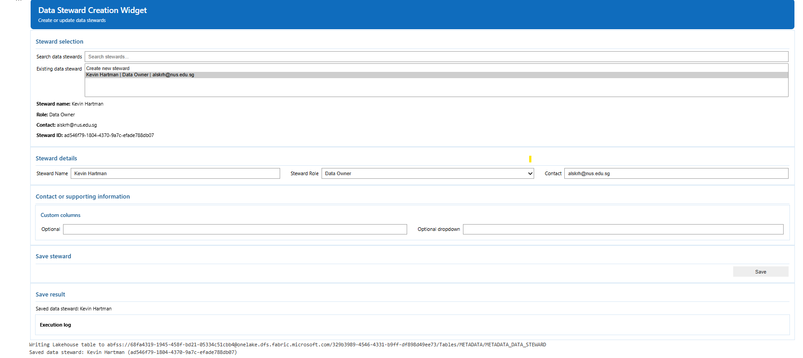

# Step 1: Create Data Stewards and Data Agreements

**Use `01_governance` in the Governance workspace to establish accountable Data Stewards and the Data Agreement before Engineering starts.**

The agreement workflow uses `DATA_AGREEMENT_CONFIG` from `00_env_config` to control form fields and widget behaviour.

## Before you begin

Confirm that:

- the correct Fabric Environment is attached
- `00_env_config` has been run
- the Governance metadata tables are available

## What to do

### 1. Create the Data Stewards

Populate the Data Steward records for the accountable parties.

### 2. Create the Data Agreement

Create the Data Agreement between the relevant Data Stewards.

.png)

!!! note "The Data Contract comes later"

    At this stage the agreement exists before the Data Catalogue has been created. Step 5 returns to `01_governance` after `02_pipeline` has produced the engineering evidence and links the governed Data Catalogue to the Data Agreement through a Data Contract.

## Expected result

You should now have:

- accountable Data Steward records
- a Data Agreement describing the governance relationship
- the governance foundation needed before running the Development pipeline

**Next:** [Step 2: Run the Common Pipeline Patterns](02-run-pipeline.md)
