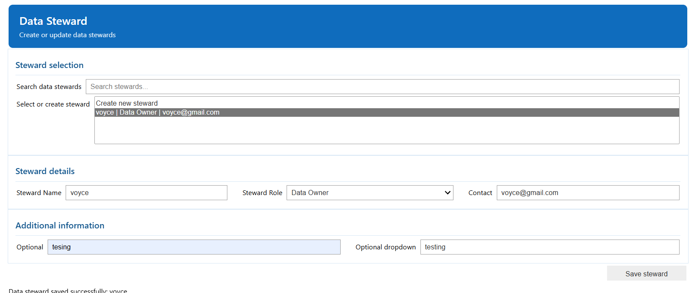
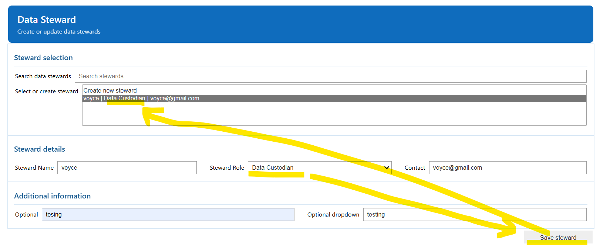
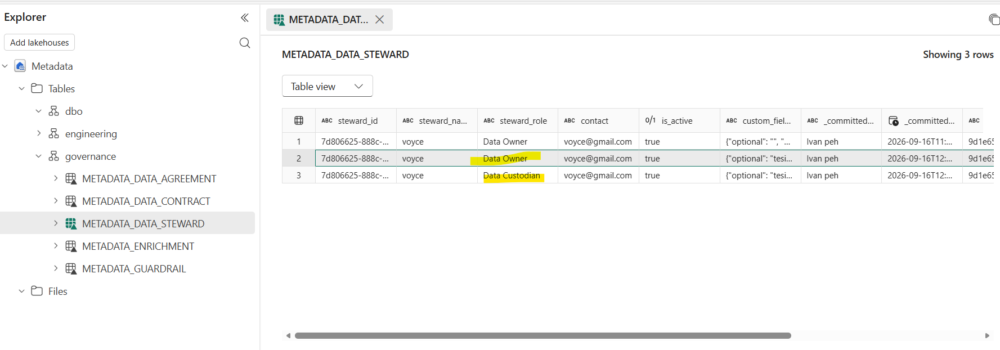
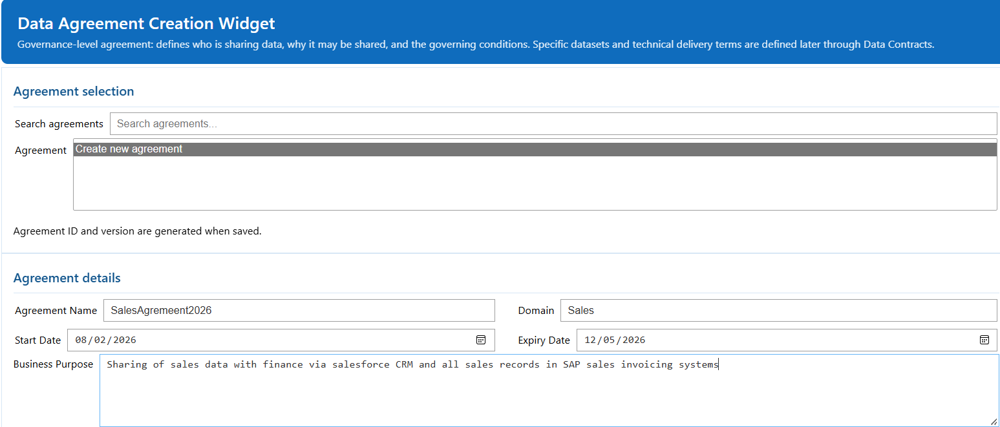
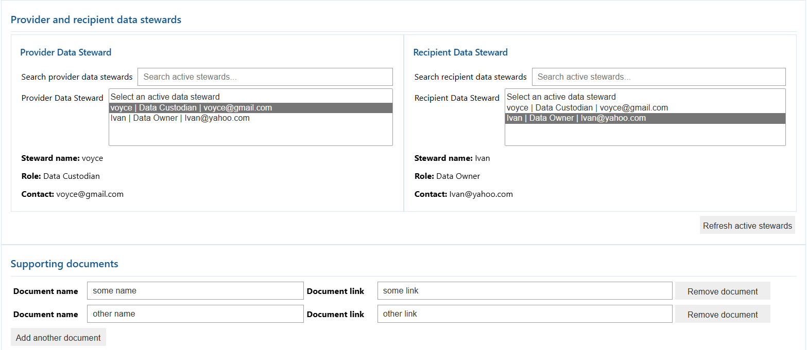

# Step 1. Establish Governance context

**Use `01_governance` for the first Governance task, creating the Data Stewards and the Data Agreement. We put this at the first step but technically there is no depandancy until step 5 promotion so you may skip and revist this later if you prefer to start with the ETL process first**


## 1. Load the shared environment notebook that we set up in 00B

```python
%run 00_env_config
```

## 2. Import required widgets functions
- we created widgets with ipywidgets to provide users a simplistic UI to record and capture the data needed , 
- feel free to swap out to an actual frontend or capture the data into the underlying metdata tables yourself if you want to.

```python
from fabricops_kit import (
    widget_render_data_agreement,
    widget_render_data_steward,
)

```

## 3. Create the Data Stewards

- Use the widget to create the data producer/consumer of the data
- The dropdown list are configurable and comes from the 00_env_conig notebook
- To update a record you simply edit the data and press save again
- The widget will write into the underlying metdata table for us , as you can see from the example below i created myself as a Data Owner and later updated it as Data Custodian
  




## Create the Data Agreement

- Use the Data Agreement widget to create the relationship between the accountable producer and consumer stewards.
- Capture the purpose, scope, permitted use, validity, supporting information, and other governance context required by your organisation.




## Stop here

At the end of Step 1 you should have:

- producer and consumer Data Steward records,
- one Data Agreement between them,
- visible persisted rows in the metadata tables,

**Next:** [Step 2. Build and run the ETL](02-run-pipeline.md)
