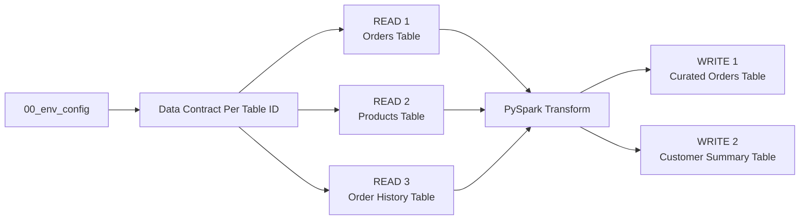

# Step 2. Build and run the ETL

Run the `02_pipeline` template in the Engineering Development Workspace.

This step builds on [Step 00C. Prepare the demo data](00C-prepare-demo-data-with-fabricops-io.md) and expects the demo data to already be loaded into the respective Lakehouse and Warehouse tables.

This walkthrough intentionally demonstrates one pattern: **full read → transform → full overwrite**.

For target-aware incremental reads, incremental writes, partition-aware processing, and profiling partial batches versus complete persisted tables, continue with [Step 2B. Run an incremental append pipeline](02B-build-and-run-incremental-append-etl.md).

## What you will do

1. Read three source tables.
2. Transform them with normal PySpark.
3. Write two target tables.

Along the way, FabricOps will skip contract-backed Guardrails before a Data Contract exists, profile the governed tables, record pipeline lineage, and build the Data Catalogue that Governance uses in Step 3.

The standard **full refresh** pipeline shape is:



## 1. Load the shared environment and pipeline functions

Run the shared environment notebook from Step 00B and import the pipeline functions used by this template.

??? example "Show notebook setup screenshot"
    

## 2. Run the Data Contract selection

For the first Guided Demo run, there is no Data Contract yet. Run the cell and leave the selection unchanged. Contract-backed checks will return as skipped when no Data Contract is selected.

??? example "Expand to see how it looks"

    ```python
    CONTRACTS = widget_select_data_contract(spark_session=spark)
    ```

    The selector defaults every discovered source and target to **Enforce**.

    This is the normal pipeline path, so no mode change is required for the initial Guided Demo run.


    

    This is expected. There is no enforceable Data Contract yet because Governance has not authored and activated one.

## 3. Read

The template contains three independent Read blocks.

| Read | Store | Schema | Table |
| --- | --- | --- | --- |
| Orders | `Bronze` Lakehouse | `demo` | `orders` |
| Products | `Bronze` Lakehouse | `demo` | `products` |
| Order History | `Gold` Warehouse | `demo` | `order_history` |

### About `orchestrate_read()`

`orchestrate_read()` is the standard FabricOps entry point for reading a governed source.

Instead of manually wiring together the physical read, source identity, Guardrails, and profiling, you describe the source once and FabricOps orchestrates the standard Read lifecycle around it.

Under the hood, it uses `pipeline_read()` to read from the configured Lakehouse or Warehouse, resolves the canonical `table_id`, runs the applicable Freshness, Schema, and Data Quality Guardrails, and profiles the source when profiling applies.

The main parameters are:

- `name` → a readable name for this source inside the notebook.
- `store` → the logical FabricOps store defined in `00_env_config`, such as `Bronze` or `Gold`.
- `schema` → the source schema.
- `table_name` → the source table.
- `read_mode` → how the source should be read, such as `"full"` or `"incremental"`.
- `query` → optional T-SQL pushed down to a Warehouse instead of reading the complete table.
- `target_table_id` → optional governed target context used by target-aware incremental reads.
- `spark_session` → the Spark session used by the Read lifecycle.

### Configure and run each Read

Each source is configured directly in its own `orchestrate_read()` call.

```python
source = orchestrate_read(
    name="orders",
    store="Bronze",
    schema="demo",
    table_name="orders",
    read_mode="full",
    query=None,
    spark_session=spark,
)

sources["orders"] = source
```

The returned `source` keeps the DataFrame together with the supporting Read outputs:

- `source["dataframe"]` → the Spark DataFrame returned by the Read.
- `source["table_id"]` → the canonical FabricOps identity for the source table.
- `source["freshness_result"]` → the Freshness Guardrail result.
- `source["schema_result"]` → the Schema Guardrail result.
- `source["dq_result"]` → the Data Quality Guardrail result.
- `source["profile_result"]` → the profiling result when profiling applies.
- `source["orchestration_stages"]` → the status and timing of each Read stage.

Store the complete result in `sources["orders"]` so later transformation and Write steps can reuse the DataFrame, canonical `table_id`, Guardrail results, profiling output, and orchestration status.

??? info "What happens under the hood"
    `orchestrate_read()` handles the standard FabricOps Read flow.

    Under the hood, it uses `pipeline_read()` to select the appropriate Lakehouse or Warehouse read path. For Warehouse sources, it can also push down a T-SQL query when one is provided.

    It resolves the canonical `table_id` and runs the applicable source Guardrails defined by the Data Contract through:

    - `check_freshness()`
    - `check_schema()`
    - `check_dq()`

    Lastly, it calls `profile_table()` when profiling applies.

    The returned source result is carried forward so later Write blocks can use its `table_id` for source-to-target lineage.

    These lower-level functions remain public if you need to build a custom flow.

??? example "Show Read orchestration output"
    

## 4. Transformation

After reading the data from the Lakehouse or Warehouse into PySpark DataFrames, use normal PySpark in this section to perform your project-specific transformation logic, such as:

- joining DataFrames,
- filtering rows,
- aggregating data,
- deriving new columns,
- reshaping or selecting the final output structure.

For common examples, see the [PySpark transformation cheat sheet](../reference/engineering-cheat-sheet.md#pyspark-transformation-cheat-sheet).


You can also use Copilot, ChatGPT, Claude, or other AI coding tools to help draft the PySpark transformation. Always validate the generated logic and resulting DataFrame against your actual data before writing.

## 5. Write

The template contains two independent Write blocks.

| Write | Store | Schema | Table | Load strategy |
| --- | --- | --- | --- | --- |
| Curated Orders | `Silver` | `demo` | `curated_orders` | `overwrite` |
| Customer Summary | `Gold` | `demo` | `customer_summary` | `overwrite` |

### About `orchestrate_write()`

`orchestrate_write()` is the standard FabricOps entry point for validating and publishing a governed target.

Instead of manually wiring together target identity, Data Contract Guardrails, the physical write, lineage, metadata registration, and profiling, you describe the target once and FabricOps orchestrates the standard Write lifecycle around it.

Under the hood, FabricOps resolves the target `table_id` and contributing source identities, runs the applicable Schema, Sensitive Data, Source Drift, Data Quality, and Guardrail Coverage checks, then uses `pipeline_write()` to publish to the configured Lakehouse or Warehouse. The persisted target is profiled after a successful write.

The main parameters are:

- `dataframe` → the transformed Spark DataFrame to publish.
- `name` → a readable name for this target inside the notebook.
- `sources` → the Read results that contributed to this target, used to retain source-to-target lineage.
- `store` → the logical destination store defined in `00_env_config`.
- `schema` → the target schema.
- `table_name` → the target table.
- `load_strategy` → how the target should be written, such as `"overwrite"`, `"append"`, `"scd1"`, or `"scd2"`.
- `contracts` → the Data Contract selections used for governed validation and enforcement.
- `repartition_by` → optional Spark partitioning control before the write.
- `spark_session` → the Spark session used by the Write lifecycle.

### Configure and run each Write

Each target is configured directly in its own `orchestrate_write()` call. Write strategy belongs to the target, so the same pipeline may publish different targets using different load strategies.

```python
write_result = orchestrate_write(
    transformed_df,
    name="curated_orders",
    sources=[
        sources["orders"],
        sources["products"],
        sources["history"],
    ],
    store="Silver",
    schema="demo",
    table_name="curated_orders",
    load_strategy="overwrite",
    contracts=CONTRACTS,
    repartition_by=None,
    spark_session=spark,
)
```

The returned `write_result` keeps the target identity together with the supporting Write outputs:

- `write_result["table_id"]` → the canonical FabricOps identity for the target table.
- `write_result["schema_result"]` → the Schema Guardrail result.
- `write_result["sensitive_result"]` → the Sensitive Data Guardrail result, including any applied treatment.
- `write_result["source_drift_results"]` → the Source Drift results for the contributing sources.
- `write_result["dq_result"]` → the Data Quality Guardrail result.
- `write_result["coverage_result"]` → whether the required Guardrails are covered for the target.
- `write_result["orchestration_stages"]` → the status and timing of each Write stage.
- `write_result["published"]` → whether the target was physically written.
- `write_result["profile_result"]` → the profile of the persisted target when profiling applies.

This keeps the publication result, Guardrail results, profiling output, and orchestration status together for later use in the notebook.

??? info "What happens under the hood"
    `orchestrate_write()` handles the standard FabricOps Write flow.

    It first resolves the target `table_id` and the `table_id` of each contributing source.

    It then runs the applicable Guardrails defined by the Data Contract through:

    - `check_schema()`
    - `check_sensitive_data()`
    - `check_source_drift()`
    - `check_dq()`
    - `check_guardrail_coverage()`

    Sensitive Data treatment is applied before the remaining Data Quality checks and publication.

    If the Guardrails pass, `pipeline_write()` writes to the appropriate Lakehouse or Warehouse destination and records the associated publication metadata and source-to-target lineage.

    Lastly, `profile_table()` profiles the persisted target.

    These lower-level functions remain public if you need to build a custom flow.

!!! warning "Multiple Write blocks are not atomic"
    Each `orchestrate_write()` publishes independently.

    In this demo, WRITE 1 can successfully publish `curated_orders` before WRITE 2 fails. If you rerun the notebook, WRITE 1 runs again.

    This full-refresh example uses Overwrite, so rerunning replaces the first target. With non-idempotent modes such as Append, a retry can duplicate data.

    If partial publication or duplicate writes are unacceptable, use separate pipeline executions for each governed target.

!!! warning "Warehouse schema prerequisite"
    Before writing to a Fabric Warehouse, the target schema must already exist.

    FabricOps can create or overwrite the target table, but it does not create the Warehouse schema automatically.

    For example, before writing `demo.customer_summary`, create the `demo` schema in the target Warehouse:

    ```sql
    CREATE SCHEMA demo;
    ```

    You only need to create each Warehouse schema once. The Guided Demo creates the `demo` schema earlier in [Step 00C. Prepare the demo data](00C-prepare-demo-data-with-fabricops-io.md).

??? example "Show Write orchestration output"
    

??? example "Show publication results"
    **Second Write orchestration**

    

    **Silver Lakehouse target**

    

    **Gold Warehouse target**

    

    **FabricOps metadata captured**

    

## Expected result

At the end of Step 2 you should have:

- three source tables read through FabricOps into Spark DataFrames,
- `demo.curated_orders` fully overwritten in the Silver Lakehouse and `demo.customer_summary` fully overwritten in the Gold Warehouse,
- Catalogue, profile, lineage, and source observation metadata recorded for the pipeline,
- contract-backed checks shown as `SKIPPED` in Development because no Data Contract has been selected yet.

**Next:** [Step 3. Author and freeze the Data Contract](03-author-and-freeze-data-contract.md)
