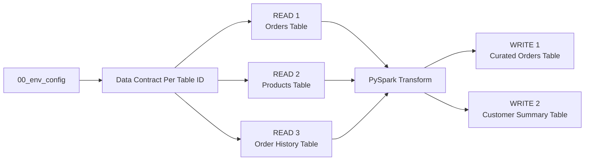
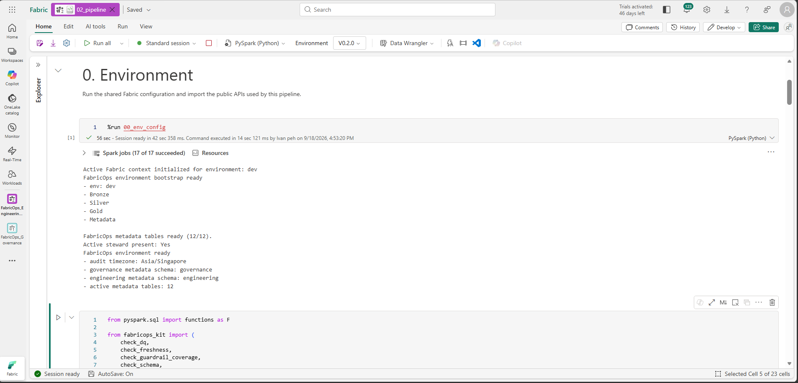
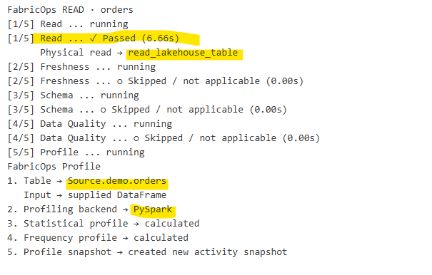
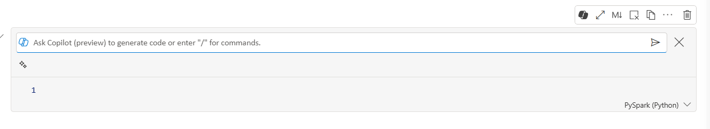
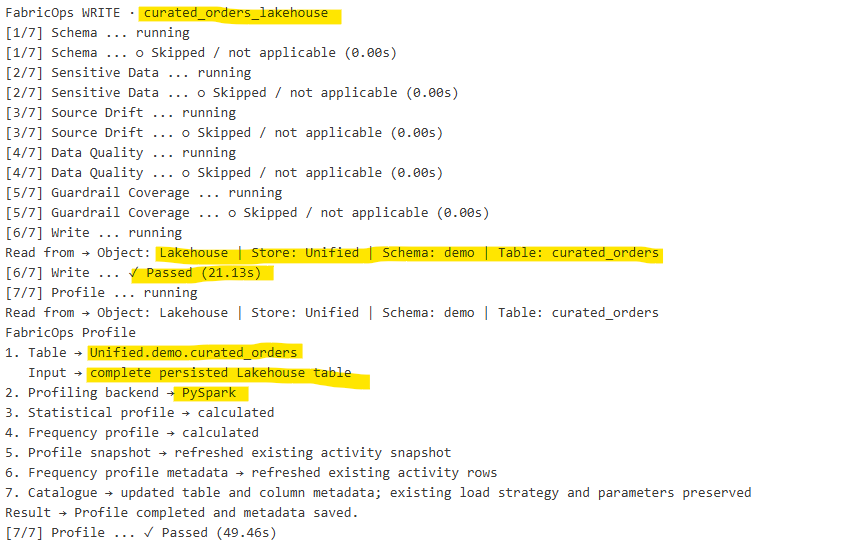
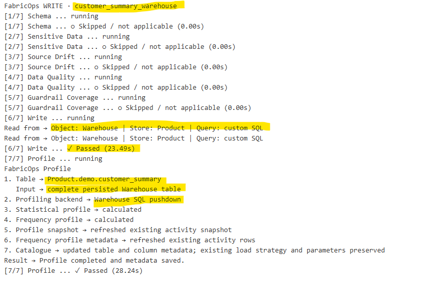
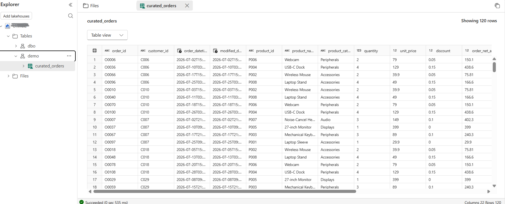
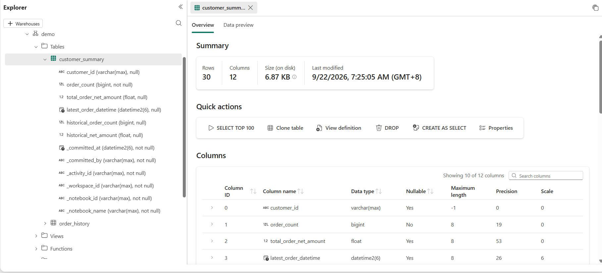
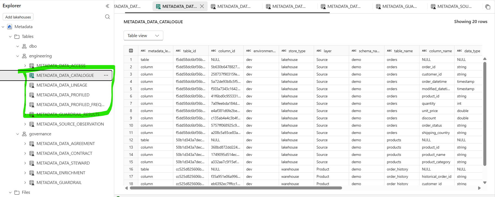

# Step 2. Build and run the ETL

Run the `02_pipeline` template in the Engineering Development Workspace.

This step builds on [Step 00C. Prepare the demo data](00C-prepare-demo-data-with-fabricops-io.md) and expects the demo data to already be loaded into the respective Lakehouse and Warehouse tables.

This walkthrough intentionally demonstrates one pattern: **full read → transform → full overwrite**.

For target-aware incremental reads, incremental writes, partition-aware processing, and profiling partial batches versus complete persisted tables, continue with [Step 2B. Run an incremental append pipeline](02B-build-and-run-incremental-append-etl.md).


## What you will do

1. Read three source tables.
2. Transform them with normal PySpark.
3. Write two target tables.

Along the way, FabricOps will skip contract-backed Guardrails before a Data Contract exists, profile the governed tables, record pipeline lineage, and build the Data Catalogue that Governance uses in Step 3.

The standard **full refresh** pipeline shape is:



## 1. Load the shared environment and pipeline functions

Run the shared environment notebook from Step 00B and import the pipeline functions used by this template.

??? example "Show notebook setup screenshot"
    

## 2. Run the Data Contract selection

Run the **Data Contract** section:

```python
CONTRACTS = widget_select_data_contract(spark_session=spark)
```

??? example "Show Data Contract selection output"
    

The selector defaults every discovered source and target to **Enforce**. This is the normal pipeline path, so no mode change is required for the initial Guided Demo run.

This is expected. There is no enforceable Data Contract yet because Governance has not authored and activated one. In Development, contract-backed checks therefore return skipped instead of requiring you to comment them out.

This means the same `02_pipeline` notebook and the same cloneable blocks work before and after Governance is introduced. Step 4 explicitly switches only the governed target to Validate mode; unrelated sources and targets keep their own Enforce behavior.

## 3. Read

The template contains three independent Read blocks.

| Read | Store | Schema | Table |
| --- | --- | --- | --- |
| Orders | `Bronze` Lakehouse | `demo` | `orders` |
| Products | `Bronze` Lakehouse | `demo` | `products` |
| Order History | `Gold` Warehouse | `demo` | `order_history` |

### Configure and run each Read

Each source is configured directly in its own `orchestrate_read()` call. There are no separate `READ_*` passthrough variables. Read strategy belongs to the source, so the same pipeline may mix full and incremental reads.

For the full-refresh Orders source in this step:

```python
source = orchestrate_read(
    name="orders",
    store="Bronze",
    schema="demo",
    table_name="orders",
    read_mode="full",
    query=None,
    spark_session=spark,
)
sources["orders"] = source
```

The returned DataFrame is available as `source["dataframe"]` and the named source is available later as `sources["orders"]`.

??? info "Read block details"
    The standard Read block is intentionally small. **The `orchestrate_read()` arguments are the configuration.** FabricOps owns the governed execution behind them.

    **What you choose**

    - `name` gives the source a readable notebook name.
    - `store`, `schema`, and `table_name` identify the logical source. `00_env_config` resolves the physical Fabric resource for the current environment.
    - `read_mode` is chosen independently for each source. Use `"full"` when the pipeline needs the complete source, or `"incremental"` when that source should read only the new scope supported by the governed source-to-target state.
    - `query` optionally pushes source-side SQL to a Warehouse. `query=None` uses the normal table read.
    - `target_table_id` is supplied when an incremental read needs the governed target context used to resolve its committed incremental state.

    This means one pipeline can mix source strategies. For example, Orders can be incremental while Products remains a full reference read.

    ```python
    orders = orchestrate_read(
        name="orders",
        store="Bronze",
        schema="demo",
        table_name="orders",
        read_mode="incremental",
        target_table_id=target_table_id,
        spark_session=spark,
    )

    products = orchestrate_read(
        name="products",
        store="Bronze",
        schema="demo",
        table_name="products",
        read_mode="full",
        spark_session=spark,
    )
    ```

    **What FabricOps handles**

    Behind that one call, FabricOps resolves the source and canonical `table_id`, chooses the Lakehouse or Warehouse read path, applies the standard source Guardrails such as Freshness, Schema, and Data Quality, and profiles the source when the read mode provides the complete persisted table. Stages that do not apply are reported as skipped rather than requiring notebook plumbing.

    You do **not** reconstruct `pipeline_read()`, `check_freshness()`, `check_schema()`, `check_dq()`, or `profile_table()` inside the standard `02_pipeline`. Those lower-level public functions remain available for advanced custom composition.

    **What comes back**

    The result keeps the Spark DataFrame, canonical source identity, Guardrail results, profile result when applicable, and orchestration stage status together. Keep the result in `sources` so the transformation can access its DataFrame and the Write block can retain source lineage.

    ```python
    sources["orders"] = source

    # Optional development inspection
    # display(source["dataframe"])
    ```

??? example "Show complete Read block output"
    


## 4. Transformation

After reading the data from the Lakehouse or Warehouse into PySpark DataFrames, use normal PySpark in this section to perform your project-specific transformation logic, such as:

- joining DataFrames,
- filtering rows,
- aggregating data,
- deriving new columns,
- reshaping or selecting the final output structure.

For common examples, see the [PySpark transformation cheat sheet](../reference/engineering-cheat-sheet.md#pyspark-transformation-cheat-sheet).

??? example "Show Copilot example"
    

You can also use Copilot, ChatGPT, Claude, or other AI coding tools to help draft the PySpark transformation. Always validate the generated logic and resulting DataFrame against your actual data before writing.

## 5. Write

The template contains two independent Write blocks.

| Write | Store | Schema | Table | Load strategy |
| --- | --- | --- | --- | --- |
| Curated Orders | `Silver` | `demo` | `curated_orders` | `overwrite` |
| Customer Summary | `Gold` | `demo` | `customer_summary` | `overwrite` |

### Configure the Write block

!!! warning "Warehouse schema prerequisite"
    Before writing to a Fabric Warehouse, the target schema must already exist. FabricOps can create or overwrite the target table, but it does not create the Warehouse schema automatically.

    For example, before writing `demo.customer_summary`, create the `demo` schema in the target Warehouse:

    ```sql
    CREATE SCHEMA demo;
    ```

    You only need to create each Warehouse schema once. The guided demo creates the `demo` schema earlier in [Step 00C. Prepare the demo data](00C-prepare-demo-data-with-fabricops-io.md).

!!! important "This is the part you edit"
    Each Write block is designed to be cloned. For a normal pipeline, **these are the only Write settings you need to change**:

    - `WRITE_NAME` → a short notebook name used to reference this output later.
    - `WRITE_DATAFRAME` → the transformed Spark DataFrame you want to publish.
    - `WRITE_SOURCE_NAMES` → the Read blocks that contributed to this output, used for lineage.
    - `WRITE_STORE` → the FabricOps destination store defined in `00_env_config`.
    - `WRITE_SCHEMA` → the target schema.
    - `WRITE_TABLE` → the target table.
    - `WRITE_LOAD_STRATEGY` → keep as `overwrite` in this full-refresh template.
    - `WRITE_REPARTITION_BY` → optional Spark write parallelism; leave as `None` unless you have a reason to tune it.

```python
WRITE_NAME = "curated_orders_lakehouse"
WRITE_DATAFRAME = transformed_df
WRITE_SOURCE_NAMES = ("orders", "products", "history")
WRITE_STORE = "Silver"
WRITE_SCHEMA = "demo"
WRITE_TABLE = "curated_orders"
WRITE_LOAD_STRATEGY = "overwrite"
WRITE_REPARTITION_BY = None
```

Everything below uses those settings. You normally do not need to edit the FabricOps preparation, Guardrails, publication, profiling, or registration logic.

### Run the Write block

`orchestrate_write()` is the normal path. Validate and Enforce visibly run the same Schema → Sensitive Data → Source Drift → Data Quality → Guardrail Coverage sequence. Validate then returns without publication; Enforce continues through Write → Profile while `pipeline_write()` retains the physical publication and metadata commit boundary.

The selector's default Enforce mode follows this existing path. Validate mode is optional and target-scoped; when selected in Step 4, the same Write block evaluates the frozen candidate and structurally skips `pipeline_write()` for that target only.

```python
write_result = orchestrate_write(
    WRITE_DATAFRAME, name=WRITE_NAME,
    sources=[sources[name] for name in WRITE_SOURCE_NAMES],
    store=WRITE_STORE, schema=WRITE_SCHEMA, table_name=WRITE_TABLE,
    load_strategy=WRITE_LOAD_STRATEGY, contracts=CONTRACTS,
    spark_session=spark,
)
```

In Enforce mode, success means the target has been physically written and FabricOps records the associated Catalogue, Lineage, and Source Observation state handled by the publication flow. In Validate mode, success returns `published=False` and `validation_passed=True`; the notebook exits without writing or profiling the target.

??? info "Write block details"
    The standard Write block is intentionally small. **The `orchestrate_write()` arguments are the configuration.** FabricOps owns the governed publication lifecycle behind them.

    **What you choose**

    - The first argument is the project-transformed PySpark DataFrame to publish.
    - `name` gives the target a readable notebook name.
    - `sources` identifies the governed Read results that contributed to this target so FabricOps can retain source-to-target lineage.
    - `store`, `schema`, and `table_name` identify the logical destination. `00_env_config` resolves the physical Fabric resource for the current environment.
    - `load_strategy` is chosen independently for each target. Use the strategy required by that target, such as `"overwrite"`, `"append"`, `"scd1"`, or `"scd2"`.
    - `contracts=CONTRACTS` supplies the table-level Data Contract context selected by the notebook.
    - `repartition_by` is optional Spark write parallelism. Leave it as `None` unless the write scale or performance requires an explicit value.

    This means one pipeline can publish different targets with different strategies. The write strategy belongs to the target, just as the read strategy belongs to each source.

    ```python
    write_result = orchestrate_write(
        transformed_df,
        name="curated_orders",
        sources=[sources["orders"], sources["products"]],
        store="Silver",
        schema="demo",
        table_name="curated_orders",
        load_strategy="overwrite",
        contracts=CONTRACTS,
        repartition_by=None,
        spark_session=spark,
    )
    ```

    **What FabricOps handles**

    Behind that one call, FabricOps resolves the canonical target identity and source lineage, then runs the standard governed target lifecycle: Schema, Sensitive Data, Source Drift, Data Quality, and Guardrail Coverage. If publication is allowed, FabricOps routes the physical write to the correct Lakehouse or Warehouse implementation, records the governed metadata, and profiles the complete persisted target.

    You do **not** reconstruct `check_schema()`, `check_sensitive_data()`, `check_source_drift()`, `check_dq()`, `check_guardrail_coverage()`, `pipeline_write()`, or `profile_table()` inside the standard `02_pipeline`. Those lower-level public functions remain available for advanced custom composition.

    **How the Data Contract changes publication**

    Validate and Enforce use the same pre-publication Guardrails. The difference is what happens after they pass:

    - **Validate:** returns `published=False` and `validation_passed=True`. The target is not written or profiled.
    - **Enforce:** continues through the physical write and profiles the persisted target.

    Contract mode is resolved per governed target, so targets in the same notebook can be at different Data Contract lifecycle stages.

    **What comes back**

    The result keeps the canonical target identity, publication or validation state, Guardrail results, profile result when applicable, and orchestration stage status together. Keep it in `writes` when later notebook logic needs the publication result.

    ```python
    writes["curated_orders"] = write_result
    ```

??? example "Show complete Write block outputs"
    
    
    Written to lakehouse
    
    Written to warehouse 
    
    Metadata is captured
    

## Expected result

At the end of Step 2 you should have:

- three source tables read through FabricOps into Spark DataFrames,
- `demo.curated_orders` fully overwritten in the Silver Lakehouse and `demo.customer_summary` fully overwritten in the Gold Warehouse,
- Catalogue, profile, lineage, and source observation metadata recorded for the pipeline,
- contract-backed checks shown as `SKIPPED` in Development because no Data Contract has been selected yet.


**Next:** [Step 3. Author and freeze the Data Contract](03-author-and-freeze-data-contract.md)
