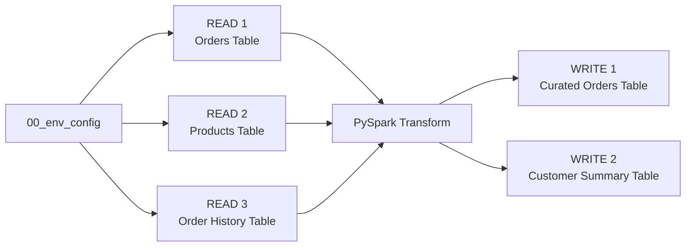

# Step 2. Build and run the ETL

Run the `02_pipeline` template in the Engineering Development Workspace.

This step builds on [Step 00C. Prepare the demo data](00C-prepare-demo-data-with-fabricops-io.md) and expects the demo data to already be loaded into the respective Lakehouse and Warehouse tables.

This walkthrough intentionally demonstrates one pattern: **full read → transform → full overwrite**.

For target-aware incremental reads, incremental writes, partition-aware processing, and profiling partial batches versus complete persisted tables, continue with [Step 2B. Run an incremental append pipeline](02B-build-and-run-incremental-append-etl.md).


## What you will do

1. Read three source tables.
2. Transform them with normal PySpark.
3. Write two target tables.

Along the way, FabricOps will skip contract-backed Guardrails before a Data Contract exists, profile the governed tables, record pipeline lineage, and build the Data Catalogue that Governance uses in Step 3.

The standard **full refresh** pipeline shape is:



## 1. Load the shared environment and pipeline functions

Run the shared environment notebook from Step 00B and import the pipeline functions used by this template.

??? example "Show notebook setup screenshot"
    

## 2. Run the Data Contract selection

Run the standard Data Contract section from `02_pipeline`:

```python
CONTRACTS = widget_select_data_contract(spark_session=spark)
```

??? example "Show Data Contract selection output"
    

At this point in the Guided Demo, Governance has not authored a Data Contract yet, so there is nothing to select. **That is expected and does not require changing or skipping the standard template.** The selector returns the available contract context and the same `02_pipeline` continues normally.

The orchestrators then execute the standard pipeline lifecycle. Contract-backed Guardrails with no applicable contract return `SKIPPED`, while the pipeline can still read, transform, publish, profile, and register the metadata Governance needs for Step 3.

After Step 3 authors and freezes a Data Contract, this same selector becomes meaningful in Step 4 when Engineering selects the frozen candidate for validation.

## 3. Read

The template contains three independent Read blocks.

| Read | Store | Schema | Table |
| --- | --- | --- | --- |
| Orders | `Bronze` Lakehouse | `demo` | `orders` |
| Products | `Bronze` Lakehouse | `demo` | `products` |
| Order History | `Gold` Warehouse | `demo` | `order_history` |

### Configure the Read block

!!! important "This is the part you edit"
    Each Read block is designed to be cloned. For a normal pipeline, **these are the only Read settings you need to change**:

    - `READ_NAME` → a short notebook name used to reference this source later.
    - `READ_STORE` → the FabricOps store defined in `00_env_config`, such as `Bronze` or `Gold`.
    - `READ_SCHEMA` → the source schema.
    - `READ_TABLE` → the source table.
    - `READ_MODE` → keep as `"full"` in this full-refresh template.
    - `READ_QUERY` → use `None` for a normal full table read, or a Warehouse `SELECT` to project/shape the full row set without turning the flow into an incremental read.

```python
READ_NAME = "orders"
READ_STORE = "Bronze"
READ_SCHEMA = "demo"
READ_TABLE = "orders"
READ_MODE = "full"
READ_QUERY = None
```

Everything below uses those settings. You normally do not need to edit the FabricOps orchestration, checks, profiling, or registration logic.

### Run the Read block

`orchestrate_read()` is the normal path. It exposes each Read stage and returns the Spark DataFrame together with its canonical FabricOps `table_id`. Underneath it runs Read → Freshness → Schema → Data Quality → Profile.

```python
source = orchestrate_read(
    name=READ_NAME, store=READ_STORE, schema=READ_SCHEMA,
    table_name=READ_TABLE, read_mode=READ_MODE, query=READ_QUERY,
    spark_session=spark,
)
df = source["dataframe"]

# Optional development inspection
# display(df)
```

**You can stop here if you only want to read the data.** At this point `df` already exists and can be used in normal PySpark.

??? info "What `orchestrate_read()` does"
    The variables at the top of the Read block describe the source. The standard block then passes them directly to `orchestrate_read()`.

    FabricOps owns the repeated runtime sequence:

    **Read → Freshness → Schema → Data Quality → Profile**

    The returned `source` contains the Spark DataFrame, canonical `table_id`, check results, profile result, and stage observability. Keep the transformation itself outside the orchestrator as normal PySpark.

    You do not need to call `pipeline_read()`, `check_freshness()`, `check_schema()`, `check_dq()`, or `profile_table()` individually in the standard `02_pipeline` flow. Those lower-level public functions remain available for advanced custom composition and are documented in the Function Reference.

??? example "Show complete Read block output"
    


## 4. Transformation

After reading the data from the Lakehouse or Warehouse into PySpark DataFrames, use normal PySpark in this section to perform your project-specific transformation logic, such as:

- joining DataFrames,
- filtering rows,
- aggregating data,
- deriving new columns,
- reshaping or selecting the final output structure.

For common examples, see the [PySpark transformation cheat sheet](../reference/engineering-cheat-sheet.md#pyspark-transformation-cheat-sheet).

??? example "Show Copilot example"
    

You can also use Copilot, ChatGPT, Claude, or other AI coding tools to help draft the PySpark transformation. Always validate the generated logic and resulting DataFrame against your actual data before writing.

## 5. Write

The template contains two independent Write blocks.

| Write | Store | Schema | Table | Load strategy |
| --- | --- | --- | --- | --- |
| Curated Orders | `Silver` | `demo` | `curated_orders` | `overwrite` |
| Customer Summary | `Gold` | `demo` | `customer_summary` | `overwrite` |

### Configure the Write block

!!! warning "Warehouse schema prerequisite"
    Before writing to a Fabric Warehouse, the target schema must already exist. FabricOps can create or overwrite the target table, but it does not create the Warehouse schema automatically.

    For example, before writing `demo.customer_summary`, create the `demo` schema in the target Warehouse:

    ```sql
    CREATE SCHEMA demo;
    ```

    You only need to create each Warehouse schema once. The guided demo creates the `demo` schema earlier in [Step 00C. Prepare the demo data](00C-prepare-demo-data-with-fabricops-io.md).

!!! important "This is the part you edit"
    Each Write block is designed to be cloned. For a normal pipeline, **these are the only Write settings you need to change**:

    - `WRITE_NAME` → a short notebook name used to reference this output later.
    - `WRITE_DATAFRAME` → the transformed Spark DataFrame you want to publish.
    - `WRITE_SOURCE_NAMES` → the Read blocks that contributed to this output, used for lineage.
    - `WRITE_STORE` → the FabricOps destination store defined in `00_env_config`.
    - `WRITE_SCHEMA` → the target schema.
    - `WRITE_TABLE` → the target table.
    - `WRITE_LOAD_STRATEGY` → keep as `overwrite` in this full-refresh template.
    - `WRITE_REPARTITION_BY` → optional Spark write parallelism; leave as `None` unless you have a reason to tune it.

```python
WRITE_NAME = "curated_orders_lakehouse"
WRITE_DATAFRAME = transformed_df
WRITE_SOURCE_NAMES = ("orders", "products", "history")
WRITE_STORE = "Silver"
WRITE_SCHEMA = "demo"
WRITE_TABLE = "curated_orders"
WRITE_LOAD_STRATEGY = "overwrite"
WRITE_REPARTITION_BY = None
```

Everything below uses those settings. You normally do not need to edit the FabricOps preparation, Guardrails, publication, profiling, or registration logic.

### Run the Write block

`orchestrate_write()` is the normal path. Validate and Enforce visibly run the same Schema → Sensitive Data → Source Drift → Data Quality → Guardrail Coverage sequence. Validate then returns without publication; Enforce continues through Write → Profile while `pipeline_write()` retains the physical publication and metadata commit boundary.

```python
write_result = orchestrate_write(
    WRITE_DATAFRAME, name=WRITE_NAME,
    sources=[sources[name] for name in WRITE_SOURCE_NAMES],
    store=WRITE_STORE, schema=WRITE_SCHEMA, table_name=WRITE_TABLE,
    load_strategy=WRITE_LOAD_STRATEGY, contracts=CONTRACTS,
    spark_session=spark,
)
```

In this initial run there is no Data Contract selection context, so `orchestrate_write()` follows the normal publication path. Success means the target has been physically written and FabricOps records the associated Catalogue, Lineage, profile, and Source Observation state needed by the later governance steps. Validate mode is introduced in Step 4 after a frozen contract exists.

??? info "What `orchestrate_write()` does"
    The variables at the top of the Write block describe the output. The standard block passes the transformed DataFrame, contributing sources, destination settings, load strategy, and current contract context directly to `orchestrate_write()`.

    FabricOps owns the repeated governed sequence:

    **Schema → Sensitive Data → Source Drift → Data Quality → Guardrail Coverage → Write → Profile**

    Contract-backed stages with no applicable contract are visibly `SKIPPED`. When a frozen contract is later selected in Validate mode, the same pre-publication Guardrails run but publication stops before Write. In Enforce mode, the orchestrator continues through Write and Profile.

    You do not need to call the individual Guardrail functions, `pipeline_write()`, or `profile_table()` yourself in the standard `02_pipeline` flow. Those lower-level public functions remain available for advanced custom composition and are documented in the Function Reference.

??? example "Show complete Write block outputs"
    
    
    Written to lakehouse
    
    Written to warehouse 
    
    Metadata is captured
    

## Expected result

At the end of Step 2 you should have:

- three source tables read through FabricOps into Spark DataFrames,
- `demo.curated_orders` fully overwritten in the Silver Lakehouse and `demo.customer_summary` fully overwritten in the Gold Warehouse,
- Catalogue, profile, lineage, and source observation metadata recorded for the pipeline,
- contract-backed checks shown as `SKIPPED` in Development because no Data Contract has been selected yet.


**Next:** [Step 3. Author and freeze the Data Contract](03-author-and-freeze-data-contract.md)
