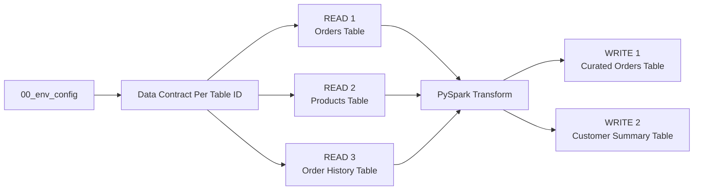
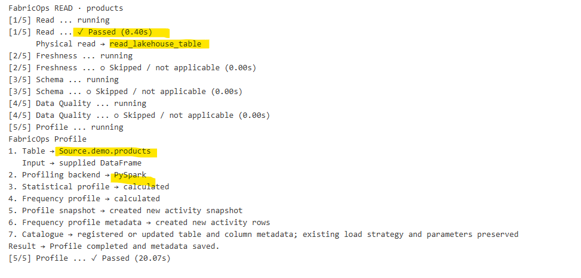
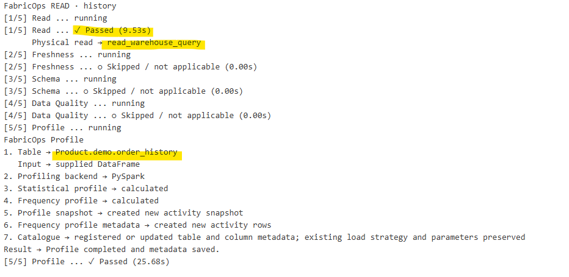

# Step 2. Build and run the ETL
The current walkthrough intentionally demonstrates one pattern: **full read → transform → full overwrite**.

Run the `02_pipeline` template in the Engineering Development Workspace.

This step builds on [Step 00C. Prepare the demo data](00C-prepare-demo-data-with-fabricops-io.md) and expects the demo data to already be loaded into the respective Lakehouse and Warehouse tables.

## What you will do

1. Read three source tables.
2. Transform them with normal PySpark.
3. Write two target tables.

Along the way, FabricOps will skip contract-backed Guardrails before a Data Contract exists, profile the governed tables, record pipeline lineage, and build the Data Catalogue that Governance uses in Step 3.

The standard **full refresh** pipeline shape is:



## 1. Load the shared environment and pipeline functions

Run the shared environment notebook from Step 00B and import the pipeline functions used by this template.

??? example "Show notebook setup screenshot"
    

## 2. Run the Data Contract selection

For the first Guided Demo run, there is no Data Contract yet. Run the cell and leave the selection unchanged. Contract-backed checks will return as skipped when no Data Contract is selected.

??? example "Expand to see how it looks"

    ```python
    CONTRACTS = widget_select_data_contract(spark_session=spark)
    ```
    There is no enforceable Data Contract yet because Governance has not authored and activated one, so it should be empty.

    

    
## 3. Read

For this walkthrough we will read 3 tables into this pipeline.

| Read | Store | Schema | Table |
| --- | --- | --- | --- |
| Orders | `Bronze` Lakehouse | `demo` | `orders` |
| Products | `Bronze` Lakehouse | `demo` | `products` |
| Order History | `Gold` Warehouse | `demo` | `order_history` |

The template reads three sources through [`orchestrate_read()`](../api/reference/orchestrate_read.md). 

```python
source = orchestrate_read(
    name="orders",
    store="Bronze",
    schema="demo",
    table_name="orders",
    read_mode="full",
    query=None,
    spark_session=spark,
)

sources["orders"] = source
```
`orchestrate_read()` returns a dictionary containing the source DataFrame, governed table_id, guardrail results, profiling results, and orchestration metadata. The full dictionary is kept in sources so its DataFrame can be used for transformation and its governed metadata can later be passed to orchestrate_write() for lineage.

??? info "Understand orchestrate_read()"
    **Parameters**

    - `name` → readable name for the source inside the notebook.
    - `store` → logical FabricOps store defined in `00_env_config`.
    - `schema` → source schema.
    - `table_name` → source table.
    - `read_mode` → how the source is read, such as `"full"` or `"incremental"`.
    - `query` → optional T-SQL pushed down to a Warehouse instead of reading the complete table.
    - `target_table_id` → optional governed target context for target-aware incremental reads.
    - `spark_session` → Spark session used by the Read lifecycle.

    **What happens under the hood**

    [`orchestrate_read()`](../api/reference/orchestrate_read.md) uses [`pipeline_read()`](../api/reference/pipeline_read.md) to select the appropriate Lakehouse or Warehouse read path. For Warehouse sources, it can push down a T-SQL query when one is provided.

    It resolves the canonical `table_id` and runs the applicable source Guardrails defined by the Data Contract through:

    - [`check_freshness()`](../api/reference/check_freshness.md)
    - [`check_schema()`](../api/reference/check_schema.md)
    - [`check_dq()`](../api/reference/check_dq.md)

    Lastly, it calls [`profile_table()`](../api/reference/profile_table.md) when profiling applies.

    The returned source result is carried forward so later Write blocks can use its `table_id` for source-to-target lineage.

    **What comes back**

    - `source["dataframe"]` → Spark DataFrame returned by the Read.
    - `source["table_id"]` → canonical FabricOps identity for the source table.
    - `source["freshness_result"]` → Freshness Guardrail result.
    - `source["schema_result"]` → Schema Guardrail result.
    - `source["dq_result"]` → Data Quality Guardrail result.
    - `source["profile_result"]` → profiling result when profiling applies.
    - `source["orchestration_stages"]` → status and timing of each Read stage.

    These lower-level functions remain public if you need to build a custom flow.

??? example "Show Read orchestration output"
    
    
    

## 4. Transformation

Use normal PySpark for the project-specific transformation logic, such as:

- joining DataFrames,
- filtering rows,
- aggregating data,
- deriving new columns,
- reshaping or selecting the final output structure.

Transformation remains ordinary project-owned PySpark between the governed Read and Write boundaries. Use the [PySpark Transformation Reference](../reference/pyspark-transformation.md) for common joins, filters, derivations, aggregations, windows, reshaping, and Spark optimization patterns.

If avaliable to you utilze Copilot, ChatGPT, Claude, or other AI coding tools to help draft the PySpark transformation. Always validate the generated logic and resulting DataFrame against your actual data by 'display(dataframe)' before proceeding to write.


## 5. Write

For this walkthrough we will write 2 tables via this pipeline.

| Write | Store | Schema | Table | Load strategy |
| --- | --- | --- | --- | --- |
| Curated Orders | `Silver` | `demo` | `curated_orders` | `overwrite` |
| Customer Summary | `Gold` | `demo` | `customer_summary` | `overwrite` |

The template writes two target two targets through [`orchestrate_write()`](../api/reference/orchestrate_write.md). 

```python
write_result = orchestrate_write(
    transformed_df,
    name="curated_orders_lakehouse",
    sources=[sources["orders"], sources["products"], sources["history"]],
    store="Unified",
    schema="demo",
    table_name="curated_orders",
    write_mode="overwrite",
    contracts=CONTRACTS,
    repartition_by=None,
    spark_session=spark,
)

if not write_result["published"]:
    notebookutils.notebook.exit("Data Contract validation passed for curated_orders_lakehouse; target not published.")

writes["curated_orders_lakehouse"] = write_result
```
`orchestrate_write()` returns a dictionary containing the target table_id, guardrail results, publication status, profiling results, and orchestration metadata. The result is first checked to confirm whether the target was published, then the full dictionary is kept in writes for inspection and downstream reference.

??? info "Understand orchestrate_write()"
    **Parameters**

    - `dataframe` → transformed Spark DataFrame to publish.
    - `name` → readable name for the target inside the notebook.
    - `sources` → Read results that contributed to the target, used for source-to-target lineage.
    - `store` → logical destination store defined in `00_env_config`.
    - `schema` → target schema.
    - `table_name` → target table.
    - `write_mode` → how the target is written, such as `"overwrite"`, `"append"`, `"scd1"`, or `"scd2"`.
    - `contracts` → Data Contract selections used for governed validation and enforcement.
    - `repartition_by` → optional Spark partitioning control before the write.
    - `spark_session` → Spark session used by the Write lifecycle.

    **What happens under the hood**

    [`orchestrate_write()`](../api/reference/orchestrate_write.md) first resolves the target `table_id` and the `table_id` of each contributing source.

    It then runs the applicable Guardrails defined by the Data Contract through:

    - [`check_schema()`](../api/reference/check_schema.md)
    - [`check_sensitive_data()`](../api/reference/check_sensitive_data.md)
    - [`check_source_drift()`](../api/reference/check_source_drift.md)
    - [`check_dq()`](../api/reference/check_dq.md)
    - [`check_guardrail_coverage()`](../api/reference/check_guardrail_coverage.md)

    Sensitive Data treatment is applied before the remaining Data Quality checks and publication. See [Sensitive Data Treatments](../reference/sensitive-data-treatments.md) for Mask, Bucket, Tokenize, and Remove behavior and examples.

    If the Guardrails pass, [`pipeline_write()`](../api/reference/pipeline_write.md) writes to the appropriate Lakehouse or Warehouse destination and records the associated publication metadata and source-to-target lineage.

    Lastly, [`profile_table()`](../api/reference/profile_table.md) profiles the persisted target.

    **What comes back**

    - `write_result` → `table_id` → canonical FabricOps identity for the target table.
    - `write_result` → `schema_result` → Schema Guardrail result.
    - `write_result` → `sensitive_result` → Sensitive Data Guardrail result, including any applied treatment.
    - `write_result` → `source_drift_results` → Source Drift results for the contributing sources.
    - `write_result` → `dq_result` → Data Quality Guardrail result.
    - `write_result` → `coverage_result` → Guardrail Coverage result for the target.
    - `write_result` → `orchestration_stages` → status and timing of each Write stage.
    - `write_result` → `published` → whether the target was physically written.
    - `write_result` → `profile_result` → profile of the persisted target when profiling applies.

    These lower-level functions remain public if you need to build a custom flow.

!!! warning "Multiple Write blocks are not atomic"
    Each `orchestrate_write()` publishes independently this means that,
    WRITE 1 can successfully publish `curated_orders` but WRITE 2 fails.

    For this demo we use Overwrite, so re-running the whole pipeline replaces the entire output anyways so. 
    
    However if we use Append, a retry can duplicate data.

    If partial publication or duplicate writes are unacceptable, use separate pipeline executions for each governed target.

!!! warning "Warehouse schema prerequisite"
    Before writing to a Fabric Warehouse, the target schema must already exist.

    FabricOps can create or overwrite the target table, but it does not create the Warehouse schema automatically.

    For example, before writing `demo.customer_summary`, create the `demo` schema in the target Warehouse:

    ```sql
    CREATE SCHEMA demo;
    ```

    You only need to create each Warehouse schema once. The Guided Demo creates the `demo` schema earlier in [Step 00C. Prepare the demo data](00C-prepare-demo-data-with-fabricops-io.md).

??? example "Show Write orchestration output"
    
    

??? example "Show publication results"  

    **Silver Lakehouse target**
    

    **Gold Warehouse target**
    

    **FabricOps metadata captured**
    

## Expected result

At the end of Step 2 you should have:

- three source tables read through FabricOps into Spark DataFrames,
- `demo.curated_orders` fully overwritten in the Silver Lakehouse and `demo.customer_summary` fully overwritten in the Gold Warehouse,
- [Catalogue](../reference/metadata/metadata_data_catalogue.md), [profile](../reference/metadata/metadata_data_profiled.md), [lineage](../reference/metadata/metadata_data_lineage.md), and [source observation](../reference/metadata/metadata_source_observation.md) metadata recorded for the pipeline,
- contract-backed checks shown as `SKIPPED` in Development because no Data Contract has been selected yet.

??? info "Inspect the Dictonary that you had read / write"

    ```python
    # Enter the name of the source you created above, then uncomment any result you want to inspect.
    inspect_write = "curated_orders_lakehouse"

    # Uncomment only what you want to inspect.
    # display(writes[inspect_write]["sensitive_result"]["dataframe"])       # DataFrame after Sensitive Data treatment.
    # display(writes[inspect_write]["profile_result"]["profile"])           # Column-level profile metrics.
    # display(writes[inspect_write]["profile_result"]["frequency_profile"]) # Value-frequency profile.
    # display(writes[inspect_write]["schema_result"])                       # Schema guardrail result.
    # display(writes[inspect_write]["sensitive_result"])                    # Sensitive Data guardrail result.
    # display(writes[inspect_write]["source_drift_results"])                # Source Drift results.
    # display(writes[inspect_write]["dq_result"])                           # Data Quality guardrail result.
    # display(writes[inspect_write]["coverage_result"])                     # Guardrail Coverage result.
    # display(writes[inspect_write]["orchestration_stages"])                # Ordered orchestrator execution stages.
    ```

**Next:** [Step 3. Author and freeze the Data Contract](03-author-and-freeze-data-contract.md)
