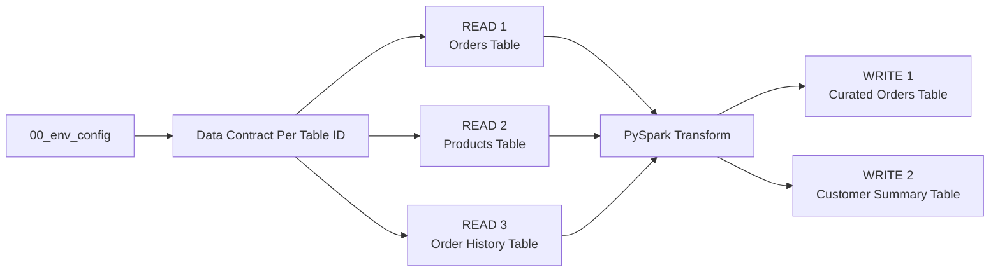

# Step 2. Build and run the ETL

Run the `02_pipeline` template in the Engineering Development Workspace.

This step builds on [Step 00C. Prepare the demo data](00C-prepare-demo-data.md) and and expects the demo data to already be loaded into the respective Lakehouse and Warehouse tables.

For simplicity, this walkthrough **reads the full source tables into DataFrames** before transformation and writes.

For target-aware incremental reads, incremental writes, partition-aware processing, and profiling partial batches versus complete persisted tables, continue with [Step 2A. Run an incremental pipeline](02A-run-incremental-pipeline.md).


## What you will do

1. Read three source tables.
2. Transform them with normal PySpark.
3. Write two target tables.

Along the way, FabricOps will skip contract-backed Guardrails before a Data Contract exists, profile the governed tables, record pipeline lineage, and build the Data Catalogue that Governance uses in Step 3.

The standard **full read** pipeline shape is:



## 1. Load the shared environment and pipeline functions

Run the shared environment notebook from Step 00B and import the pipeline functions used by this template.

??? example "Show notebook setup screenshot"
    

## 2. Run the Data Contract selection

Run the **Data Contract** section:

```python
CONTRACTS = widget_select_data_contract(spark_session=spark)
```

??? example "Show Data Contract selection output"
    

This is expected. There is no Data Contract yet because Governance has not authored one. We will revisit this in [Step 04. Select and validate the Data Contract](04-run-pipeline-with-guardrails.md).

In Development, when no Data Contract is selected, guardrail checks return skipped instead of requiring you to comment them out.

This means the same 02_pipeline notebook can be used both before and after Governance is introduced.

## 3. Read these tables

The template contains three independent Read blocks.

| Read | Store | Schema | Table |
| --- | --- | --- | --- |
| Orders | `Bronze` Lakehouse | `demo` | `orders` |
| Products | `Bronze` Lakehouse | `demo` | `products` |
| Order History | `Gold` Warehouse | `demo` | `order_history` |

### Configure one Read block

Each Read block is designed to be cloned. Copy the block and change only the source variables:
```python
READ_NAME = "orders"
READ_STORE = "Bronze"
READ_SCHEMA = "demo"
READ_TABLE = "orders"
READ_QUERY = None
```

### Run the read

`pipeline_read()` resolves whether the source is a Lakehouse or Warehouse, reads it through the appropriate FabricOps I/O function, and returns the Spark DataFrame together with its canonical FabricOps `table_id`.

??? info "How the full Read block works"
    Each Read block is intentionally split into **READ → CHECK → PROFILE → KEEP** so you can see exactly where the data becomes available and where FabricOps governance begins.

    **1. Define the source**

    - `READ_NAME` gives the source a reusable name in the notebook.
    - `READ_STORE`, `READ_SCHEMA`, and `READ_TABLE` identify the physical source.
    - `READ_QUERY` optionally supplies a SQL query for Warehouse reads.

    **2. READ — get the DataFrame**

    `pipeline_read()` is an orchestration function that resolves whether the requested source is a Lakehouse or Warehouse, reads it through the appropriate FabricOps I/O function, and returns the Spark DataFrame together with its canonical FabricOps `table_id`.

    **3. CHECK — run Guardrails**

    - `check_freshness()` checks whether the source is recent enough based on the selected Data Contract.
    - `check_schema()` checks whether the columns and data types match the contract.
    - `check_dq()` runs the configured Data Quality rules.
    - These checks run after the DataFrame has already been read.
    - In the first Development run, when no Data Contract is selected yet, contract-backed checks safely return `skipped`.

    **4. PROFILE — refresh the saved source profile**

    - `profile_table()` profiles the DataFrame that was already read above, so FabricOps does not read the same source table a second time.
    - The physical source coordinates are supplied so the first Development run can register the table in the Catalogue even when no Catalogue row exists yet.
    - Profiling results are saved to `METADATA_DATA_PROFILED`.
    - Frequency profiling, when generated, is saved to `METADATA_DATA_PROFILED_FREQUENCY`.

    **5. KEEP — make the source available downstream**

    - `sources[READ_NAME] = source` adds the completed source flow to the `sources` dictionary.
    - The Transform and Write sections can then reuse both its DataFrame and `table_id`.
    - This happens after the checks so a source that fails a required Guardrail is not silently treated as an approved downstream input.

??? tip "Warehouse SQL pushdown"
    `READ_QUERY = None` reads the full table.

    The Order History example deliberately supplies SQL so projection and filtering happen in the Warehouse before the result reaches Spark:

    ```python
    READ_QUERY = """
    SELECT
        historical_order_id,
        customer_id,
        order_datetime,
        net_amount
    FROM demo.order_history
    WHERE order_datetime >= '2025-01-01'
    """
    ```

    The demo predicate preserves the canonical `order_history` fixture while still showing the pushdown path.

    When `READ_QUERY` is supplied, `pipeline_read()` routes the request to `read_warehouse_query()` and pushes the SQL down to the underlying Warehouse.


```python
source = pipeline_read(
    store=READ_STORE,
    schema=READ_SCHEMA,
    table_name=READ_TABLE,
    query=READ_QUERY,
    spark_session=spark,
)

df = source["dataframe"]
table_id = source["table_id"]
```

**You can stop here if you only want to read the data.** At this point `df` already exists and can be used in normal PySpark.

??? example "Optional Read inspection"
    ```python
    # display(df)
    # display(dq_df)
    # display(dq_failed_values)
    ```

??? info "Source profiling call"
    ```python
    profile_result = profile_table(
        dataframe=df,
        store=READ_STORE,
        schema=READ_SCHEMA,
        table_name=READ_TABLE,
        spark_session=spark,
    )
    
    # display(profile_result["profile"])
    # display(profile_result["frequency_profile"])
    ```

??? tip "Profiling behaviour"
    FabricOps always profiles the complete table.
    
    For a full source read or full overwrite, the complete dataset is already available as a Spark DataFrame, so FabricOps profiles it directly with PySpark.
    
    For partial reads or writes such as `append`, `SCD1`, or `SCD2`, the available Spark DataFrame contains only the changed or incoming data. FabricOps therefore reads the complete persisted table again before profiling it.
    
    For Lakehouse tables, FabricOps profiles the complete table with PySpark. 
    
    For Warehouse tables, FabricOps uses Warehouse SQL pushdown to profile the complete persisted table efficiently.

??? example "Show complete Read block output"
    


## 4. Transformation

After reading the data from the Lakehouse or Warehouse into PySpark DataFrames, use normal PySpark in this section to perform your project-specific transformation logic, such as:

- joining DataFrames,
- filtering rows,
- aggregating data,
- deriving new columns,
- reshaping or selecting the final output structure.

For common examples, see the [PySpark transformation cheat sheet](../reference/engineering-cheat-sheet.md#pyspark-transformation-cheat-sheet).

??? example "Show Copilot example"
    

You can also use Copilot, ChatGPT, Claude , or other AI coding tools to help draft the PySpark transformation. Always validate the generated logic and resulting DataFrame against your actual data before writing.

## 5. Write the tables

The template contains two independent Write blocks.

| Write | Store | Schema | Table | Load strategy |
| --- | --- | --- | --- | --- |
| Curated Orders | `Silver` | `demo` | `curated_orders` | `overwrite` |
| Customer Summary | `Gold` | `demo` | `customer_summary` | `append` |

### Configure one Write block

Each Write block is designed to be cloned. Copy the block and change only the target variables:

```python
WRITE_NAME = "curated_orders_lakehouse"
WRITE_DATAFRAME = transformed_df
WRITE_SOURCE_NAMES = ("orders", "products", "history")
WRITE_STORE = "Silver"
WRITE_SCHEMA = "demo"
WRITE_TABLE = "curated_orders"
WRITE_LOAD_STRATEGY = "overwrite"
```

### Run the write

`pipeline_write()` resolves whether the target is a Lakehouse or Warehouse and performs the physical publication through the appropriate FabricOps I/O function.


```python
write_result = pipeline_write(
    prepared_df,
    store=WRITE_STORE,
    schema=WRITE_SCHEMA,
    table_name=WRITE_TABLE,
    load_strategy=WRITE_LOAD_STRATEGY,
    source_table_ids=[source["table_id"] for source in write_sources],
    repartition_by=WRITE_REPARTITION_BY,
    spark_session=spark,
)
```

After this succeeds, the target has been physically written and FabricOps records the associated catalogue, lineage, and source observation state handled by the publication flow.

??? info "How the full Write block works"
    Each Write block is split into **PREPARE → CHECK → WRITE → PROFILE → KEEP** so the physical publication boundary is obvious.

    **1. Define the target**

    - `WRITE_DATAFRAME` identifies the transformed DataFrame to publish.
    - `WRITE_STORE`, `WRITE_SCHEMA`, and `WRITE_TABLE` identify the destination.
    - `WRITE_LOAD_STRATEGY` controls how the target is written, such as `overwrite`, `append`, `SCD1`, or `SCD2`.
    - `WRITE_REPARTITION_BY` optionally controls Spark write parallelism before publication.
    - `WRITE_SOURCE_NAMES` identifies the exact source reads that produced this target.

    **2. PREPARE — resolve the target and source lineage**

    - `write_sources` selects only the source reads used by this target.
    - `resolve_table_id()` resolves the canonical target `table_id`.
    - The target DataFrame already exists before anything is written.

    **3. CHECK — validate before publication**

    - `check_schema()` validates the output columns and data types.
    - `check_sensitive_data()` applies configured masking, redaction, hashing, or tokenization and returns `prepared_df`.
    - `check_source_drift()` checks each source against the last successfully accepted state for this target.
    - `check_dq()` runs the target Data Quality rules.
    - `check_guardrail_coverage()` confirms that all required Guardrails for the publication were evaluated.
    - In the first Development run, when no Data Contract is selected yet, contract-backed checks safely return `skipped`.

    **4. WRITE — publish the target**

    `pipeline_write()` is the publication boundary.

    **5. PROFILE — profile what was actually written**

    `profile_table()` reads the persisted target and refreshes its saved profile after publication.

    **6. KEEP — retain the completed write result**

    - `writes[WRITE_NAME] = write_result` stores the completed publication result for later notebook use.
    - It is kept after publication and profiling succeed so the `writes` dictionary represents completed target flows.

??? example "Optional Write inspection"
    ```python
    # display(WRITE_DATAFRAME)
    # display(prepared_df)
    # display(target_dq_df)
    # display(target_dq_failed_values)
    # display(support_mapping_df)
    ```

??? tip "Load strategy"
    `WRITE_LOAD_STRATEGY` controls how FabricOps applies incoming data to the target.

    Supported strategies include `overwrite`, `append`, `SCD1`, and `SCD2`.

??? tip "Spark write parallelism"
    `WRITE_REPARTITION_BY` optionally repartitions the DataFrame before writing and works for both Lakehouse and Warehouse targets.

    The first write leaves it as `None`. The Warehouse example uses `WRITE_REPARTITION_BY = 4` to demonstrate parallel Spark write tasks.

    `4` means four Spark partitions/tasks are prepared for the write. It does not create four physical Warehouse table partitions, and actual concurrency still depends on the Spark capacity available to the session.

    Rule of thumb:

    - Leave it as `None` for small or normal writes.
    - Under ~1 million rows → usually leave as `None`.
    - Around 1–10 million rows → consider repartitioning if the write is slow.
    - Above ~10 million rows → write parallelism is more likely to help.

??? info "Target profiling call"
    ```python
    write_profile = profile_table(
        table_id=write_result["table_id"],
        spark_session=spark,
    )
    
    #display(write_profile["profile"])
    #display(write_profile["frequency_profile"])
    ```

??? tip "Profiling behaviour"
    FabricOps always profiles the complete table.

    For a full source read or full overwrite, the complete dataset is already available as a Spark DataFrame, so FabricOps profiles it directly with PySpark.

    For partial reads or writes such as `append`, `SCD1`, or `SCD2`, the available Spark DataFrame contains only the changed or incoming data. FabricOps therefore reads the complete persisted table again before profiling it.

    For Lakehouse tables, FabricOps profiles the complete table with PySpark.

    For Warehouse tables, FabricOps uses Warehouse SQL pushdown to profile the complete persisted table efficiently.

??? example "Show complete Write block outputs"
    
    

## Expected result

At the end of Step 2 you should have:

- three source tables read through FabricOps into Spark DataFrames,
- `demo.curated_orders` written to the Silver Lakehouse and `demo.customer_summary` written to the Gold Warehouse,
- Catalogue, profile, lineage, and source observation metadata recorded for the pipeline,
- contract-backed checks shown as `SKIPPED` in Development because no Data Contract has been selected yet.


**Next:** [Step 3. Author and freeze the Data Contract](03-enrich-guardrails.md)
