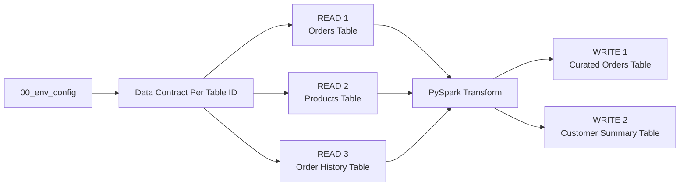

# Step 2. Build and run the ETL

Run the `02_pipeline` template in the Engineering Development Workspace.

We are building of the foundation of [Step 00C. Prepare the demo data](00C-prepare-demo-data.md) and the demo files are expected to be landed in the respective lakehouse and warehouse tables

For simplicity, this walkthrough **reads the full source tables into DataFrames** before transformation and writes.

For watermark-based incremental reads, incremental writes, partition-aware processing, and related advanced patterns, see the **Advanced Incremental Read and Write Guide**.


By the end of this step, you will:

* Read three tables,
* Transform the source data with normal PySpark,
* Write two tables

You will also see how FabricOps
* Skip guardrails (checks) before a Data Contract exists,
* Profile and store table level pipeline lineage,
* Creates the data catalogue that will be consumed by Step 3 of the demo that goverance will use

The standard **full read** pipeline shape is:



## Load the shared environment notebook that we set up in 00B & Import required pipeline functions


## 2. Run the Data Contract selection

Run the **Data Contract** section:

```python
CONTRACTS = widget_select_data_contract(spark_session=spark)
```


This is expected. There is no Data Contract yet because Governance has not authored one. We will revisit this in [Step 04. Select and validate the Data Contract](04-run-pipeline-with-guardrails.md).

In Development, when no Data Contract is selected, guardrail checks return skipped instead of requiring you to comment them out.

This means the same 02_pipeline notebook can be used both before and after Governance is introduced.

## 3. Read the tables

The template contains three independent Read blocks.

| Read | Store | Schema | Table |
| --- | --- | --- | --- |
| Orders | `Bronze` Lakehouse | `demo` | `orders` |
| Products | `Bronze` Lakehouse | `demo` | `products` |
| Order History | `Gold` Warehouse | `demo` | `order_history` |
### **Each Read Code Block is designed to be clonable** 
You can just clone the whole block and edit the variables to point to a different source
```python
READ_NAME = "orders"
READ_STORE = "Bronze"
READ_SCHEMA = "demo"
READ_TABLE = "orders"
READ_QUERY = None
```
### What the whole READ block does

#### Define the source
- `READ_NAME` gives the source a reusable name in the notebook.
- `READ_STORE`, `READ_SCHEMA`, and `READ_TABLE` identify `Bronze.demo.orders`.
- `READ_QUERY` optionally supplies a SQL query for Warehouse reads.

!!! tip "Warehouse SQL pushdown"
    `READ_QUERY = None` reads the full table.

    To filter, join, aggregate, or otherwise shape the data in the Warehouse before it reaches Spark, pass a SQL query through `READ_QUERY`.

    When `READ_QUERY` is supplied, `pipeline_read()` routes the request to `read_warehouse_query()` and pushes the SQL down to the underlying Warehouse.

#### Read the input tables with `pipeline_read()`
- Resolves the canonical FabricOps `table_id` and the configured physical store.
- Detects whether the source is a **Lakehouse** or **Warehouse**.
- Routes automatically to the correct FabricOps reader:
  - Lakehouse table → `read_lakehouse_table()`
  - Warehouse table → `read_warehouse_table()`
  - Warehouse with `READ_QUERY` supplied → `read_warehouse_query()`
- For a Warehouse query, the SQL is pushed down to the Warehouse before the result is returned to Spark.
- Returns the Spark DataFrame together with the resolved `table_id` and small source metadata in the `source` result.

#### Run Guardrail checks
- The checks resolve the selected Data Contract for this `table_id` from `METADATA_DATA_CONTRACT`.
- `check_freshness()` checks whether the source is recent enough based on the contract's Freshness rule.
- `check_schema()` checks whether the columns and data types match the contract's Schema rule.
- `check_dq()` runs the Data Quality rules defined in the contract.
- Each check records its runtime outcome in `METADATA_GUARDRAIL_RESULTS`.

   In this first Development run, there is no selected Data Contract yet, so contract-backed checks safely return `skipped`.

#### Profile the source
- `profile_table()` refreshes the saved profile for the complete source table.
- Profiling results are saved to `METADATA_DATA_PROFILED`.
- Frequency profiling, when generated, is saved to `METADATA_DATA_PROFILED_FREQUENCY`.

#### Keep the source for later steps
- `sources["orders"]` stores the read result.
- The Transform and Write sections can later reuse both the DataFrame and its `table_id`.

#### Optional
- Uncomment the `display()` lines only when you want to inspect the source data, profile, or failed DQ spark dataframes.

## 4. Transformation

After reading the data from the Lakehouse or Warehouse into PySpark DataFrames, use normal PySpark in this section to perform your project-specific transformation logic, such as:

- joining DataFrames,
- filtering rows,
- aggregating data,
- deriving new columns,
- reshaping or selecting the final output structure.

For common examples, see the [PySpark transformation cheat sheet](../reference/engineering-cheat-sheet.md#pyspark-transformation-cheat-sheet).

You can also use Copilot, ChatGPT, Calude , or other AI coding tools to help draft the PySpark transformation. Always validate the generated logic and resulting DataFrame against your actual data before writing.

## 5. Write the tables

The template contains two independent Write blocks.

| Write | Store | Schema | Table | Load strategy |
| --- | --- | --- | --- | --- |
| Curated Orders | `Silver` | `demo` | `curated_orders` | `overwrite` |
| Customer Summary | `Gold` | `demo` | `customer_summary` | `overwrite` |

### **Each Write Code Block is designed to be clonable** 
You can just clone the whole block and edit the variables to point to a different source

```python
WRITE_NAME = "curated_orders_lakehouse"
WRITE_DATAFRAME = transformed_df
WRITE_SOURCE_NAMES = ("orders", "products", "history")
WRITE_STORE = "Silver"
WRITE_SCHEMA = "demo"
WRITE_TABLE = "curated_orders"
WRITE_LOAD_STRATEGY = "overwrite"
```

### What the whole WRITE block does

#### Define the target

- `WRITE_DATAFRAME` identifies the transformed DataFrame to publish.
- `WRITE_STORE`, `WRITE_SCHEMA`, and `WRITE_TABLE` identify the destination.
- `WRITE_LOAD_STRATEGY` controls how the target is written, such as `overwrite`, `append`, `SCD1`, or `SCD2`.
- `WRITE_REPARTITION_BY` optionally controls Spark write parallelism before publication.
- `WRITE_SOURCE_NAMES` identifies the exact source reads that produced this target.

!!! tip "Load strategy"
    `WRITE_LOAD_STRATEGY` controls how FabricOps applies incoming data to the target.

    Supported strategies include `overwrite`, `append`, `SCD1`, and `SCD2`.

!!! tip "Spark write parallelism"
    `WRITE_REPARTITION_BY` optionally repartitions the DataFrame before writing.

    For example, `64` allows up to 64 write tasks, subject to the Spark capacity available to the session.

    Rule of thumb:
    - Leave it as `None` for small or normal writes.
    - Under ~1 million rows → usually leave as `None`.
    - Around 1–10 million rows → consider repartitioning if the write is slow.
    - Above ~10 million rows → write parallelism is more likely to help.


#### Resolve the target and its sources

- `write_sources` selects only the source reads used by this target.
- Their `table_id` values are reused for Source Drift, Guardrail coverage, and Lineage.
- `resolve_table_id()` resolves the canonical FabricOps `table_id` for the target once and reuses it throughout the WRITE block.

#### Run Guardrail checks

- The checks resolve the selected Data Contract for the target from `METADATA_DATA_CONTRACT`.
- `check_schema()` validates the output columns and data types.
- `check_sensitive_data()` applies configured masking, redaction, hashing, or tokenization before writing.
- `check_source_drift()` checks each source against the last successfully accepted state for this target.
- `check_dq()` runs the target Data Quality rules.
- `check_guardrail_coverage()` confirms that all required Guardrails for the publication were evaluated.
- Runtime outcomes are recorded in `METADATA_GUARDRAIL_RESULTS`.

   In this first Development run, there is no selected Data Contract yet, so contract-backed checks safely return `skipped`.

#### Write the target with `pipeline_write()`

- Resolves whether the target is a **Lakehouse** or **Warehouse** and routes automatically to the correct Fabric write path.
- Applies `WRITE_LOAD_STRATEGY` to control how data is published.
- When `WRITE_REPARTITION_BY` is set, repartitions the DataFrame so Spark can distribute the write across multiple tasks.
- Persists the target processing definition to `METADATA_DATA_CATALOGUE`.
- After the physical write succeeds, records the source and target `table_id` values in `METADATA_DATA_LINEAGE`.
- Successful source observation state is then committed to `METADATA_SOURCE_OBSERVATION`.

#### Profile the persisted target

- `profile_table()` refreshes the profile from the table that was actually written.
- Profiling results are saved to `METADATA_DATA_PROFILED`.
- Frequency profiling, when generated, is saved to `METADATA_DATA_PROFILED_FREQUENCY`.

#### Keep the write result

- `writes[WRITE_NAME]` stores the `pipeline_write()` result.
- Later cells can reuse the published target's canonical `table_id`.

#### Optional

- Uncomment the `display()` lines only when you want to inspect the prepared DataFrame, failed DQ values, Sensitive Data support mappings, or persisted target profile.


**Next:** [Step 3. Author and freeze the Data Contract](03-enrich-guardrails.md)
