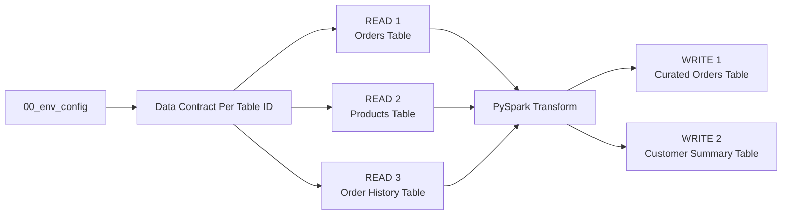
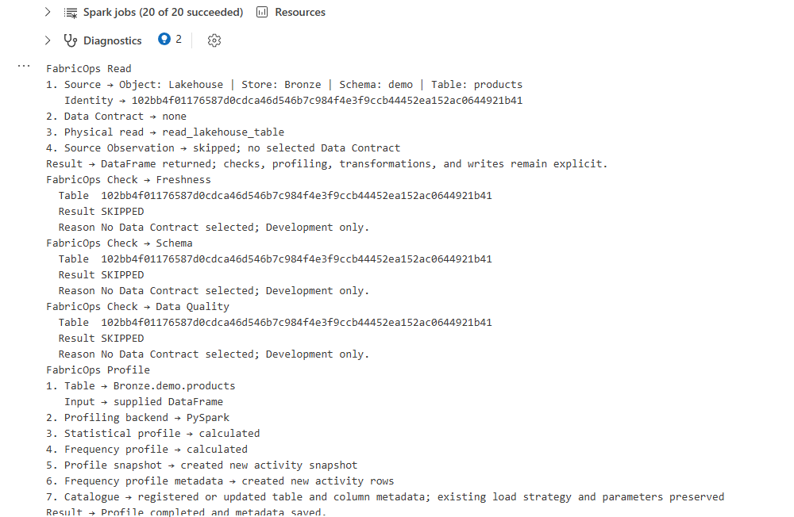
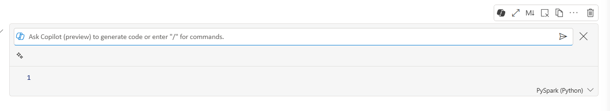
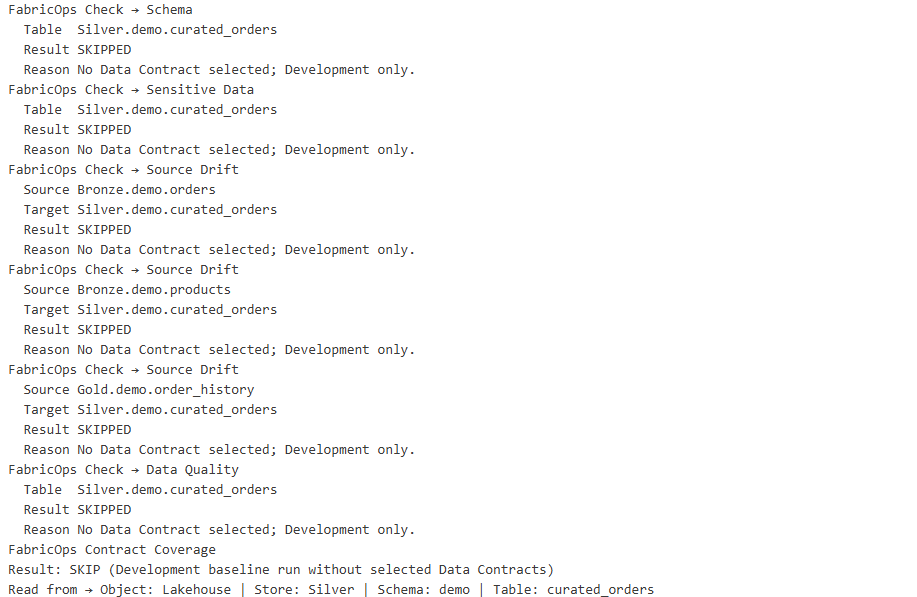
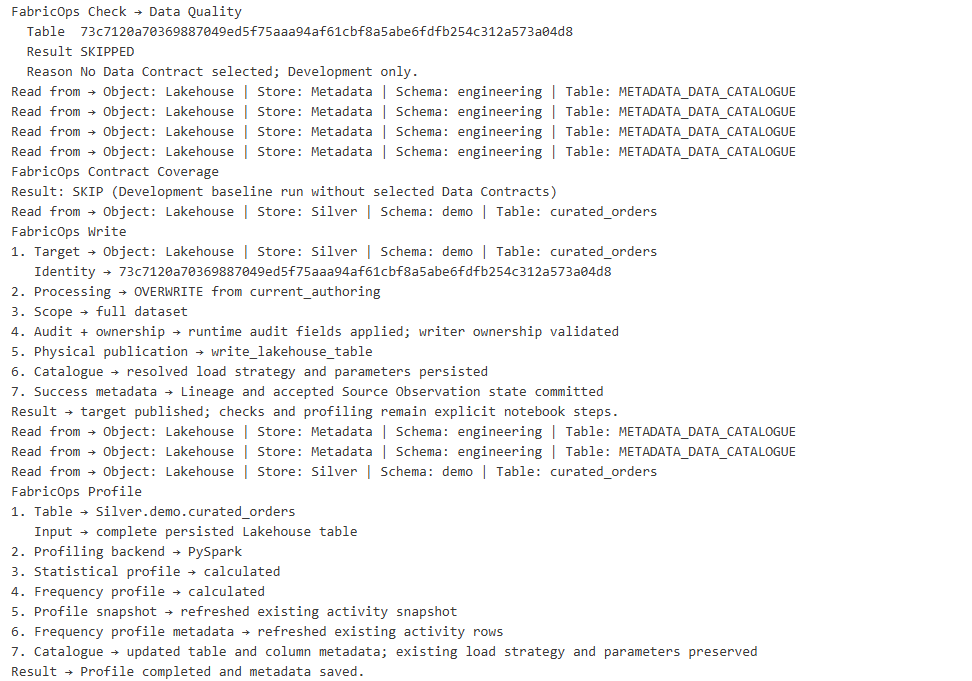

# Step 2. Build and run the ETL

Run the `02_pipeline` template in the Engineering Development Workspace.

This step builds on [Step 00C. Prepare the demo data](00C-prepare-demo-data.md) and expects the demo data to already be loaded into the respective Lakehouse and Warehouse tables.

For simplicity, this walkthrough **reads the full source tables into DataFrames** before transformation and writes.

For target-aware incremental reads, incremental writes, partition-aware processing, and profiling partial batches versus complete persisted tables, continue with [Step 2A. Run an incremental pipeline](02A-run-incremental-pipeline.md).


## What you will do

1. Read three source tables.
2. Transform them with normal PySpark.
3. Write two target tables.

Along the way, FabricOps will skip contract-backed Guardrails before a Data Contract exists, profile the governed tables, record pipeline lineage, and build the Data Catalogue that Governance uses in Step 3.

The standard **full read** pipeline shape is:



## 1. Load the shared environment and pipeline functions

Run the shared environment notebook from Step 00B and import the pipeline functions used by this template.

??? example "Show notebook setup screenshot"
    

## 2. Run the Data Contract selection

Run the **Data Contract** section:

```python
CONTRACTS = widget_select_data_contract(spark_session=spark)
```

??? example "Show Data Contract selection output"
    

This is expected. There is no Data Contract yet because Governance has not authored one. We will revisit this in [Step 04. Select and validate the Data Contract](04-run-pipeline-with-guardrails.md).

In Development, when no Data Contract is selected, guardrail checks return skipped instead of requiring you to comment them out.

This means the same 02_pipeline notebook can be used both before and after Governance is introduced.

## 3. Read

The template contains three independent Read blocks.

| Read | Store | Schema | Table |
| --- | --- | --- | --- |
| Orders | `Bronze` Lakehouse | `demo` | `orders` |
| Products | `Bronze` Lakehouse | `demo` | `products` |
| Order History | `Gold` Warehouse | `demo` | `order_history` |

### Configure the Read block

Each Read block is designed to be cloned. Copy the block and change only the source variables:

```python
READ_NAME = "orders"
READ_STORE = "Bronze"
READ_SCHEMA = "demo"
READ_TABLE = "orders"
READ_QUERY = None
```

### Run the Read block

`pipeline_read()` resolves whether the source is a Lakehouse or Warehouse, reads it through the appropriate FabricOps I/O function, and returns the Spark DataFrame together with its canonical FabricOps `table_id`.

```python
source = pipeline_read(
    store=READ_STORE,
    schema=READ_SCHEMA,
    table_name=READ_TABLE,
    query=READ_QUERY,
    spark_session=spark,
)

df = source["dataframe"]
table_id = source["table_id"]
```

**You can stop here if you only want to read the data.** At this point `df` already exists and can be used in normal PySpark.

??? info "Read block details"
    The full Read block follows **READ → CHECK → PROFILE → KEEP**.

    **READ**

    `pipeline_read()` gets the DataFrame and canonical `table_id`. `READ_QUERY = None` reads the full table.

    For a Warehouse source, `READ_QUERY` can instead contain SQL so projection and filtering happen before the result reaches Spark:

    ```python
    READ_QUERY = """
    SELECT
        historical_order_id,
        customer_id,
        order_datetime,
        net_amount
    FROM demo.order_history
    WHERE order_datetime >= '2025-01-01'
    """
    ```

    When `READ_QUERY` is supplied, FabricOps routes the request through `read_warehouse_query()` and pushes the SQL down to the Warehouse.

    **CHECK**

    FabricOps then runs the configured source Guardrails such as freshness, schema, and Data Quality checks. Before a Data Contract is selected, contract-backed checks safely return `SKIPPED`.

    **PROFILE**

    `profile_table()` profiles the complete table. For a full source read, the complete dataset is already available as a Spark DataFrame, so FabricOps profiles it directly with PySpark.

    ```python
    profile_result = profile_table(
        dataframe=df,
        store=READ_STORE,
        schema=READ_SCHEMA,
        table_name=READ_TABLE,
        spark_session=spark,
    )

    # display(profile_result["profile"])
    # display(profile_result["frequency_profile"])
    ```

    For a partial read, FabricOps reads the complete persisted table again before profiling it. Lakehouse tables are profiled with PySpark. Warehouse tables use Warehouse SQL pushdown.

    **KEEP**

    `sources[READ_NAME] = source` keeps the completed source flow available for downstream Transform and Write blocks.

    Optional inspection remains available when you need it:

    ```python
    # display(df)
    # display(dq_df)
    # display(dq_failed_values)
    ```

??? example "Show complete Read block output"
    


## 4. Transformation

After reading the data from the Lakehouse or Warehouse into PySpark DataFrames, use normal PySpark in this section to perform your project-specific transformation logic, such as:

- joining DataFrames,
- filtering rows,
- aggregating data,
- deriving new columns,
- reshaping or selecting the final output structure.

For common examples, see the [PySpark transformation cheat sheet](../reference/engineering-cheat-sheet.md#pyspark-transformation-cheat-sheet).

??? example "Show Copilot example"
    

You can also use Copilot, ChatGPT, Claude, or other AI coding tools to help draft the PySpark transformation. Always validate the generated logic and resulting DataFrame against your actual data before writing.

## 5. Write

The template contains two independent Write blocks.

| Write | Store | Schema | Table | Load strategy |
| --- | --- | --- | --- | --- |
| Curated Orders | `Silver` | `demo` | `curated_orders` | `overwrite` |
| Customer Summary | `Gold` | `demo` | `customer_summary` | `append` |

### Configure the Write block

Each Write block is designed to be cloned. Copy the block and change only the target variables:

```python
WRITE_NAME = "curated_orders_lakehouse"
WRITE_DATAFRAME = transformed_df
WRITE_SOURCE_NAMES = ("orders", "products", "history")
WRITE_STORE = "Silver"
WRITE_SCHEMA = "demo"
WRITE_TABLE = "curated_orders"
WRITE_LOAD_STRATEGY = "overwrite"
```

### Run the Write block

`pipeline_write()` resolves whether the target is a Lakehouse or Warehouse and performs the physical publication through the appropriate FabricOps I/O function.

```python
write_result = pipeline_write(
    prepared_df,
    store=WRITE_STORE,
    schema=WRITE_SCHEMA,
    table_name=WRITE_TABLE,
    load_strategy=WRITE_LOAD_STRATEGY,
    source_table_ids=[source["table_id"] for source in write_sources],
    repartition_by=WRITE_REPARTITION_BY,
    spark_session=spark,
)
```

After this succeeds, the target has been physically written and FabricOps records the associated Catalogue, lineage, and source observation state handled by the publication flow.

??? info "Write block details"
    The full Write block follows **PREPARE → CHECK → WRITE → PROFILE → KEEP**.

    **PREPARE**

    FabricOps resolves the target `table_id`, the source lineage, the load strategy, and any optional `WRITE_REPARTITION_BY` setting.

    **CHECK**

    FabricOps validates the target schema, applies configured sensitive data handling, checks source drift, runs Data Quality rules, and confirms Guardrail coverage. Before a Data Contract is selected, contract-backed checks safely return `SKIPPED`.

    **WRITE**

    `pipeline_write()` is the physical publication boundary. `WRITE_LOAD_STRATEGY` supports `overwrite`, `append`, `SCD1`, and `SCD2`.

    `WRITE_REPARTITION_BY` optionally controls Spark write parallelism. Leave it as `None` for small or normal writes and increase it only when write scale or performance justifies the extra parallelism.

    **PROFILE**

    FabricOps profiles the complete persisted target after publication.

    ```python
    write_profile = profile_table(
        table_id=write_result["table_id"],
        spark_session=spark,
    )

    # display(write_profile["profile"])
    # display(write_profile["frequency_profile"])
    ```

    For `overwrite`, the complete DataFrame is already available and can be profiled directly. For `append`, `SCD1`, or `SCD2`, FabricOps re-reads the complete persisted target before profiling it.

    **KEEP**

    `writes[WRITE_NAME] = write_result` keeps the completed publication result available for later notebook use.

    Optional inspection remains available when you need it:

    ```python
    # display(WRITE_DATAFRAME)
    # display(prepared_df)
    # display(target_dq_df)
    # display(target_dq_failed_values)
    # display(support_mapping_df)
    ```

??? example "Show complete Write block outputs"
    
    

## Expected result

At the end of Step 2 you should have:

- three source tables read through FabricOps into Spark DataFrames,
- `demo.curated_orders` written to the Silver Lakehouse and `demo.customer_summary` written to the Gold Warehouse,
- Catalogue, profile, lineage, and source observation metadata recorded for the pipeline,
- contract-backed checks shown as `SKIPPED` in Development because no Data Contract has been selected yet.


**Next:** [Step 3. Author and freeze the Data Contract](03-enrich-guardrails.md)
